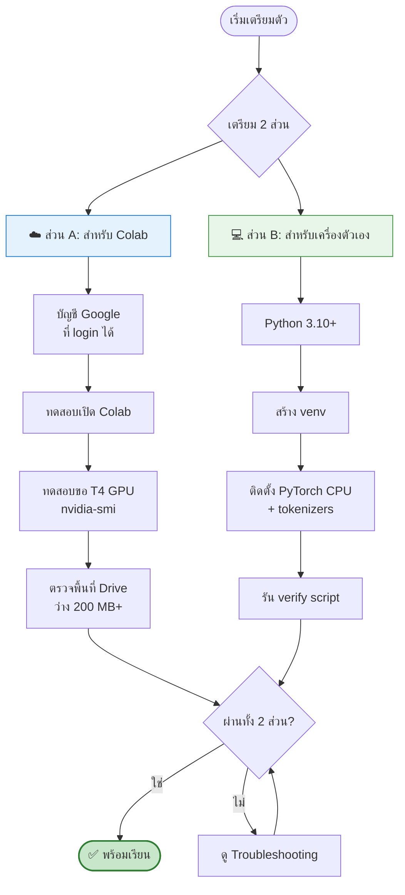

[⬅️ กลับหน้าหลัก](../README.md) | [ถัดไป: LLM Fundamentals ➡️](01-llm-fundamentals.md)

---

# ✅ Module 00 — เตรียมความพร้อมก่อนเรียน

> **ทำก่อนวันเวิร์กช็อปอย่างน้อย 1 วัน** — การเตรียมล่วงหน้าช่วยประหยัดเวลาในห้องเรียนได้มาก

## 🎯 Learning Objectives
- ติดตั้ง environment สำหรับทั้ง 2 เฟสได้สำเร็จ
- เข้าใจว่าเฟสไหนใช้เครื่องมืออะไร
- ตรวจสอบได้เองว่าเครื่องพร้อมหรือยัง

---

## 🗺️ ภาพรวมสิ่งที่ต้องเตรียม



---

## ☁️ ส่วน A — เตรียมสำหรับเฟส Train (Google Colab)

### A1. บัญชี Google

- [ ] มีบัญชี Google (Gmail) ที่ login ได้จริง
- [ ] **⚠️ ใช้บัญชี Gmail ส่วนตัว ไม่ใช่บัญชีของสถาบัน**

> **ทำไมต้องเป็น Gmail ส่วนตัว?**
> ในอดีต (ปี 2021) Google เคยจำกัดการเข้าถึง Colab สำหรับบัญชี Google Workspace for Education บางประเภท ทำให้เข้าใช้งานไม่ได้ การใช้ Gmail ส่วนตัวลดความเสี่ยงนี้

- [ ] เตรียมบัญชี Google สำรองอีก 1 บัญชี (เผื่อบัญชีหลักมีปัญหา)
- [ ] **⚠️ ห้ามใช้หลายบัญชี Colab พร้อมกันบนเครื่องเดียว** — Google ระบุว่าจะ block พฤติกรรมนี้

### A2. ทดสอบเปิด Colab และขอ GPU

1. เปิด https://colab.research.google.com
2. คลิก **New notebook**
3. เมนู **Runtime → Change runtime type**
4. เลือก **Hardware accelerator → T4 GPU** → **Save**
5. รัน cell นี้:

```python
!nvidia-smi
```

**✅ ผลลัพธ์ที่ควรเห็น:** ตารางแสดง `Tesla T4` พร้อม memory 15360MiB

```
+---------------------------------------------------------------------------------------+
| NVIDIA-SMI 5xx.xx     Driver Version: 5xx.xx     CUDA Version: 12.x                   |
|-----------------------------------------+----------------------+----------------------+
| GPU  Name                 Persistence-M  | Bus-Id        Disp.A | Volatile Uncorr. ECC |
|   0  Tesla T4                        Off | 00000000:00:04.0 Off |                    0 |
|                                          |  0MiB / 15360MiB     |                      |
+-----------------------------------------+----------------------+----------------------+
```

**❌ ถ้าไม่เห็น GPU:** ไม่ใช่เรื่องผิดปกติ — Colab free tier **ไม่การันตี GPU** ดู [Troubleshooting](08-troubleshooting.md#colab-ไม่ให้-gpu)

### A3. ตรวจพื้นที่ Google Drive

- [ ] มีพื้นที่ว่างใน Google Drive อย่างน้อย **200 MB** สำหรับเก็บ checkpoint

### A4. (ทางเลือก) บัญชี HuggingFace

ถ้าจะสอนเรื่อง model sharing:
- [ ] สมัคร https://huggingface.co
- [ ] สร้าง Access Token แบบ **write** ที่ Settings → Access Tokens

---

## 💻 ส่วน B — เตรียมสำหรับเฟส Run (เครื่องตัวเอง)

### B1. ตรวจสอบ Python

```bash
python --version
# ต้องได้ Python 3.10 ขึ้นไป
```

ถ้ายังไม่มี ดาวน์โหลดจาก https://www.python.org/downloads/

> 💡 **Windows:** ตอนติดตั้งอย่าลืมติ๊ก **"Add Python to PATH"**

### B2. สร้าง Virtual Environment

```bash
# สร้าง venv
python -m venv guppy-env

# เปิดใช้งาน
# Windows (PowerShell):
guppy-env\Scripts\Activate.ps1
# Windows (CMD):
guppy-env\Scripts\activate.bat
# macOS / Linux:
source guppy-env/bin/activate
```

**✅ ผลลัพธ์ที่ควรเห็น:** มี `(guppy-env)` นำหน้า prompt

### B3. ติดตั้ง Dependencies

```bash
# PyTorch เวอร์ชัน CPU — เบากว่ามาก ไม่ต้องมี CUDA
pip install torch --index-url https://download.pytorch.org/whl/cpu

# Dependencies อื่น ๆ
pip install tokenizers safetensors gradio
```

> ⚠️ **สำคัญ: ควร pin PyTorch version ให้ตรงกันทั้งห้อง**
> เพื่อลดปัญหา version mismatch ตอนโหลด checkpoint ที่เทรนบน Colab
> ผู้สอนควรกำหนดเวอร์ชันที่แน่นอน เช่น `pip install torch==2.6.0 --index-url ...`

**พื้นที่ที่ต้องใช้:** ~2 GB (ส่วนใหญ่คือ PyTorch)

#### กรณีพิเศษ

| เครื่อง | คำแนะนำ |
|---|---|
| มี NVIDIA GPU | ติดตั้ง build CUDA ได้ แต่ CPU build ก็เพียงพอสำหรับโมเดล 8.7M |
| Mac (Apple Silicon) | PyTorch รองรับ `mps` backend อัตโนมัติ ติดตั้งปกติได้เลย |
| RAM น้อย (< 8GB) | ยังใช้ได้ โมเดล 8.7M ใช้ RAM น้อยมาก |

### B4. รัน Verification Script

สร้างไฟล์ `verify_setup.py`:

```python
"""ตรวจสอบว่า environment พร้อมสำหรับเวิร์กช็อปหรือยัง"""
import sys

print("=" * 50)
print("GuppyLM Workshop — Environment Check")
print("=" * 50)

# 1. Python version
v = sys.version_info
ok_py = v.major == 3 and v.minor >= 10
print(f"[{'OK' if ok_py else 'FAIL'}] Python {v.major}.{v.minor}.{v.micro}")

# 2. PyTorch
try:
    import torch
    print(f"[OK] PyTorch {torch.__version__}")

    # ตรวจ device ที่ใช้ได้
    if torch.cuda.is_available():
        print(f"     -> CUDA GPU: {torch.cuda.get_device_name(0)}")
    elif getattr(torch.backends, "mps", None) and torch.backends.mps.is_available():
        print("     -> Apple Silicon (MPS)")
    else:
        print("     -> CPU only (เพียงพอสำหรับเวิร์กช็อปนี้)")

    # ทดสอบคำนวณจริง
    x = torch.randn(2, 3)
    y = x @ x.T
    print(f"[OK] Tensor computation works, shape={tuple(y.shape)}")
except ImportError:
    print("[FAIL] PyTorch ยังไม่ได้ติดตั้ง")

# 3. tokenizers
try:
    import tokenizers
    print(f"[OK] tokenizers {tokenizers.__version__}")
except ImportError:
    print("[FAIL] tokenizers ยังไม่ได้ติดตั้ง")

# 4. ตัวเลือกเสริม
for pkg in ["safetensors", "gradio"]:
    try:
        __import__(pkg)
        print(f"[OK] {pkg}")
    except ImportError:
        print(f"[--] {pkg} (ไม่บังคับ แต่แนะนำ)")

print("=" * 50)
```

รัน:
```bash
python verify_setup.py
```

**✅ ผลลัพธ์ที่ควรเห็น:**
```
==================================================
GuppyLM Workshop — Environment Check
==================================================
[OK] Python 3.11.9
[OK] PyTorch 2.6.0+cpu
     -> CPU only (เพียงพอสำหรับเวิร์กช็อปนี้)
[OK] Tensor computation works, shape=(2, 2)
[OK] tokenizers 0.21.0
[OK] safetensors
[OK] gradio
==================================================
```

---

## 📋 Checklist สรุป

พิมพ์หน้านี้แจกนักศึกษาได้เลย:

### สำหรับนักศึกษา
- [ ] มีบัญชี Gmail ส่วนตัวที่ login ได้
- [ ] เปิด Colab และขอ T4 GPU สำเร็จ (เห็นผลจาก `nvidia-smi`)
- [ ] Google Drive มีพื้นที่ว่าง 200 MB+
- [ ] ติดตั้ง Python 3.10+ บนเครื่องตัวเอง
- [ ] สร้าง venv และ activate ได้
- [ ] ติดตั้ง PyTorch (CPU) + tokenizers สำเร็จ
- [ ] รัน `verify_setup.py` ผ่านทุกข้อ
- [ ] นำ laptop + สายชาร์จมาในวันเรียน

### สำหรับผู้สอน
ดู [คู่มือผู้สอน](../instructor/INSTRUCTOR_GUIDE.md) ฉบับเต็ม

---

## ⚠️ ข้อควรรู้เกี่ยวกับ Google Colab Free Tier

Google ระบุใน [Colab FAQ](https://research.google.com/colaboratory/faq.html) อย่างเป็นทางการว่า:

> *"Colab is able to provide resources free of charge in part by having dynamic usage limits that sometimes fluctuate... overall usage limits as well as idle timeout periods, maximum VM lifetime, GPU types available, and other factors vary over time. Colab does not publish these limits."*

และเรื่องเวลาสูงสุด:

> *"In the version of Colab that is free of charge notebooks can run for at most 12 hours, depending on availability and your usage patterns."*

**แปลว่า:**

| ประเด็น | ความจริง |
|---|---|
| ได้ GPU แน่นอนไหม? | ❌ ไม่การันตี — ช่วง demand สูงอาจได้แค่ CPU |
| Session อยู่ได้นานเท่าไหร่? | สูงสุด 12 ชั่วโมง (เป็นเพดาน ไม่ใช่การันตี) |
| Idle timeout เท่าไหร่? | Google ไม่เผยแพร่ตัวเลข (community รายงานราว 90 นาที แต่ไม่ใช่ค่าตามสัญญา) |
| Quota ต่อสัปดาห์? | ไม่เปิดเผย (ประมาณการจาก community: 15–30 GPU-hr) |

> 🛡️ **วิธีรับมือ:** เราจะ save checkpoint ลง Google Drive ทุก 500 steps ตั้งแต่ต้น — ถ้า session ตายก็ไม่เสียงานทั้งหมด ดูรายละเอียดใน [Module 04](04-export-checkpoint.md)

---

## 🔄 ทางเลือกอื่นนอกจาก Colab

| แพลตฟอร์ม | Quota ฟรี | GPU | ข้อดี | ข้อเสีย |
|---|---|---|---|---|
| **Google Colab** ⭐ | ไม่เปิดเผย | T4 16GB (ไม่การันตี) | UI คุ้นเคย, integrate Drive | quota คาดเดายาก |
| **Kaggle Notebooks** ⭐ | ~30 GPU-hr/สัปดาห์ (ประกาศชัด) | P100 16GB / T4×2 | quota เห็นชัด, storage 20GB persistent | UI ต่างจาก Colab, ต้องยืนยันเบอร์โทร |
| **Lightning AI Studio** | 15 credits/เดือน (~22 ชม. T4) | T4/L4/A10G | environment persist ข้าม session | credit หมดเร็ว, restart ทุก 4 ชม. |
| **Paperspace Gradient** | community tier จำกัด | จำกัด | มี free tier | คิวยาว |

> 💡 **คำแนะนำ:** ใช้ **Colab เป็นหลัก** และเตรียม **Kaggle เป็น backup อันดับ 1** เพราะ quota ชัดเจนและโค้ดแทบไม่ต้องแก้ (เปลี่ยนแค่ path)

---

[⬅️ กลับหน้าหลัก](../README.md) | [ถัดไป: LLM Fundamentals ➡️](01-llm-fundamentals.md)
