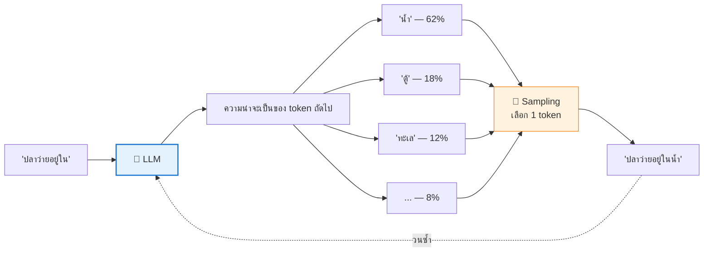
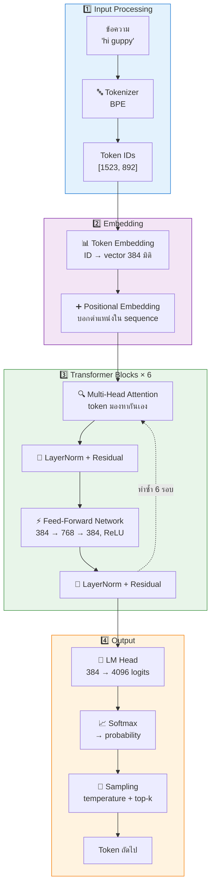
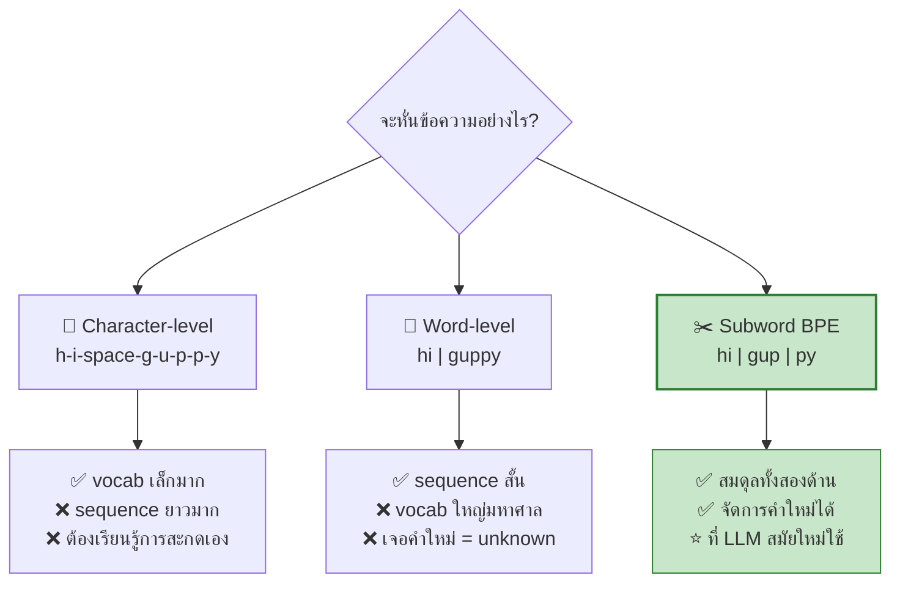
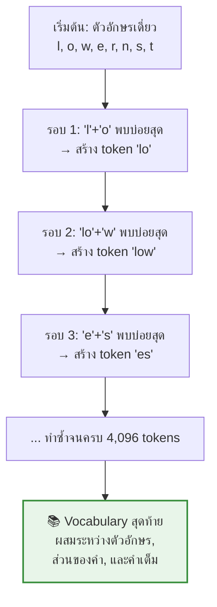
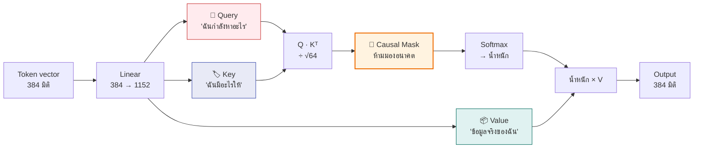
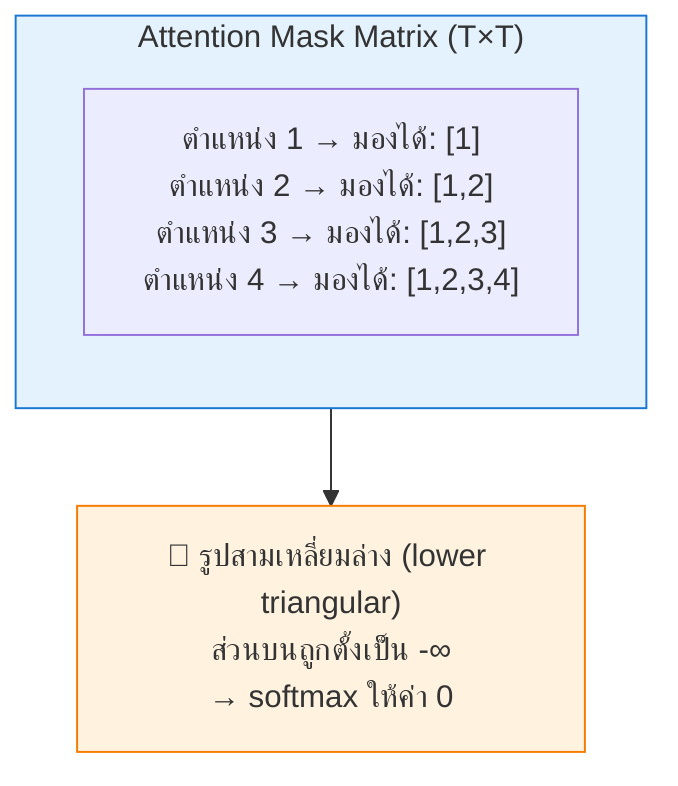
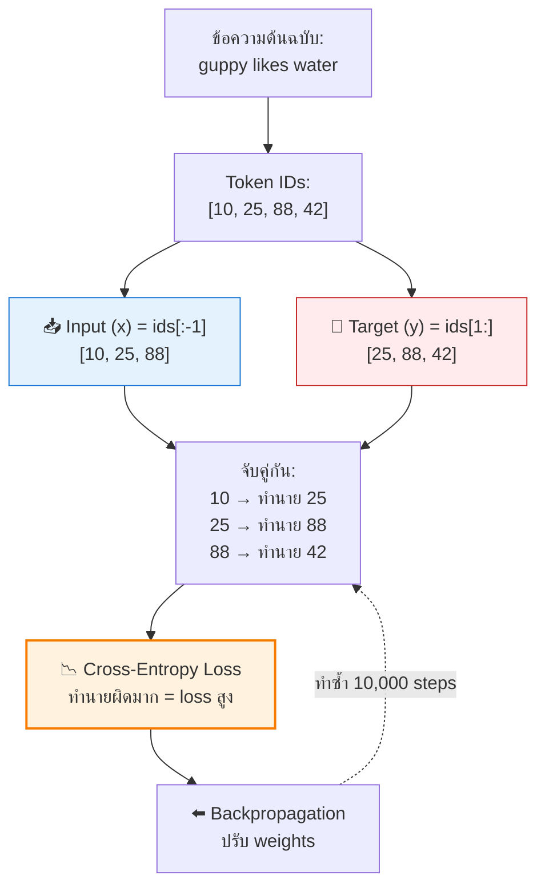
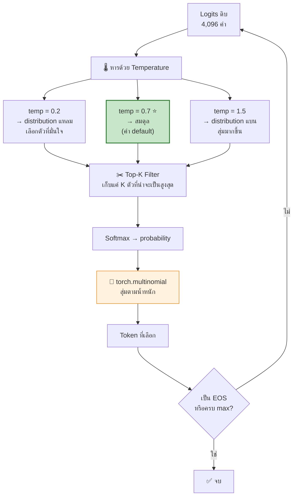
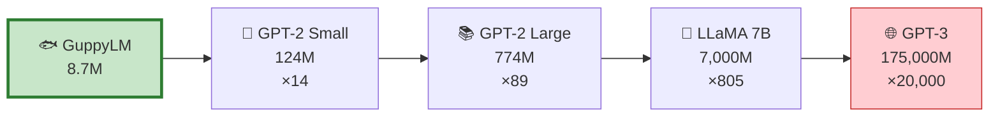

[⬅️ Module 00](00-preparation.md) | [หน้าหลัก](../README.md) | [ถัดไป: Data & Tokenizer ➡️](02-data-tokenizer.md)

---

# 🧠 Module 01 — LLM Fundamentals

> ⏱️ **60 นาที** · บรรยาย + demo

## 🎯 Learning Objectives
เมื่อจบ module นี้ นักศึกษาจะสามารถ:
- อธิบายได้ว่า LLM ทำนาย token ถัดไปอย่างไร
- บอกหน้าที่ของ tokenizer, embedding, attention, sampling ได้
- เข้าใจว่า GuppyLM (8.7M) ต่างจาก GPT-4 อย่างไร — และเหมือนกันตรงไหน

---

## 1.1 LLM ทำอะไรกันแน่?

**คำตอบสั้น ๆ: ทำนาย token ถัดไป**

LLM ไม่ได้ "เข้าใจ" ภาษาแบบมนุษย์ มันเรียนรู้ **การกระจายความน่าจะเป็น** ของ token ถัดไป เมื่อรู้ token ก่อนหน้าทั้งหมด

การทำซ้ำวงจรนี้ทีละ token เรียกว่า **autoregressive generation**

---

## 1.2 Pipeline ทั้งหมดของ LLM

---

## 1.3 Tokenizer — สะพานระหว่างข้อความกับตัวเลข

คอมพิวเตอร์ทำงานกับตัวเลข ไม่ใช่ตัวอักษร **tokenizer** คือตัวแปลง

### ทำไมไม่แยกทีละตัวอักษร หรือทีละคำ?

### BPE ทำงานอย่างไร

**Byte-Pair Encoding** เริ่มจากตัวอักษรเดี่ยว แล้ว "รวมคู่ที่พบบ่อยที่สุด" ซ้ำ ๆ จนได้ vocabulary ตามขนาดที่ต้องการ

### เปรียบเทียบขนาด vocabulary

| Model | Vocab size | หมายเหตุ |
|---|---|---|
| **GuppyLM** | 4,096 | domain แคบมาก (เรื่องปลา) จึงพอ |
| GPT-2 | 50,257 | ภาษาอังกฤษทั่วไป |
| LLaMA 2 | 32,000 | multilingual |
| GPT-4 (o200k) | ~200,000 | multilingual + code |

> 💡 **บทเรียนสำคัญ:** GuppyLM ใช้ vocab แค่ 4,096 ได้เพราะ**จำกัด domain ให้แคบมาก** — นี่คือกุญแจที่ทำให้โมเดล 8.7M ให้ผลลัพธ์ที่ดูสมเหตุสมผลได้

---

## 1.4 Attention — หัวใจของ Transformer

**ปัญหา:** เมื่อโมเดลอ่านคำว่า "มัน" ในประโยค "ปลาว่ายในตู้เพราะ**มัน**หิว" — "มัน" หมายถึงอะไร?

**คำตอบ:** attention ให้ token แต่ละตัว "มองไปหา" token อื่นทั้งหมด แล้วให้น้ำหนักว่าตัวไหนสำคัญ

### Query, Key, Value

### Causal Mask — ทำไมต้องห้ามมองอนาคต?

เพราะตอน generate จริง โมเดลยังไม่รู้อนาคต ถ้าตอนเทรนให้มองอนาคตได้ โมเดลจะ "โกง" โดยลอกคำตอบ

### Multi-Head — ทำไมต้องหลายหัว?

GuppyLM มี 6 heads แต่ละหัวขนาด 64 มิติ (384 ÷ 6 = 64) แต่ละหัวเรียนรู้ "ความสัมพันธ์คนละแบบ" เช่น หัวหนึ่งจับ syntax อีกหัวจับ semantic แล้วนำผลมารวมกัน

---

## 1.5 Next-Token Prediction — วิธีเทรน

> 🔑 **นี่คือเหตุผลที่ LLM เทรนได้ด้วยข้อมูลมหาศาลโดยไม่ต้อง label มนุษย์** — ข้อความเองเป็นทั้ง input และ label (self-supervised learning)

**ค่า loss เริ่มต้นที่คาดหวัง:** ถ้าโมเดลเดามั่วสุ่มเท่า ๆ กันทุก token → loss ≈ ln(vocab_size) = ln(4096) ≈ **8.3**
ถ้าเห็นค่าเริ่มต้นใกล้ ๆ นี้แปลว่า initialization ถูกต้อง

---

## 1.6 Sampling — จาก logits เป็นข้อความ

หลังได้ probability distribution แล้วจะเลือก token อย่างไร?

| Parameter | ค่าต่ำ | ค่าสูง | Default ของ GuppyLM |
|---|---|---|---|
| `temperature` | คาดเดาได้ น่าเบื่อ ซ้ำ | สร้างสรรค์ แต่มั่ว | **0.7** |
| `top_k` | 1 = greedy (ผลเหมือนเดิมทุกครั้ง) | 50+ = หลากหลาย | **50** |

---

## 1.7 GuppyLM vs โมเดลระดับโลก

**สิ่งที่เหมือนกัน:**
- ✅ Transformer architecture เดียวกัน
- ✅ Next-token prediction เหมือนกัน
- ✅ Attention mechanism เหมือนกัน
- ✅ Training loop เหมือนกัน

**สิ่งที่ต่าง:** ขนาด, ข้อมูล, และ engineering optimization

> 💬 **ประโยคที่ควรพูดในห้อง:** *"ความต่างระหว่างสิ่งที่เราจะสร้างวันนี้กับ GPT-4 คือ scale — ไม่ใช่แนวคิด ถ้าคุณเข้าใจ GuppyLM คุณเข้าใจแกนกลางของ GPT-4 แล้ว"*

---

## 🎬 Demo: ลองคุยกับ Guppy ก่อน

ให้นักศึกษาเปิด https://arman-bd.github.io/guppylm/ ในมือถือ/laptop

**จุดที่ควรชี้ให้ดู:**
1. โมเดลรัน**ในเบราว์เซอร์ล้วน ๆ** — ไม่มี server ไม่มี API key (ONNX + WebAssembly, ไฟล์ ~10 MB)
2. ตอบเรื่องน้ำ/อาหาร/ตู้ปลาได้ดี แต่ไม่เข้าใจแนวคิดนามธรรม
3. **บุคลิกฝังอยู่ใน weights** — README ของ GuppyLM ระบุตรง ๆ ว่าโมเดล 9M ไม่สามารถ conditionally follow instructions ได้ บุคลิกมาจาก training data ล้วน ๆ

**คำถามชวนคิด:** *"ถ้าเราเปลี่ยนข้อมูลเทรนจากปลาเป็นหุ่นยนต์ โมเดลจะเปลี่ยนไหม? ต้องแก้ architecture ไหม?"*
→ คำตอบ: เปลี่ยนแค่ data ก็พอ — **the model is the data**

---

## 📝 สรุป Module 01

| แนวคิด | หน้าที่ |
|---|---|
| Tokenizer (BPE) | แปลงข้อความ ↔ ตัวเลข |
| Token Embedding | ID → vector ที่มีความหมาย |
| Positional Embedding | บอกตำแหน่งใน sequence |
| Multi-Head Attention | ให้ token มองหากันเอง |
| Causal Mask | ห้ามมองอนาคต |
| FFN | ประมวลผลข้อมูลแต่ละตำแหน่ง |
| LayerNorm + Residual | ทำให้เทรน deep network ได้ |
| LM Head | vector → logits ของทุก token |
| Sampling | logits → token จริง |

---

[⬅️ Module 00](00-preparation.md) | [หน้าหลัก](../README.md) | [ถัดไป: Data & Tokenizer ➡️](02-data-tokenizer.md)
