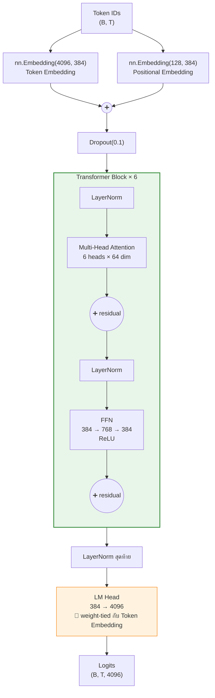
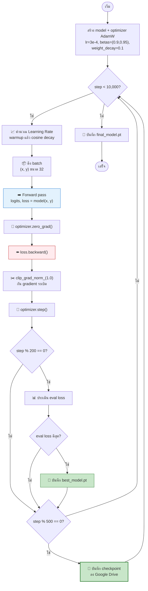
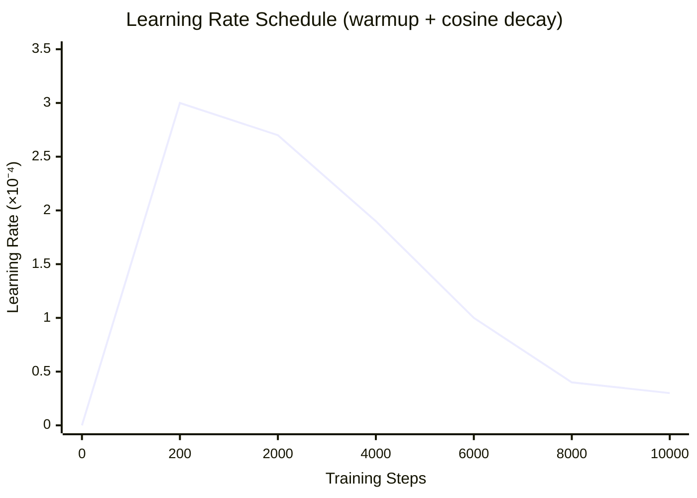
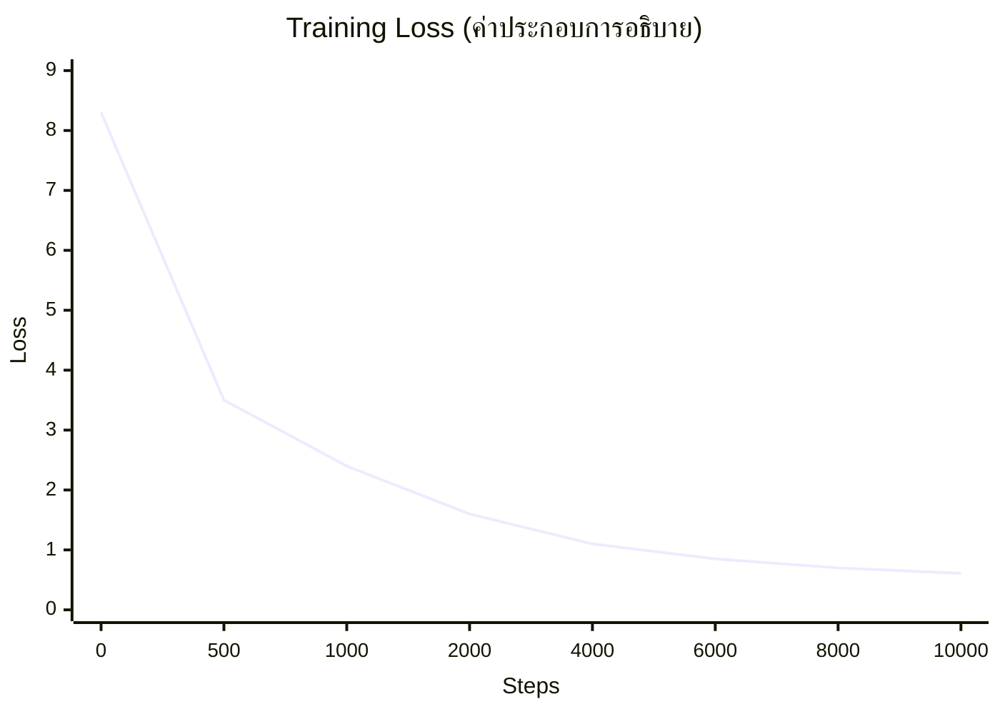
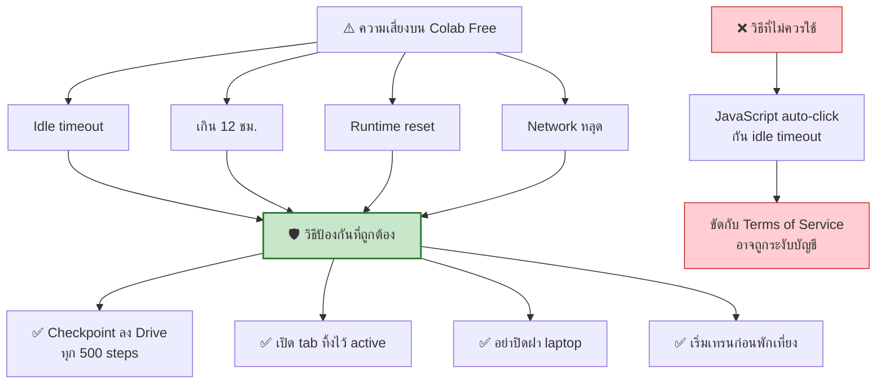

[⬅️ Module 02](02-data-tokenizer.md) | [หน้าหลัก](../README.md) | [ถัดไป: Export Checkpoint ➡️](04-export-checkpoint.md)

---

# 🧠 Module 03 — Model Architecture & Training

> ⏱️ **75 นาที** · อ่านโค้ด + Lab เทรนจริงบน Colab

## 🎯 Learning Objectives
- อ่านและอธิบายโค้ด `model.py` ได้ทีละส่วน
- Map แต่ละบรรทัดของโค้ดเข้ากับแนวคิด LLM ที่เรียนใน Module 01
- เข้าใจ training loop: loss, optimizer, LR schedule, checkpointing
- เทรนโมเดลของตัวเองสำเร็จ

---

## 3.1 สถาปัตยกรรมของ GuppyLM



**สังเกต: เป็น Pre-Norm architecture** — LayerNorm อยู่**ก่อน** attention/FFN แล้วค่อยบวก residual (`x = x + attn(norm1(x))`) ซึ่งช่วยให้เทรน deep network ได้เสถียรกว่า post-norm

---

## 3.2 Mapping โค้ด ↔ แนวคิด

ตารางนี้คือ**หัวใจของการสอน module นี้** — เปิด `guppylm/model.py` คู่กันไป

| แนวคิด LLM | โค้ดใน `model.py` | อธิบาย |
|---|---|---|
| Token embedding | `self.tok_emb = nn.Embedding(vocab_size, d_model)` | ID → vector 384 มิติ |
| Positional encoding | `self.pos_emb = nn.Embedding(max_seq_len, d_model)` | learned position (ไม่ใช่ RoPE) |
| รวม embedding | `x = self.drop(self.tok_emb(idx) + self.pos_emb(pos))` | บวก token + position เข้าด้วยกัน |
| Q, K, V | `self.qkv = nn.Linear(d_model, 3 * d_model)` | สร้างทั้ง 3 พร้อมกันแล้ว split |
| Scaled dot-product | `attn = (q @ k.transpose(-2,-1)) / math.sqrt(self.head_dim)` | หาร √64 กันค่าใหญ่เกิน |
| Causal masking | `mask = torch.tril(...)` + `masked_fill(mask==0, float('-inf'))` | ห้ามมองอนาคต |
| Attention weights | `attn = self.dropout(F.softmax(attn, dim=-1))` | แปลงเป็น probability |
| FFN | `self.down(F.relu(self.up(x)))` | 384 → 768 → 384 |
| Residual | `x = x + self.attn(self.norm1(x), mask)` | pre-norm + residual |
| LayerNorm | `self.norm1 = nn.LayerNorm(d_model)` | คุมสเกล activation |
| Stack layers | `nn.ModuleList([Block(config) for _ in range(n_layers)])` | ซ้อน 6 ชั้น |
| Weight tying | `self.lm_head.weight = self.tok_emb.weight` | แชร์น้ำหนัก ประหยัด params |
| Loss | `F.cross_entropy(logits.view(...), targets.view(-1), ignore_index=0)` | ข้าม padding (id=0) |
| Weight init | `nn.init.normal_(m.weight, mean=0.0, std=0.02)` | init แบบ GPT มาตรฐาน |

### Cell — นับ parameters และตรวจ shape

```python
from guppylm.config import GuppyConfig
from guppylm.model import GuppyLM
import torch

m = GuppyLM(GuppyConfig())
print(m.param_summary())

# ทดสอบ forward pass
idx = torch.randint(0, 4096, (2, 16))    # batch=2, seq_len=16
logits, loss = m(idx)
print(f"logits shape: {logits.shape}")   # (2, 16, 4096)
print(f"loss (ไม่มี target): {loss}")     # None

# ทดสอบพร้อม target
targets = torch.randint(0, 4096, (2, 16))
logits, loss = m(idx, targets)
print(f"loss เริ่มต้น: {loss.item():.3f}")  # ควรใกล้ ln(4096) ≈ 8.3
```

**✅ ผลลัพธ์ที่ควรเห็น:**
```
GuppyLM: 8,7xx,xxx params (8.7M)
logits shape: torch.Size([2, 16, 4096])
loss เริ่มต้น: 8.3xx
```

> 🔑 **จุดสอนสำคัญ:** loss เริ่มต้น ≈ 8.3 = ln(4096) พิสูจน์ว่าโมเดลเริ่มจาก "เดามั่วเท่า ๆ กันทุก token" ถูกต้องตามทฤษฎี ถ้าได้ค่าต่างจากนี้มาก แปลว่า initialization มีปัญหา

---

## 3.3 Configuration

### `GuppyConfig` (สถาปัตยกรรมโมเดล)

```python
vocab_size   = 4096
max_seq_len  = 128
d_model      = 384
n_layers     = 6
n_heads      = 6
ffn_hidden   = 768
dropout      = 0.1
pad_id       = 0      # <pad>
bos_id       = 1      # <|im_start|>
eos_id       = 2      # <|im_end|>
```

### `TrainConfig` (การเทรน)

```python
batch_size     = 32
learning_rate  = 3e-4
min_lr         = 3e-5
weight_decay   = 0.1
warmup_steps   = 200
max_steps      = 10000
eval_interval  = 200
save_interval  = 500
grad_clip      = 1.0
device         = "auto"
output_dir     = "checkpoints"
```

---

## 3.4 Training Loop



### Learning Rate Schedule



**สูตรที่ใช้:**
```python
# ช่วง warmup (step < 200)
lr = learning_rate * step / warmup_steps

# ช่วง cosine decay
progress = (step - warmup_steps) / (max_steps - warmup_steps)
coeff = 0.5 * (1.0 + math.cos(math.pi * progress))
lr = min_lr + (learning_rate - min_lr) * coeff
```

**ทำไมต้อง warmup?** ตอนเริ่มเทรน weights ยังสุ่มอยู่ ถ้า LR สูงทันทีจะทำให้ gradient ระเบิดหรือ diverge — ค่อย ๆ เพิ่มขึ้นจะเสถียรกว่า

**ทำไมต้อง cosine decay?** ช่วงท้ายต้องการปรับละเอียด LR ต่ำช่วยให้ converge เข้าจุดต่ำสุดได้ดีกว่า

### AMP (Automatic Mixed Precision)

```python
use_amp = device.type == "cuda"
```

> 📌 **จุดสำคัญเชิงออกแบบ:** AMP ถูก gate ไว้เฉพาะ CUDA เท่านั้น
> - บน **GPU**: ใช้ FP16/BF16 → เร็วขึ้นมาก ประหยัด VRAM
> - บน **CPU/MPS**: fallback เป็น FP32 อัตโนมัติ ไม่ error
>
> นี่คือเหตุผลที่โค้ดชุดเดียวรันได้ทั้ง Colab GPU และเครื่อง CPU

---

## 3.5 Lab: เทรนจริง

### Cell — แก้ output_dir ให้ชี้ไป Google Drive

```python
# ตรวจสอบ path ที่ mount ไว้จาก Module 02
print(CKPT_DIR)  # /content/drive/MyDrive/guppylm_workshop/checkpoints
```

แก้ `guppylm/config.py` ให้ `output_dir` ชี้ไปที่ Drive หรือ override ตอนเรียก train

### Cell — เริ่มเทรน

```python
!python -m guppylm.train
```

**✅ ผลลัพธ์ที่ควรเห็น:**
```
Device: cuda (Tesla T4)
GuppyLM: 8,7xx,xxx params (8.7M)
Step     0 | LR 0.00e+00 | train 8.317 | eval 8.315 | 0.4s
Step   200 | LR 3.00e-04 | train 4.821 | eval 4.903 | 12.1s
Step   400 | LR 2.99e-04 | train 3.244 | eval 3.301 | 23.8s
...
Step 10000 | LR 3.00e-05 | train 0.612 | eval 0.688 | 298.5s
Saved: checkpoints/final_model.pt
```

⏱️ **เวลาที่คาดหวัง:** ~5 นาทีบน T4 ที่ว่าง (เผื่อ 15–30 นาทีถ้า GPU แชร์กันเยอะ)

### วิธีอ่าน Loss Curve



> ⚠️ กราฟนี้เป็น**ค่าประกอบการอธิบายรูปทรงของ curve** ไม่ใช่ผลการวัดจริง — ตัวเลขจริงขึ้นกับ run ให้นักศึกษาเปรียบเทียบกับผลของตัวเอง

| รูปแบบที่เห็น | ความหมาย | ต้องทำอะไร |
|---|---|---|
| ลดลงเรื่อย ๆ แล้วนิ่ง | ✅ ปกติ converge ดี | ไม่ต้องทำอะไร |
| ไม่ลดเลย แบนราบ | ⚠️ LR ต่ำเกิน / data ผิด | ตรวจ data, เพิ่ม LR |
| แกว่งขึ้นลงรุนแรง | ⚠️ LR สูงเกิน | ลด LR |
| กลายเป็น NaN | ❌ gradient ระเบิด | ลด LR ÷10, ตรวจ grad_clip |
| train ลด แต่ eval ขึ้น | ⚠️ Overfitting | เพิ่ม data diversity |

---

## 3.6 เทคนิคป้องกัน Session ตาย



### Resume จาก checkpoint

```python
import torch, os

resume_path = f'{CKPT_DIR}/best_model.pt'
if os.path.exists(resume_path):
    ckpt = torch.load(resume_path, map_location='cpu', weights_only=False)
    model.load_state_dict(ckpt['model_state_dict'])
    print("✅ Resumed from checkpoint")
else:
    print("เริ่มเทรนใหม่จากศูนย์")
```

> ⚠️ **ข้อจำกัดที่ต้องบอกนักศึกษา:**
> checkpoint ของ GuppyLM บันทึกเฉพาะ `model_state_dict` และ `config`
> **ไม่ได้บันทึก `optimizer_state_dict` และ `step`**
> ดังนั้นการ resume จะได้แค่ weights ไม่ได้ต่อ optimizer momentum หรือ LR schedule
>
> สำหรับเวิร์กช็อปที่เทรนแค่ ~5 นาที ถือว่ายอมรับได้ แต่ถ้าจะทำจริงจังควรแก้ `train.py` ให้บันทึกเพิ่ม:
> ```python
> torch.save({
>     'model_state_dict': model.state_dict(),
>     'optimizer_state_dict': optimizer.state_dict(),  # เพิ่ม
>     'step': step,                                     # เพิ่ม
>     'config': config,
> }, path)
> ```

---

## 3.7 ทดสอบโมเดลที่เทรนเสร็จ (ยังอยู่บน Colab)

```python
from guppylm.inference import GuppyInference

engine = GuppyInference(
    checkpoint_path=f'{CKPT_DIR}/best_model.pt',
    tokenizer_path='data/tokenizer.json',
    device='cuda'
)

for q in ["hi guppy", "are you hungry?", "tell me a joke"]:
    r = engine.chat_completion([{"role": "user", "content": q}])
    print(f"You>   {q}")
    print(f"Guppy> {r['choices'][0]['message']['content']}\n")
```

🎉 **ถึงจุดนี้นักศึกษามี LLM ของตัวเองแล้ว!** ขั้นต่อไปคือนำมันออกจาก Colab

---

## 🧪 Lab Exercises

ทำ [Lab 4–5](07-labs.md#lab-4--ปรับ-learning-rate)

---

[⬅️ Module 02](02-data-tokenizer.md) | [หน้าหลัก](../README.md) | [ถัดไป: Export Checkpoint ➡️](04-export-checkpoint.md)
