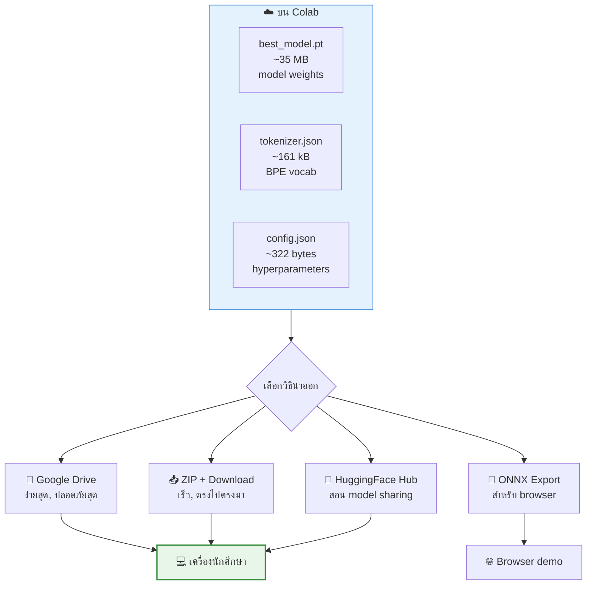
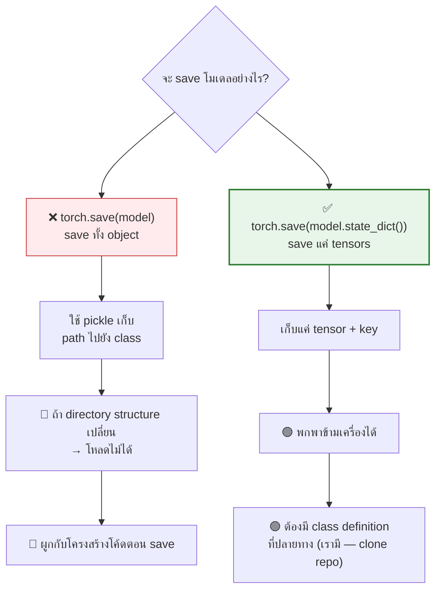
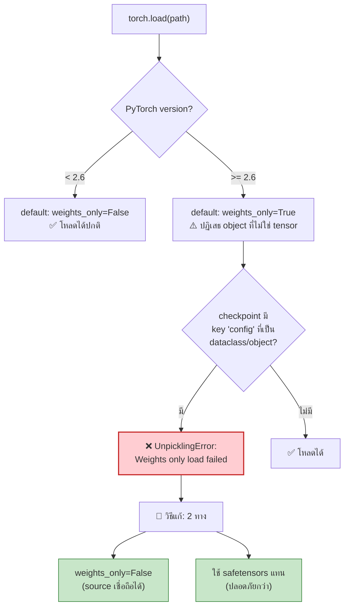
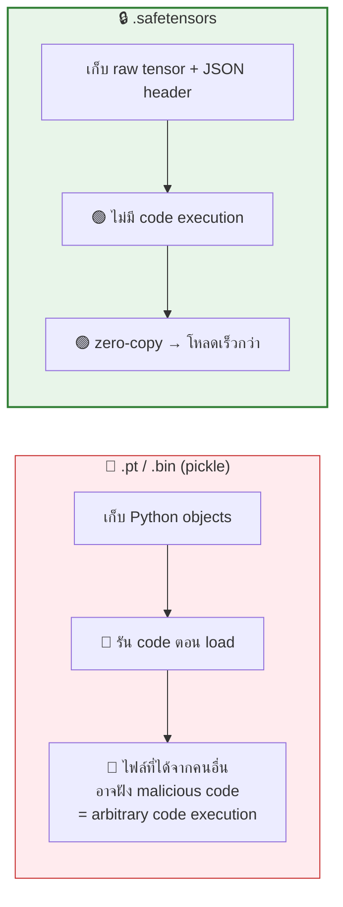
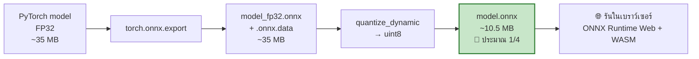
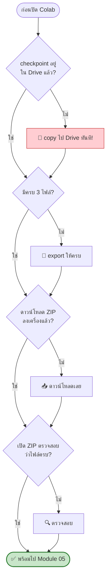

[⬅️ Module 03](03-model-training.md) | [หน้าหลัก](../README.md) | [ถัดไป: Run Local LLM ➡️](05-run-local.md)

---

# 📦 Module 04 — Export Checkpoint จาก Colab

> ⏱️ **45 นาที** · Lab ปฏิบัติบน Google Colab
> 🆕 **Module ใหม่** — นี่คือสะพานเชื่อมระหว่างเฟส Train และเฟส Run

## 🎯 Learning Objectives
- บันทึก checkpoint ในรูปแบบที่พกพาข้ามเครื่องได้
- เข้าใจความต่างระหว่าง `state_dict` กับการ save ทั้ง model object
- ใช้ safetensors เพื่อความปลอดภัย
- นำโมเดลออกจาก Colab ได้หลายวิธี

---

## 4.1 ภาพรวม: ต้องเอาอะไรกลับมาบ้าง?



### ไฟล์ที่จำเป็น 3 ไฟล์

| ไฟล์ | คืออะไร | ขนาด | จำเป็น? |
|---|---|---|---|
| `best_model.pt` / `pytorch_model.bin` | น้ำหนักโมเดล (FP32) | **~35 MB** | ✅ ต้องมี |
| `tokenizer.json` | BPE tokenizer 4,096 vocab | **~161 kB** | ✅ ต้องมี |
| `config.json` | hyperparameters | **~322 bytes** | ✅ ต้องมี |

**ทำไม 35 MB?** 8.7M parameters × 4 bytes (FP32) ≈ 34.9 MB
(LM head weight-tied กับ embedding จึงไม่นับซ้ำ)

---

## 4.2 Lab: Export แบบพกพาได้

### Cell 1 — แยก state_dict และ config

```python
import torch, json, os, shutil

EXPORT_DIR = '/content/drive/MyDrive/guppylm_workshop/export'
os.makedirs(EXPORT_DIR, exist_ok=True)

# โหลด checkpoint ที่เทรนเสร็จ
ckpt = torch.load(
    f'{CKPT_DIR}/best_model.pt',
    map_location='cpu',
    weights_only=False   # ⚠️ จำเป็น! ดูคำอธิบายด้านล่าง
)

print("Keys ใน checkpoint:", list(ckpt.keys()))

# ✅ แนะนำ: save เฉพาะ state_dict (พกพาได้ดีกว่า)
torch.save(ckpt['model_state_dict'], f'{EXPORT_DIR}/pytorch_model.bin')

# save config เป็น JSON แยก (portable ข้าม PyTorch version)
cfg = ckpt['config']
cfg_dict = cfg if isinstance(cfg, dict) else cfg.__dict__
with open(f'{EXPORT_DIR}/config.json', 'w') as f:
    json.dump(cfg_dict, f, indent=2)

# copy tokenizer
shutil.copy('data/tokenizer.json', f'{EXPORT_DIR}/tokenizer.json')

# แสดงผล
print("\n📦 ไฟล์ที่ export:")
for f in sorted(os.listdir(EXPORT_DIR)):
    size = os.path.getsize(f'{EXPORT_DIR}/{f}')
    print(f"  {f:25} {size/1024/1024:8.2f} MB")
```

**✅ ผลลัพธ์ที่ควรเห็น:**
```
Keys ใน checkpoint: ['model_state_dict', 'config']

📦 ไฟล์ที่ export:
  config.json                   0.00 MB
  pytorch_model.bin            33.28 MB
  tokenizer.json                0.15 MB
```

---

## 4.3 ทำไมต้อง state_dict ไม่ใช่ทั้ง model?



> 📖 **ตาม PyTorch documentation:** การ save ทั้ง model object ใช้ `pickle` ซึ่งเก็บ path ไปยัง class ทำให้เปราะบางมาก — ถ้าโครงสร้าง directory หรือโค้ดเปลี่ยน จะโหลดไม่ได้ การ save `state_dict` เป็นวิธีที่แนะนำ

---

## 4.4 ⚠️ กับดักสำคัญ: `weights_only` ใน PyTorch 2.6+

PyTorch 2.6 (ออก 29 มกราคม 2025) เปลี่ยน default ของ `torch.load` เป็น `weights_only=True`

จาก PyTorch 2.6 release blog:
> *"we are closing the loop on the deprecation that started in 2.4 and flipped `torch.load` to use `weights_only=True` by default"*



**GuppyLM แก้ปัญหานี้ให้แล้ว** โดยใส่ `weights_only=False` ใน `inference.py` — แต่ถ้านักศึกษาเขียนโค้ดโหลดเอง ต้องจำใส่ parameter นี้

```python
# ✅ ถูกต้อง
ckpt = torch.load(path, map_location='cpu', weights_only=False)

# ❌ จะ error บน PyTorch 2.6+
ckpt = torch.load(path, map_location='cpu')
```

---

## 4.5 ทางเลือก: safetensors (ปลอดภัยกว่า)

### Cell 2 — Export เป็น safetensors

```python
!pip install -q safetensors
from safetensors.torch import save_file

sd = ckpt['model_state_dict']
# safetensors ต้องการ contiguous tensors
sd = {k: v.contiguous() for k, v in sd.items()}
save_file(sd, f'{EXPORT_DIR}/model.safetensors')

print(f"safetensors size: {os.path.getsize(f'{EXPORT_DIR}/model.safetensors')/1024/1024:.2f} MB")
```

### ทำไมต้อง safetensors?



> 🔑 **จุดสอนสำคัญ:** เมื่อนักศึกษาแลกเปลี่ยนโมเดลกันเอง หรือดาวน์โหลดโมเดลจากอินเทอร์เน็ต ไฟล์ `.pt` เป็นความเสี่ยงด้านความปลอดภัยจริง ๆ ทีมงาน PyTorch เองก็แนะนำ safetensors สำหรับ checkpoint ที่ไม่ไว้ใจ

**โหลดกลับ:**
```python
from safetensors.torch import load_file
sd = load_file('model.safetensors')
model.load_state_dict(sd)
```

---

## 4.6 วิธีนำไฟล์ออกจาก Colab

### วิธี A — ZIP + Download (แนะนำสำหรับห้องเรียน)

```python
import shutil
from google.colab import files

shutil.make_archive('/content/guppy_export', 'zip', EXPORT_DIR)
size = os.path.getsize('/content/guppy_export.zip') / 1024 / 1024
print(f"ZIP size: {size:.2f} MB")

files.download('/content/guppy_export.zip')
```

> 💡 `files.download()` โหลดได้ทีละไฟล์เท่านั้น จึงต้อง zip รวมก่อน

### วิธี B — ผ่าน Google Drive (ปลอดภัยสุด)

ไฟล์อยู่ใน Drive แล้วตั้งแต่ตอน export — เปิด https://drive.google.com แล้วดาวน์โหลดโฟลเดอร์ `guppylm_workshop/export` ได้เลย

**ข้อดี:** ถึงแม้ Colab session ตาย ไฟล์ก็ยังอยู่

### วิธี C — HuggingFace Hub (สอน model sharing)

```python
!pip install -q huggingface_hub
from huggingface_hub import login, create_repo, upload_folder

login()   # จะขึ้น widget ให้ใส่ token (write permission)

USERNAME = "your-username"   # แก้เป็นชื่อของตัวเอง
REPO = f"{USERNAME}/my-guppy"

create_repo(REPO, exist_ok=True)
upload_folder(
    folder_path=EXPORT_DIR,
    repo_id=REPO,
    commit_message="GuppyLM from RMUTSV workshop"
)
print(f"✅ อัปโหลดแล้ว: https://huggingface.co/{REPO}")
```

**โหลดกลับที่เครื่อง local:**
```python
from huggingface_hub import hf_hub_download
p = hf_hub_download(repo_id="your-username/my-guppy", filename="pytorch_model.bin")
```

> 💡 Colab รองรับการตั้ง `HF_TOKEN` เป็น **secret** ของ notebook (ไอคอนกุญแจด้านซ้าย) เพื่อ auto-login โดยไม่ต้องพิมพ์ token ทุกครั้ง

### วิธี D — ONNX Export (สำหรับ browser)

repo มี `tools/export_onnx.py` ที่ export เป็น ONNX แล้ว quantize เป็น uint8

```python
!pip install -q onnx onnxruntime onnxscript
!python tools/export_onnx.py    # ⚠️ ตรวจ arguments จากไฟล์จริงก่อน
```



> ⚠️ **Caveat:** ยืนยันได้ว่า repo มีไฟล์ `tools/export_onnx.py` และผลลัพธ์เป็น quantized uint8 `model.onnx` ขนาดราว 10.5 MB แต่**ไม่สามารถยืนยัน CLI arguments ที่แน่นอนได้** — ผู้สอนควรเปิดไฟล์จริงดูก่อนวันสอน

---

## 4.7 Checklist ก่อนออกจาก Colab



**Checklist สำหรับนักศึกษา:**
- [ ] `pytorch_model.bin` (หรือ `best_model.pt`) — ~35 MB
- [ ] `tokenizer.json` — ~161 kB
- [ ] `config.json` — ~322 bytes
- [ ] ดาวน์โหลด ZIP ลงเครื่องแล้ว
- [ ] แตก ZIP แล้วเห็นครบ 3 ไฟล์
- [ ] (สำรอง) ไฟล์ยังอยู่ใน Google Drive

> ⚠️ **ปัญหาที่พบบ่อยที่สุดในการสอน:** นักศึกษาลืม save ก่อน session ตาย หรือดาวน์โหลดไม่ครบ 3 ไฟล์ — ย้ำ checklist นี้เป็นพิเศษ

---

## 🧪 Lab Exercises

ทำ [Lab 6](07-labs.md#lab-6--เปรียบเทียบขนาดไฟล์)

---

[⬅️ Module 03](03-model-training.md) | [หน้าหลัก](../README.md) | [ถัดไป: Run Local LLM ➡️](05-run-local.md)
