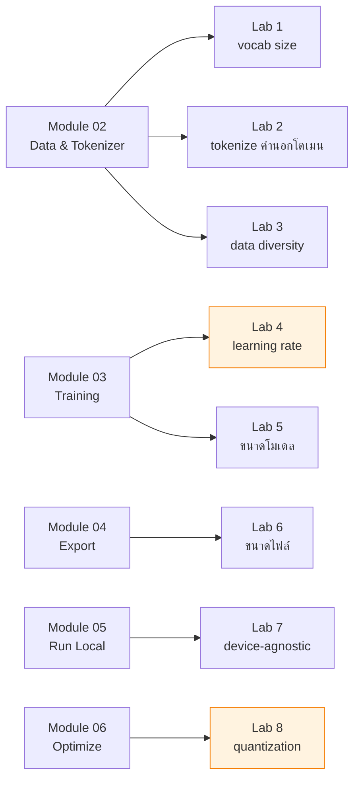

[⬅️ Module 06](06-optimize-deploy.md) | [หน้าหลัก](../README.md) | [ถัดไป: Troubleshooting ➡️](08-troubleshooting.md)

---

# 🧪 Lab Exercises

> โจทย์ปฏิบัติ 8 ข้อ เรียงตาม module — เฉลยซ่อนไว้ใน dropdown สำหรับผู้สอน

## แผนที่ Lab



---

## Lab 1 — เปลี่ยน Vocabulary Size

**🎯 เป้าหมาย:** เข้าใจ trade-off ของขนาด vocabulary

**📝 โจทย์:**
เทรน BPE tokenizer 3 ตัวด้วย `vocab_size` = 512, 2048, 4096 แล้วนำประโยคเดียวกันไป encode เปรียบเทียบจำนวน token ที่ได้

```python
from tokenizers import Tokenizer
from tokenizers.models import BPE
from tokenizers.trainers import BpeTrainer
from tokenizers.pre_tokenizers import Whitespace

def train_tok(vocab_size, path):
    tk = Tokenizer(BPE(unk_token="<unk>"))
    tk.pre_tokenizer = Whitespace()
    trainer = BpeTrainer(vocab_size=vocab_size,
        special_tokens=["<pad>","<|im_start|>","<|im_end|>","<unk>"])
    tk.train(["data/corpus.txt"], trainer)
    tk.save(path)
    return tk

text = "guppy likes swimming in clean water"
for v in [512, 2048, 4096]:
    tk = train_tok(v, f"tok_{v}.json")
    enc = tk.encode(text)
    print(f"vocab={v:5} → {len(enc.ids):2} tokens | {enc.tokens}")
```

<details>
<summary><b>💡 เฉลย / แนวคำตอบ</b></summary>

**ผลที่ควรเห็น:** vocab เล็กลง → จำนวน token มากขึ้น

```
vocab=  512 → 14 tokens | ['gu','pp','y','lik','es','sw','imm','ing',...]
vocab= 2048 →  9 tokens | ['gup','py','likes','swimming','in','clean','water']
vocab= 4096 →  7 tokens | ['guppy','likes','swimming','in','clean','water']
```

**คำอธิบาย:**
- vocab เล็ก → BPE merge ได้น้อย → 1 คำถูกแตกเป็นหลาย subword
- sequence ยาวขึ้น → ชน context limit 128 tokens เร็วขึ้น
- แต่ vocab ใหญ่เกินไปก็เปลือง parameters ใน embedding table (vocab × 384)

**คำถามต่อยอด:** ถ้า vocab = 100,000 embedding table จะมีกี่ parameters?
→ 100,000 × 384 = 38.4M — มากกว่าทั้งโมเดล GuppyLM เสียอีก!
</details>

---

## Lab 2 — Tokenize คำนอกโดเมน

**🎯 เป้าหมาย:** เห็นข้อจำกัดของ domain-specific tokenizer

**📝 โจทย์:**
ลอง encode ประโยคในโดเมน (เรื่องปลา) กับนอกโดเมน (เรื่องฟิสิกส์/ภาษาไทย) เปรียบเทียบผล

```python
tests = [
    "guppy swims in water",           # ในโดเมน
    "quantum entanglement theory",    # นอกโดเมน
    "สวัสดีครับ",                      # ภาษาไทย
]
for t in tests:
    enc = tk.encode(t)
    print(f"{t!r}\n  → {len(enc.ids)} tokens: {enc.tokens}\n")
```

<details>
<summary><b>💡 เฉลย / แนวคำตอบ</b></summary>

- **ในโดเมน:** คำเป็น token เดียว ๆ เพราะพบบ่อยใน corpus
- **นอกโดเมน:** ถูกแตกเป็นตัวอักษรหรือ subword เล็ก ๆ จำนวนมาก
- **ภาษาไทย:** แย่ที่สุด — corpus ไม่มีภาษาไทยเลย จะกลายเป็น `<unk>` หรือแตกละเอียดมาก

**บทเรียน:** tokenizer สะท้อน training corpus โดยตรง ถ้าจะทำโมเดลภาษาไทยต้องเทรน tokenizer ด้วย corpus ภาษาไทย

**เชื่อมโยง:** นี่คือเหตุผลที่ GPT-4 ใช้ vocab ~200,000 — ต้องครอบคลุมหลายภาษา + code
</details>

---

## Lab 3 — วัด Data Diversity

**🎯 เป้าหมาย:** เข้าใจว่าทำไม data ซ้ำถึงทำให้โมเดลแย่

**📝 โจทย์:**
เขียนโค้ดวัด uniqueness ของ dataset แล้วตอบว่าถ้า uniqueness ต่ำมาก (เช่น 2%) จะเกิดอะไรขึ้น

```python
outputs = ds['train']['output']
unique = len(set(outputs))
total = len(outputs)
print(f"uniqueness: {unique/total*100:.1f}%")
print(f"ซ้ำเฉลี่ย: {total/unique:.1f} ครั้ง/คำตอบ")
```

<details>
<summary><b>💡 เฉลย / แนวคำตอบ</b></summary>

GuppyLM ที่ 60,000 samples มี ~16,000 unique outputs = **~27% uniqueness** (ซ้ำเฉลี่ย ~4 ครั้ง)

เวอร์ชันแรกที่มีแค่ 10 templates ต่อหัวข้อ ซ้ำถึง **~400 ครั้ง/คำตอบ**

**ถ้า uniqueness ต่ำมาก:**
1. โมเดล **memorize** คำตอบแทนที่จะเรียนรู้ pattern
2. training loss ลดสวยงาม แต่ตอบคำถามใหม่ไม่ได้
3. คำตอบซ้ำเดิมทุกครั้งแม้เปลี่ยน temperature
4. เป็น overfitting รูปแบบหนึ่ง

**วิธีแก้:** ใช้ template composition — สุ่มประกอบส่วนย่อยแทนที่จะเขียน template ตายตัว
</details>

---

## Lab 4 — ปรับ Learning Rate

**🎯 เป้าหมาย:** เห็นผลของ LR ต่อการ converge (⚠️ ใช้เวลาเทรน — ลด `max_steps` เหลือ ~500)

**📝 โจทย์:**
เทรน 3 ครั้งด้วย `learning_rate` = 3e-5, 3e-4 (default), 3e-3 บันทึก loss ที่ step 500 เปรียบเทียบ

<details>
<summary><b>💡 เฉลย / แนวคำตอบ</b></summary>

| LR | พฤติกรรมที่คาดหวัง |
|---|---|
| **3e-5** (ต่ำ 10×) | loss ลดช้ามาก ยังสูงอยู่ที่ step 500 — เทรนได้แต่ไม่คุ้มเวลา |
| **3e-4** (default) ⭐ | loss ลดเร็วและเสถียร |
| **3e-3** (สูง 10×) | loss แกว่งรุนแรง หรือกลายเป็น **NaN** — gradient ระเบิด |

**คำอธิบาย:**
- LR สูงเกิน → step ใหญ่เกิน กระโดดข้ามจุดต่ำสุด → diverge
- LR ต่ำเกิน → step เล็กเกิน ใช้เวลานานมากกว่าจะถึงจุดต่ำสุด
- `grad_clip=1.0` ช่วยกัน NaN ได้ระดับหนึ่ง แต่ไม่ช่วยถ้า LR สูงมาก

**สังเกตเพิ่ม:** warmup 200 steps ช่วยให้ช่วงต้นเสถียร — ลองตั้ง `warmup_steps=0` แล้วดูว่าต่างไหม
</details>

---

## Lab 5 — ปรับขนาดโมเดล

**🎯 เป้าหมาย:** เห็น trade-off ระหว่างขนาดโมเดล เวลาเทรน และคุณภาพ

**📝 โจทย์:**
เทรนด้วย `n_layers` = 1, 3, 6 (แนะนำลด `max_steps` เหลือ 1000) บันทึก parameters, เวลาเทรน, eval loss

| n_layers | Parameters | เวลาเทรน | Eval loss |
|---|---|---|---|
| 1 | | | |
| 3 | | | |
| 6 | | | |

<details>
<summary><b>💡 เฉลย / แนวคำตอบ</b></summary>

**แนวโน้มที่ควรเห็น:**
- layers มากขึ้น → parameters มากขึ้น → **เวลาเทรนเพิ่มขึ้นเชิงเส้นตาม layers**
- layers มากขึ้น → eval loss ต่ำลง (จนถึงจุดหนึ่ง)
- แต่ผลตอบแทนลดลง (diminishing returns) — จาก 3→6 layers อาจดีขึ้นน้อยกว่าจาก 1→3

**บทเรียน:** การเพิ่มขนาดโมเดลไม่ได้ให้ผลดีเป็นสัดส่วนตรงเสมอไป ต้องสมดุลกับปริมาณและคุณภาพของ data ด้วย (scaling laws)

**คำถามต่อยอด:** ถ้ามี data แค่ 1,000 ตัวอย่าง การเพิ่ม layers เป็น 12 จะช่วยไหม?
→ ไม่ — จะ overfit หนักขึ้น
</details>

---

## Lab 6 — เปรียบเทียบขนาดไฟล์

**🎯 เป้าหมาย:** เข้าใจว่าน้ำหนักโมเดลกินพื้นที่เท่าไหร่ในแต่ละ format

**📝 โจทย์:**
เปรียบเทียบขนาดของ `best_model.pt` (FP32), `model.safetensors`, และ quantized ONNX แล้วอธิบายว่าทำไมถึงต่างกัน

<details>
<summary><b>💡 เฉลย / แนวคำตอบ</b></summary>

| Format | ขนาด | เหตุผล |
|---|---|---|
| `best_model.pt` (FP32) | ~35 MB | 8.7M params × 4 bytes |
| `model.safetensors` (FP32) | ~35 MB | **เท่ากัน** — เก็บ FP32 เหมือนกัน ต่างที่ความปลอดภัย ไม่ใช่ขนาด |
| `model.onnx` (uint8) | ~10.5 MB | 8.7M × 1 byte + overhead ≈ **1/4** |

**จุดที่นักศึกษามักเข้าใจผิด:** safetensors ไม่ได้ทำให้ไฟล์เล็กลง — ข้อดีคือ**ความปลอดภัย** (ไม่มี code execution ตอนโหลด) และ**ความเร็วในการโหลด** (zero-copy)

**การคำนวณ:** 8,700,000 params × 4 bytes = 34,800,000 bytes ≈ 33.2 MiB ≈ 34.8 MB
</details>

---

## Lab 7 — Device-Agnostic Script

**🎯 เป้าหมาย:** เขียนโค้ดที่รันได้ทุกเครื่อง

**📝 โจทย์:**
เขียนฟังก์ชัน `pick_device()` ที่เลือก cuda → mps → cpu ตามลำดับ แล้วทดสอบว่าโหลด checkpoint ที่เทรนบน GPU มารันบน CPU ได้

**คำถามเพิ่ม:** ถ้าลบ `map_location` ออกจะเกิดอะไรขึ้นบนเครื่องที่ไม่มี GPU?

<details>
<summary><b>💡 เฉลย / แนวคำตอบ</b></summary>

```python
import torch

def pick_device() -> str:
    if torch.cuda.is_available():
        return "cuda"
    mps = getattr(torch.backends, "mps", None)
    if mps is not None and mps.is_available():
        return "mps"
    return "cpu"
```

**จุดสำคัญ 3 ข้อ:**
1. ใช้ `getattr(torch.backends, "mps", None)` เพราะ PyTorch เวอร์ชันเก่าอาจไม่มี attribute นี้เลย → จะ AttributeError
2. `map_location` จำเป็น — ไม่งั้นจะได้ error:
   ```
   RuntimeError: Attempting to deserialize object on a CUDA device
   but torch.cuda.is_available() is False.
   ```
3. `weights_only=False` จำเป็นบน PyTorch 2.6+ เพราะ checkpoint มี key `config` ที่ไม่ใช่ tensor

**คำถามต่อยอด:** ทำไม `map_location` ถึงจำเป็น?
→ เพราะ PyTorch บันทึก **device ที่ tensor อยู่** ไปกับไฟล์ด้วย ตอนโหลดจะพยายามวางกลับที่ device เดิม
</details>

---

## Lab 8 — Quantization

**🎯 เป้าหมาย:** วัดผลจริงของ INT8 quantization

**📝 โจทย์:**
1. วัด tokens/second ของโมเดล FP32
2. ทำ dynamic quantization เป็น INT8
3. วัด tokens/second อีกครั้ง
4. ถามคำถามเดิม 5 ข้อกับทั้งสองเวอร์ชัน เทียบคุณภาพคำตอบ

| | FP32 | INT8 | ต่างกัน |
|---|---|---|---|
| ขนาดไฟล์ | | | |
| tokens/s | | | |
| คุณภาพคำตอบ | | | |

<details>
<summary><b>💡 เฉลย / แนวคำตอบ</b></summary>

**ผลที่คาดหวัง:**
- **ขนาด:** ลดลงประมาณ 4× (PyTorch docs ระบุว่า INT8 quantization ลดขนาดโมเดลได้ ~4×)
- **ความเร็ว:** เร็วขึ้น แต่ตัวเลขจริงขึ้นกับ CPU — บน x86 ที่รองรับ PyTorch 2.0+ x86 backend วัด geomean speedup ได้ **2.97×** เทียบ FP32
- **คุณภาพ:** อาจแย่ลงเล็กน้อย — ให้สังเกตว่าคำตอบยัง coherent ไหม

**จุดที่ควรเน้นในห้อง:**
โมเดล 8.7M เล็กมาก อาจ sensitive ต่อ quantization มากกว่าโมเดลใหญ่ เพราะมี redundancy น้อยกว่า ถ้าคำตอบแย่ลงชัดเจน ให้บอกนักศึกษาว่านี่คือ trade-off จริงที่วิศวกรต้องตัดสินใจ

**คำถามต่อยอด:** ในงานจริง เมื่อไหร่ควรใช้ quantization?
→ เมื่อ latency/ขนาดสำคัญกว่า accuracy เล็กน้อย เช่น deploy บน edge device หรือ mobile
</details>

---

## 🏆 Challenge Exercise (นอกเวลา)

**สร้าง LLM บุคลิกใหม่ของตัวเอง**

1. แก้ `generate_data.py` เปลี่ยนจากปลาเป็นตัวละครใหม่ (แมว / หุ่นยนต์ / ผู้ช่วย domain วิศวกรรม)
2. ใช้ **template composition** ให้ได้ uniqueness > 25%
3. เทรนใหม่บน Colab
4. รันบนเครื่องตัวเอง
5. เขียนรายงานสั้น ๆ ว่าเปลี่ยนอะไรบ้าง และผลเป็นอย่างไร

<details>
<summary><b>💡 คำใบ้สำหรับผู้สอน</b></summary>

**จุดที่นักศึกษามักพลาด:**
- เขียน template ตายตัวไม่กี่แบบ → uniqueness ต่ำ → โมเดลตอบซ้ำ
- ลืมเปลี่ยน special tokens หรือ format
- ใช้ vocab size ไม่เหมาะกับ domain ใหม่

**บทเรียนที่ต้องการให้ได้:**
architecture, tokenizer code, training loop **เหมือนเดิมทุกอย่าง** — เปลี่ยนแค่ data โมเดลก็กลายเป็นคนละตัว
นี่คือหลักการ **"the model is the data"** ที่สำคัญที่สุดของ Module นี้
</details>

---

[⬅️ Module 06](06-optimize-deploy.md) | [หน้าหลัก](../README.md) | [ถัดไป: Troubleshooting ➡️](08-troubleshooting.md)
