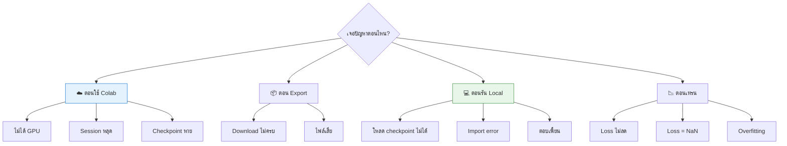
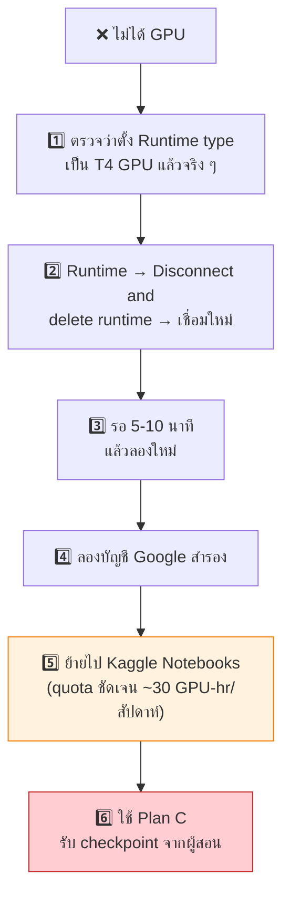
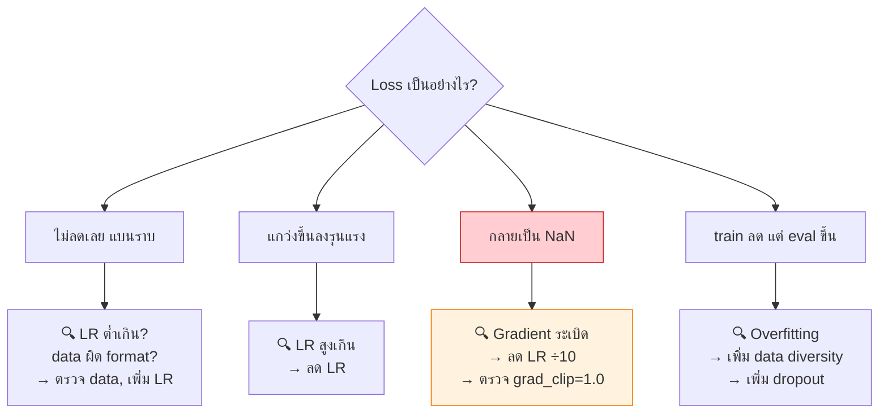

[⬅️ Lab Exercises](07-labs.md) | [หน้าหลัก](../README.md) | [ถัดไป: Assessment ➡️](09-assessment.md)

---

# 🔧 Troubleshooting Guide

> ปัญหาที่พบบ่อยในเวิร์กช็อป เรียงตามเฟส

## 🗺️ Decision Tree



---

## ☁️ ปัญหาบน Google Colab

### Colab ไม่ให้ GPU

**อาการ:** `!nvidia-smi` ไม่แสดงผล หรือขึ้นว่าไม่พบ GPU

**สาเหตุ:** Colab free tier **ไม่การันตี GPU** ตาม [Colab FAQ](https://research.google.com/colaboratory/faq.html) — Google ระบุว่า usage limits, GPU types available และปัจจัยอื่น ๆ "vary over time" และ "Colab does not publish these limits"

**วิธีแก้เรียงตามลำดับ:**



> 💡 **ป้องกันไว้ก่อน:** อย่าให้นักศึกษาทั้งห้องกด Run พร้อมกัน — ให้เหลื่อมเวลากันเล็กน้อย

---

### Session หลุดกลางเทรน

**อาการ:** Colab disconnect, ต้องเริ่มใหม่

**สาเหตุ:**
- Idle timeout (Google ไม่เผยแพร่ตัวเลข แต่ community รายงานราว 90 นาที)
- เกินเพดาน 12 ชั่วโมง (Google FAQ ระบุว่า notebooks รันได้ "at most 12 hours")
- Runtime reset จากฝั่ง Google
- Network ของผู้ใช้หลุด

**วิธีแก้:**
| ✅ ควรทำ | ❌ ไม่ควรทำ |
|---|---|
| Checkpoint ลง Google Drive ทุก 500 steps | ใช้ JavaScript auto-click กัน idle timeout |
| เปิด browser tab ทิ้งไว้ active | ปิดฝา laptop ระหว่างเทรน |
| เริ่มเทรนก่อนพักเที่ยง | ปล่อย notebook นิ่งนาน ๆ |
| Resume จาก checkpoint เมื่อหลุด | รันหลายบัญชีบนเครื่องเดียว |

> ⚠️ **เหตุผลที่ไม่ควรใช้ auto-click:** การ bypass usage policy ขัดกับ Terms of Service ของ Google และอาจทำให้บัญชีถูกระงับ — Colab ระบุว่าจะ terminate runtime ของผู้ที่พยายาม bypass notebook UI

---

### Checkpoint หายหมด

**อาการ:** หลัง runtime reset ไม่เหลืออะไรเลย

**สาเหตุ:** save ไว้ที่ `/content/` ซึ่งเป็น **ephemeral storage**

**วิธีแก้ (ป้องกันเท่านั้น — กู้ไม่ได้):**
```python
# ❌ ผิด
output_dir = "checkpoints"                                    # → /content/checkpoints

# ✅ ถูก
output_dir = "/content/drive/MyDrive/guppylm_workshop/checkpoints"
```

> 🔴 **นี่คือปัญหาที่สร้างความเสียหายมากที่สุดในเวิร์กช็อป** — ย้ำเรื่องนี้ตั้งแต่ Module 02

---

## 📦 ปัญหาตอน Export

### Download ไม่ครบ / ไฟล์เสีย

**อาการ:** แตก ZIP แล้วไม่เจอไฟล์ครบ 3 ไฟล์ หรือขนาดไฟล์ผิดปกติ

**วิธีตรวจสอบ:**
```python
import os
for f in sorted(os.listdir(EXPORT_DIR)):
    size = os.path.getsize(f'{EXPORT_DIR}/{f}')
    print(f"{f:25} {size:>12,} bytes")
```

**ขนาดที่ควรเป็น:**
| ไฟล์ | ขนาดที่คาดหวัง |
|---|---|
| `pytorch_model.bin` | ~35 MB (≈33 MiB) |
| `tokenizer.json` | ~161 kB |
| `config.json` | ~322 bytes |

**ถ้าไฟล์เล็กผิดปกติ:** แสดงว่า save ไม่สำเร็จ ให้ export ใหม่

**ทางเลือกที่เสถียรกว่า download:** ดาวน์โหลดตรงจาก Google Drive แทน — ไฟล์อยู่ที่นั่นแล้ว

---

## 💻 ปัญหาตอนรัน Local

### ❌ `UnpicklingError: Weights only load failed`

**สาเหตุ:** PyTorch 2.6+ เปลี่ยน default เป็น `weights_only=True`

```python
# ✅ วิธีแก้
ckpt = torch.load(path, map_location="cpu", weights_only=False)
```

> อ้างอิง PyTorch 2.6 release blog: *"we are closing the loop on the deprecation that started in 2.4 and flipped `torch.load` to use `weights_only=True` by default"*

---

### ❌ `Attempting to deserialize object on a CUDA device`

**สาเหตุ:** checkpoint เทรนบน GPU แต่เครื่องนี้ไม่มี GPU

```python
# ✅ วิธีแก้
ckpt = torch.load(path, map_location="cpu", weights_only=False)
```

---

### ❌ PyTorch version mismatch

**อาการ:** โหลด state_dict แล้ว error เรื่อง key ไม่ตรง หรือ deserialize ไม่ได้

**วิธีแก้:**
1. ตรวจเวอร์ชันทั้ง 2 ฝั่ง
   ```python
   import torch; print(torch.__version__)
   ```
2. Pin version ให้ตรงกัน
   ```bash
   pip install torch==2.6.0 --index-url https://download.pytorch.org/whl/cpu
   ```
3. ใช้ `state_dict` แทนการ save ทั้ง model (พกพาได้ดีกว่า)
4. หรือใช้ safetensors ซึ่งไม่ผูกกับ PyTorch pickle protocol

---

### ❌ `FileNotFoundError: data/tokenizer.json`

**สาเหตุ:** path ผิด หรือไฟล์ไม่ได้วางในตำแหน่งที่ควร

**วิธีตรวจ:**
```bash
# ตรวจว่าอยู่ directory ไหน
pwd
# ตรวจว่ามีไฟล์จริงไหม
ls -lh checkpoints/ data/
```

**โครงสร้างที่ถูกต้อง:**
```
my-guppy/
├── checkpoints/best_model.pt
├── data/tokenizer.json
└── chat.py                  ← รันจากที่นี่
```

---

### ❌ `ModuleNotFoundError: No module named 'guppylm'`

**สาเหตุ:** รัน script จาก directory ผิด หรือยังไม่ได้ clone repo

**วิธีแก้:**
```bash
cd my-guppy       # ต้องอยู่ใน directory ที่มีโฟลเดอร์ guppylm/
python chat.py
```

---

### ⚠️ คำตอบเพี้ยน / ซ้ำวนไปมา

| อาการ | สาเหตุ | วิธีแก้ |
|---|---|---|
| ตอบซ้ำคำเดิมวนไปมา | `top_k` ต่ำเกิน / temperature ต่ำเกิน | เพิ่ม `temperature` เป็น 0.8–1.0, `top_k` = 50 |
| ตอบมั่วไม่เป็นภาษา | temperature สูงเกิน | ลด temperature เป็น 0.5–0.7 |
| คุยหลายรอบแล้วแย่ลง | context เกิน 128 tokens | ใช้ single-turn (ไม่ส่ง history) |
| ตอบสั้นเกิน | max_tokens ต่ำ / เจอ EOS เร็ว | เพิ่ม `max_tokens` |
| ไม่เข้าใจคำถามนอกโดเมน | โมเดลเทรนเฉพาะเรื่องปลา | ✅ ปกติ — 8.7M ทำได้แค่นี้ |

> 💡 **สำคัญที่ต้องบอกนักศึกษา:** README ของ GuppyLM ระบุตรง ๆ ว่าโมเดล 9M **ไม่สามารถ conditionally follow instructions ได้** บุคลิกฝังอยู่ใน weights จาก training data ล้วน ๆ — อย่าคาดหวังว่าจะทำงานเหมือน ChatGPT

---

## 📉 ปัญหาตอนเทรน



### ค่าอ้างอิงที่ควรจำ

| ค่า | ความหมาย |
|---|---|
| **loss เริ่มต้น ≈ 8.3** | = ln(4096) → โมเดลเดามั่วสุ่มเท่ากันทุก token (ถูกต้อง) |
| loss เริ่มต้น > 12 | ⚠️ initialization ผิดปกติ |
| loss < 1.0 | โมเดลเรียนรู้ได้ดีแล้ว |
| loss → 0.0 | ⚠️ อาจ overfit (โดยเฉพาะถ้า eval loss ขึ้น) |

---

## 🆘 เมื่อทุกอย่างล้มเหลว

ไปที่ [**Plan C — แผนสำรองฉุกเฉิน**](../instructor/PLAN-C.md)

สรุปย่อ: ผู้สอนมี checkpoint สำเร็จรูปแจกผ่าน USB / LAN / HuggingFace → นักศึกษาข้ามเฟส Train ไปทำเฟส Run ได้เลย ยังได้เรียนรู้ deployment ครบ

---

## 📋 Quick Reference — คำสั่งตรวจสอบ

```bash
# ตรวจ environment
python --version
python -c "import torch; print(torch.__version__, torch.cuda.is_available())"

# ตรวจไฟล์
ls -lh checkpoints/ data/

# ตรวจ checkpoint ข้างใน
python -c "
import torch
c = torch.load('checkpoints/best_model.pt', map_location='cpu', weights_only=False)
print('keys:', list(c.keys()))
print('params:', sum(v.numel() for v in c['model_state_dict'].values()))
"
```

---

[⬅️ Lab Exercises](07-labs.md) | [หน้าหลัก](../README.md) | [ถัดไป: Assessment ➡️](09-assessment.md)
