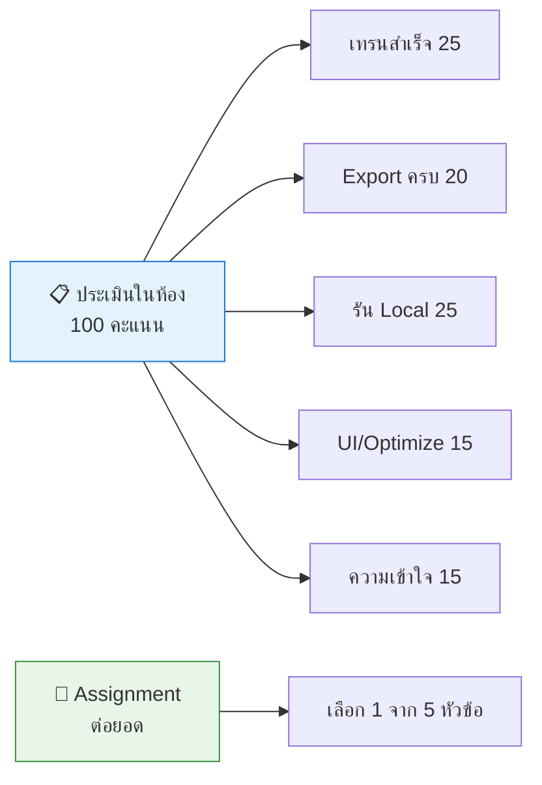
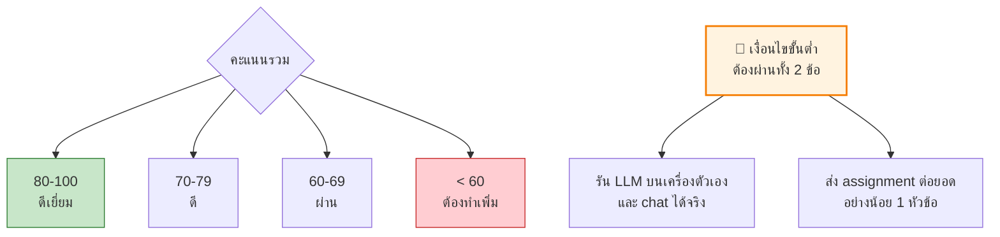
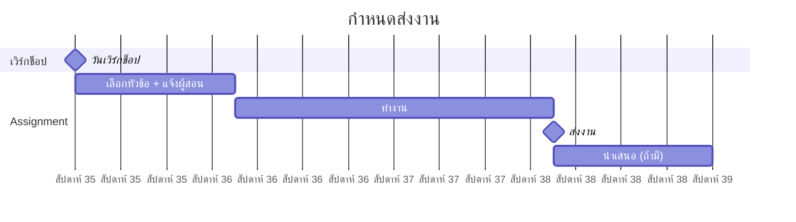

[⬅️ Troubleshooting](08-troubleshooting.md) | [หน้าหลัก](../README.md) | [ถัดไป: References ➡️](10-references.md)

---

# 📊 การประเมินผลและ Assignment ต่อยอด

## 🎯 ภาพรวมการประเมิน

---

## 📋 เกณฑ์ประเมินในห้อง (100 คะแนน)

### 1. เทรนโมเดลสำเร็จ (25 คะแนน)

| เกณฑ์ | คะแนน |
|---|---|
| เทรนจนจบ (หรือถึง checkpoint ที่ใช้ได้) | 10 |
| แสดง loss curve ที่ลดลงได้ | 10 |
| อธิบายได้ว่าทำไม loss เริ่มต้นถึงประมาณ 8.3 | 5 |

> 💡 นักศึกษาที่ใช้ Plan C (รับ checkpoint จากผู้สอน) ได้คะแนนส่วนนี้ถ้าอธิบายกระบวนการเทรนได้ถูกต้อง — ไม่ควรลงโทษเพราะ Colab ไม่ให้ GPU

### 2. Export Checkpoint (20 คะแนน)

| เกณฑ์ | คะแนน |
|---|---|
| Export ครบ 3 ไฟล์ (model, tokenizer, config) | 10 |
| ดาวน์โหลดลงเครื่องสำเร็จ ขนาดไฟล์ถูกต้อง | 5 |
| อธิบายได้ว่าทำไมต้อง save `state_dict` ไม่ใช่ทั้ง model | 5 |

### 3. รัน Local LLM (25 คะแนน)

| เกณฑ์ | คะแนน |
|---|---|
| รันโมเดลบนเครื่องตัวเองและ chat ได้ | 10 |
| เขียน `pick_device()` แบบ device-agnostic ได้ | 8 |
| อธิบาย `map_location` และ `weights_only` ได้ | 7 |

### 4. UI หรือ Optimization (15 คะแนน)

เลือกทำอย่างใดอย่างหนึ่ง:

| ตัวเลือก | คะแนน |
|---|---|
| สร้าง Gradio Web UI ใช้งานได้ | 15 |
| ทำ INT8 quantization + วัดผลเทียบ FP32 | 15 |
| Export ONNX สำเร็จ | 15 |

### 5. คำถามความเข้าใจ (15 คะแนน)

ตัวอย่างคำถาม (เลือก 5 ข้อ ข้อละ 3 คะแนน):

1. ทำไม GuppyLM ใช้ vocabulary แค่ 4,096 ในขณะที่ GPT-2 ใช้ 50,257?
2. Causal mask ทำอะไร และทำไมจำเป็น?
3. Weight tying คืออะไร ช่วยประหยัดอะไร?
4. ทำไมต้องมี warmup ก่อน cosine decay?
5. temperature กับ top_k ต่างกันอย่างไร?
6. ทำไม AMP ถึงถูก gate ไว้เฉพาะ CUDA?
7. safetensors ปลอดภัยกว่า `.pt` อย่างไร?
8. ถ้าเปลี่ยน training data จากปลาเป็นแมว ต้องแก้ architecture ไหม?

<b>💡 เฉลยสำหรับผู้สอน</b>

1. **vocab 4,096:** เพราะ domain แคบมาก (เรื่องปลาเท่านั้น) vocab ใหญ่กว่านี้จะเปลือง parameters ใน embedding table โดยไม่ได้ประโยชน์
2. **Causal mask:** ป้องกันไม่ให้ token มองเห็นอนาคต จำเป็นเพราะตอน generate จริงโมเดลยังไม่รู้อนาคต ถ้าตอนเทรนมองได้จะ "โกง" ลอกคำตอบ
3. **Weight tying:** ใช้ weight เดียวกันระหว่าง token embedding และ LM head ประหยัด parameters เท่ากับ vocab_size × d_model = 4096 × 384 ≈ 1.57M
4. **Warmup:** ตอนเริ่มเทรน weights ยังสุ่ม ถ้า LR สูงทันทีจะทำให้ gradient ระเบิดหรือ diverge ค่อย ๆ เพิ่มจะเสถียรกว่า
5. **temperature vs top_k:** temperature ปรับ**รูปร่างของ distribution** (หาร logits) ส่วน top_k **ตัดตัวเลือก**ให้เหลือ K ตัวที่น่าจะเป็นสูงสุด ทำงานคนละขั้นตอน
6. **AMP gate:** FP16/BF16 acceleration ต้องอาศัย Tensor Cores บน NVIDIA GPU บน CPU ไม่มีประโยชน์และอาจช้าลง จึง fallback เป็น FP32
7. **safetensors:** `.pt` ใช้ pickle ซึ่งรัน Python code ตอนโหลด → เสี่ยง arbitrary code execution ส่วน safetensors เก็บแค่ raw tensor + JSON header ไม่มี code execution และโหลดเร็วกว่า (zero-copy)
8. **เปลี่ยน data:** ไม่ต้องแก้ architecture เลย — เปลี่ยนแค่ training data โมเดลก็เปลี่ยนบุคลิก นี่คือหลักการ "the model is the data"

---

## 🎓 เกณฑ์ผ่าน

---

## 📝 Assignment ต่อยอด (เลือก 1 หัวข้อ)

### หัวข้อ 1 — สร้าง Personality ใหม่ 🎭

**สิ่งที่ต้องทำ:**
1. แก้ `generate_data.py` เปลี่ยนตัวละครและ domain
2. ใช้ template composition ให้ได้ uniqueness > 25%
3. เทรนใหม่ + export + รันบนเครื่อง
4. เขียนรายงาน 2–3 หน้า

**สิ่งที่ต้องส่ง:**
- โค้ด `generate_data.py` ที่แก้แล้ว
- ตัวอย่างบทสนทนา 10 ชุด
- รายงานอธิบายว่าเปลี่ยนอะไร ผลเป็นอย่างไร uniqueness เท่าไหร่

**เกณฑ์:** ความคิดสร้างสรรค์ 30% · คุณภาพ data 40% · คุณภาพรายงาน 30%

---

### หัวข้อ 2 — Scale Up 📈

**สิ่งที่ต้องทำ:**
เทรน 3 ขนาด (เช่น ~2M / ~8.7M / ~25M params) เปรียบเทียบ:

| Model | Params | เวลาเทรน | Final loss | คุณภาพคำตอบ |
|---|---|---|---|---|
| Small | | | | |
| Base (default) | | | | |
| Large | | | | |

**สิ่งที่ต้องส่ง:** ตารางเปรียบเทียบ + กราฟ loss curve + วิเคราะห์ scaling behavior

---

### หัวข้อ 3 — Deploy จริง 🚀

**สิ่งที่ต้องทำ:**
1. Upload โมเดลขึ้น HuggingFace Hub พร้อม model card
2. สร้าง HuggingFace Space (Gradio) ให้คนอื่นเข้าใช้ได้
3. หรือ export ONNX + host browser demo บน GitHub Pages

**สิ่งที่ต้องส่ง:** ลิงก์ที่เข้าใช้งานได้จริง + README อธิบายวิธีใช้

---

### หัวข้อ 4 — Optimization Report ⚙️

**สิ่งที่ต้องทำ:**
วัด latency และคุณภาพของ FP32 / INT8 quantized / ONNX Runtime บนเครื่องตัวเอง

**สิ่งที่ต้องส่ง:**
- ตารางเปรียบเทียบ (ขนาดไฟล์, tokens/s, คุณภาพคำตอบ)
- กราฟ
- ข้อสรุปว่าควรเลือกแบบไหนในสถานการณ์ใด

---

### หัวข้อ 5 — เขียนสรุปเชิงเทคนิค 📄

**สิ่งที่ต้องทำ:**
เขียนบทความ 3–5 หน้าอธิบาย pipeline ของ LLM ทั้งหมด**ด้วยคำพูดของตัวเอง** พร้อม diagram ที่วาดเอง

**หัวข้อที่ต้องครอบคลุม:**
- Tokenization (BPE)
- Embedding + Positional encoding
- Multi-head attention + causal masking
- FFN, LayerNorm, residual
- Training loop (loss, optimizer, LR schedule)
- Sampling (temperature, top-k)
- Deployment (checkpoint, quantization)

**เกณฑ์:** ความถูกต้องทางเทคนิค 50% · ความชัดเจนของการอธิบาย 30% · คุณภาพ diagram 20%

> ⚠️ ห้ามคัดลอกจากเอกสารนี้โดยตรง — ต้องเขียนใหม่ด้วยความเข้าใจของตัวเอง

---

## 📅 Timeline ที่แนะนำ

---

## 🎁 Bonus Points

| กิจกรรม | คะแนนพิเศษ |
|---|---|
| ช่วยเพื่อนแก้ปัญหาในห้องเรียน | +5 |
| พบและรายงาน bug ในเอกสารนี้ | +5 |
| ทำ assignment มากกว่า 1 หัวข้อ | +10 |
| นำเสนอผลงานหน้าชั้น | +10 |
| ส่ง Pull Request ปรับปรุงเอกสารนี้ | +10 |

---

[⬅️ Troubleshooting](08-troubleshooting.md) | [หน้าหลัก](../README.md) | [ถัดไป: References ➡️](10-references.md)
