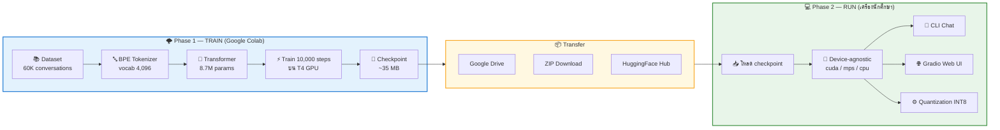

# 🐟 Workshop: Build & Train an LLM from Scratch

> เอกสารประกอบการสอนเวิร์กช็อป 1 วัน — สร้างและเทรน Large Language Model ตั้งแต่ศูนย์
> ใช้ [GuppyLM](https://github.com/arman-bd/guppylm) (8.7M parameters, MIT License) เป็นต้นแบบการเรียนรู้

**สาขาวิศวกรรมคอมพิวเตอร์ มหาวิทยาลัยเทคโนโลยีราชมงคลศรีวิชัย (RMUTSV)**

---

## 📋 ข้อมูลเวิร์กช็อป

| หัวข้อ | รายละเอียด |
|---|---|
| ระยะเวลา | 1 วันเต็ม (6–7 ชั่วโมง) |
| พื้นฐานที่ต้องมี | เขียน Python ได้ระดับพื้นฐาน (ไม่ต้องเคยใช้ PyTorch) |
| อุปกรณ์ | Laptop/PC + Internet + บัญชี Google |
| สถาปัตยกรรม | **Train on Cloud → Run on Local** (2 เฟส) |
| ผลลัพธ์ | นักศึกษาได้ LLM ของตัวเอง รันบนเครื่องตัวเองได้จริง |

---

## 🎯 แนวคิดหลัก: Train on Cloud, Run on Local



**ทำไมต้องแยก 2 เฟส?**
เครื่องในห้องเรียนส่วนใหญ่ไม่มี GPU ถ้าเทรนบนเครื่องจะช้ามากจนเทรนไม่ครบ steps ได้โมเดลคุณภาพต่ำ การแยกเฟสทำให้นักศึกษาได้เรียนรู้ **ทั้ง** training infrastructure (GPU, AMP, LR schedule, checkpointing) **และ** deployment (โหลด checkpoint, device-agnostic inference, quantization, UI) — ตรงกับการทำงานจริงในอุตสาหกรรมที่แยก training environment ออกจาก serving environment

---

## 📚 สารบัญเอกสาร

### เริ่มต้นที่นี่
| # | เอกสาร | เนื้อหา | เวลา |
|---|---|---|---|
| — | [📖 คู่มือผู้สอน](instructor/INSTRUCTOR_GUIDE.md) | สิ่งที่ผู้สอนต้องเตรียมล่วงหน้า | — |
| — | [✅ Pre-class Checklist](docs/00-preparation.md) | เตรียมเครื่อง + บัญชีก่อนวันเรียน | 30 นาที |

### Module การสอน
| # | Module | เนื้อหา | เวลา |
|---|---|---|---|
| 01 | [LLM Fundamentals](docs/01-llm-fundamentals.md) | LLM ทำงานอย่างไร, tokenizer, attention | 60 นาที |
| 02 | [Data & Tokenizer](docs/02-data-tokenizer.md) | Dataset, BPE, ChatML format | 75 นาที |
| 03 | [Model & Training](docs/03-model-training.md) | อ่านโค้ด model.py, training loop, เทรนจริง | 75 นาที |
| 04 | [Export Checkpoint](docs/04-export-checkpoint.md) | บันทึกและนำโมเดลออกจาก Colab | 45 นาที |
| 05 | [Run Local LLM](docs/05-run-local.md) | รันโมเดลบนเครื่องตัวเอง | 60 นาที |
| 06 | [Optimize & Deploy](docs/06-optimize-deploy.md) | Quantization, ONNX, Web UI | 30 นาที |

### เอกสารประกอบ
| เอกสาร | เนื้อหา |
|---|---|
| [🧪 Lab Exercises](docs/07-labs.md) | โจทย์ปฏิบัติ 8 ข้อ พร้อมเฉลย |
| [🔧 Troubleshooting](docs/08-troubleshooting.md) | ปัญหาที่พบบ่อยและวิธีแก้ |
| [📊 Assessment](docs/09-assessment.md) | เกณฑ์ประเมิน + assignment ต่อยอด |
| [🔗 References](docs/10-references.md) | แหล่งอ้างอิงและเรียนต่อ |
| [🚨 Plan C](instructor/PLAN-C.md) | แผนสำรองเมื่อ Colab ใช้ไม่ได้ |

### โค้ดพร้อมใช้
| ไฟล์ | ใช้ที่ไหน |
|---|---|
| [`code/colab/`](code/colab/) | Cells สำหรับ Google Colab |
| [`code/local/`](code/local/) | Scripts สำหรับรันบนเครื่อง |

---

## ⏱️ Rundown เวิร์กช็อป

```mermaid
gantt
    title ตารางเวิร์กช็อป 1 วัน
    dateFormat HH:mm
    axisFormat %H:%M

    section เช้า
    M0 Setup & Intro         :m0, 09:00, 30m
    M1 LLM Fundamentals      :m1, 09:30, 60m
    พักเบรก                   :done, b1, 10:30, 15m
    M2 Data & Tokenizer      :m2, 10:45, 75m

    section พักเที่ยง
    เริ่ม Training ทิ้งไว้     :crit, t1, 12:00, 60m

    section บ่าย
    M3 Model & Training      :m3, 13:00, 75m
    M4 Export Checkpoint     :m4, 14:15, 45m
    พักเบรก                   :done, b2, 15:00, 15m
    M5 Run Local LLM         :m5, 15:15, 60m
    M6 Optimize & Deploy     :m6, 16:15, 30m
    Wrap-up & Q&A            :m7, 16:45, 15m
```



> 💡 **เคล็ดลับสำคัญ:** เริ่ม training cell **ก่อนพักเที่ยง** เพื่อไม่เสียเวลาเรียนไปกับการรอ (เทรนจริง ~5 นาทีบน T4 ที่ว่าง แต่เผื่อ 15–30 นาทีถ้า GPU แชร์กันเยอะ)

---

## 🐟 GuppyLM คืออะไร?

GuppyLM เป็นโปรเจกต์เพื่อการศึกษาโดย Arman Hossain — LLM ขนาดเล็กมากที่ train from scratch ให้พูดเหมือนปลาชื่อ Guppy จุดเด่นคือ**โค้ดสั้นพอที่จะอ่านเข้าใจได้ทั้งหมดในหนึ่งวัน**

| Spec | ค่า |
|---|---|
| Parameters | 8.7M (เทียบ GPT-3 = 175,000M) |
| Layers | 6 |
| Hidden dim (d_model) | 384 |
| Attention heads | 6 |
| FFN hidden | 768 (ReLU) |
| Vocabulary | 4,096 (BPE) |
| Context length | 128 tokens |
| Normalization | LayerNorm |
| Positional | Learned embeddings |
| LM head | Weight-tied กับ token embeddings |
| License | MIT |

**สิ่งที่จงใจไม่ใส่:** GQA, RoPE, SwiGLU, KV-cache, early exit — เพื่อให้เห็นแกนกลางของ Transformer ชัดเจนก่อนไปเจอ optimization ที่ซับซ้อน

---

## 🔗 ลิงก์สำคัญ

| Resource | URL |
|---|---|
| GuppyLM Repository | https://github.com/arman-bd/guppylm |
| Pre-trained Model | https://huggingface.co/arman-bd/guppylm-9M |
| Dataset (60K) | https://huggingface.co/datasets/arman-bd/guppylm-60k-generic |
| Browser Demo | https://arman-bd.github.io/guppylm/ |
| Google Colab | https://colab.research.google.com |

---

## 🚀 การนำไปใช้บน GitHub / GitLab

เอกสารชุดนี้เขียนเป็น Markdown ล้วน ใช้ **Mermaid** สำหรับ diagram ทั้งหมด (47 diagram) จึงเปิดดูได้โดยตรงบน GitHub และ GitLab **โดยไม่ต้องมี build step หรือ static site generator**

```bash
git init
git add .
git commit -m "Add GuppyLM workshop materials"

# GitHub
git remote add origin https://github.com/<user>/guppylm-workshop.git
# GitLab
# git remote add origin https://gitlab.com/<user>/guppylm-workshop.git

git push -u origin main
```

### ความเข้ากันได้ของ Mermaid

| ประเภท diagram | จำนวน | ต้องการ Mermaid |
|---|---|---|
| `flowchart` | 42 | ทุกเวอร์ชัน ✅ |
| `gantt` | 2 | ทุกเวอร์ชัน ✅ |
| `xychart-beta` | 2 | ≥ 10.3 |
| `timeline` | 1 | ≥ 9.4 |

Diagram ทั้งหมดผ่านการตรวจสอบด้วย Mermaid 11.17 แล้ว
GitHub และ GitLab (self-managed เวอร์ชันใหม่) รองรับครบ — หากใช้ **GitLab self-managed รุ่นเก่ากว่า 16.x** `xychart-beta` (ในไฟล์ [`03-model-training.md`](docs/03-model-training.md)) อาจไม่แสดงผล สามารถแทนด้วยตารางตัวเลขได้

### ถ้าต้องการทำเป็นเว็บไซต์

โครงสร้างไฟล์รองรับ **MkDocs Material** และ **Docusaurus** ได้ทันที (ไฟล์เอกสารอยู่ใน `docs/` แล้ว) แต่ไม่จำเป็นสำหรับการใช้งานทั่วไป

---

## 📄 License

เอกสารการสอนชุดนี้เผยแพร่ภายใต้ **CC BY 4.0**
GuppyLM ต้นฉบับเป็น **MIT License** © Arman Hossain

---

<div align="center">

**สร้างเพื่อการเรียนการสอน · RMUTSV**

</div>
