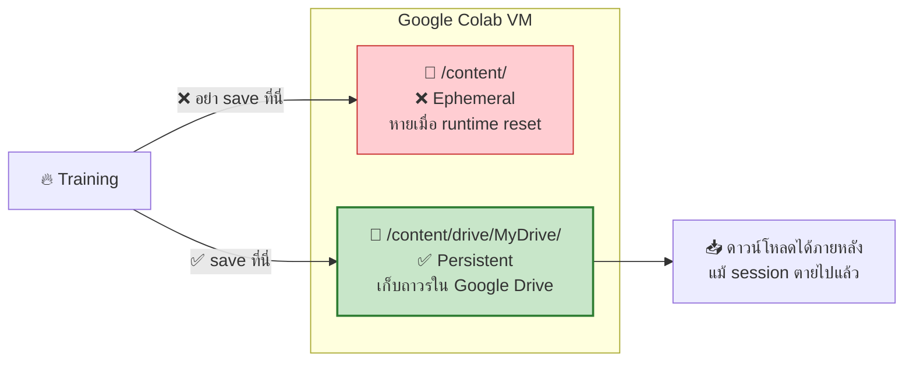
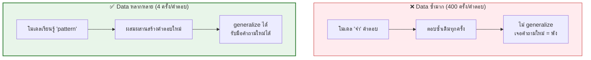
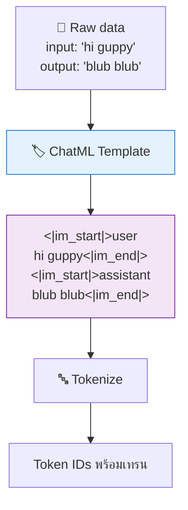
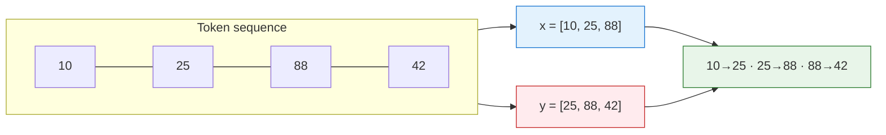

[⬅️ Module 01](01-llm-fundamentals.md) | [หน้าหลัก](../README.md) | [ถัดไป: Model & Training ➡️](03-model-training.md)

---

# 📚 Module 02 — Data & Tokenizer

> ⏱️ **75 นาที** · Lab ปฏิบัติบน Google Colab

## 🎯 Learning Objectives
- โหลดและสำรวจ dataset สำหรับเทรน LLM ได้
- เข้าใจ ChatML format และเหตุผลที่ต้องใช้ template
- เทรน BPE tokenizer ของตัวเองได้
- อธิบายความสำคัญของ data diversity ต่อคุณภาพโมเดล

---

## 2.1 เตรียม Colab Environment

### Cell 1 — ตรวจ GPU

```python
!nvidia-smi
```

### Cell 2 — Clone repository (Colab หรือ Jupyter local)

```python
import os, sys

try:
    import google.colab  # noqa: F401
    IN_COLAB = True
except ImportError:
    IN_COLAB = False

if not os.path.isdir('guppylm'):
    !git clone https://github.com/arman-bd/guppylm.git

# เพิ่ม repo เข้า sys.path เพื่อ import guppylm.* โดยไม่ต้อง %cd เข้า repo
REPO_DIR = os.path.abspath('guppylm')
if REPO_DIR not in sys.path:
    sys.path.insert(0, REPO_DIR)

!pip install -q tokenizers datasets
print(f"Environment: {'Google Colab' if IN_COLAB else 'Jupyter local'}")
```

> 📌 **ทำไมไม่ `%cd guppylm`?** เพราะต่อจากนี้เราจะ `import guppylm.*` แบบ package แล้วรัน `prepare()` / `train()` ในโปรเซสเดียวกับโน้ตบุ๊ก การเพิ่ม repo เข้า `sys.path` แทนการ `cd` ทำให้ working directory ยังเป็นที่ที่เราคุมได้

### Cell 3 — กำหนดที่เก็บ checkpoint

> บน **Colab** จะ mount Google Drive; บน **Jupyter local** จะเก็บลงโฟลเดอร์ในเครื่อง

```python
import os

if IN_COLAB:
    from google.colab import drive
    drive.mount('/content/drive')
    WORKSHOP_DIR = '/content/drive/MyDrive/guppylm_workshop'
else:
    WORKSHOP_DIR = os.path.abspath('guppylm_workshop')

CKPT_DIR   = os.path.join(WORKSHOP_DIR, 'checkpoints')
EXPORT_DIR = os.path.join(WORKSHOP_DIR, 'export')
for d in (CKPT_DIR, EXPORT_DIR):
    os.makedirs(d, exist_ok=True)
print(f"✅ Workshop directory: {WORKSHOP_DIR}")
```

> ⚠️ **ทำไมต้อง mount Drive ตั้งแต่ตอนนี้ (บน Colab)?**
> พื้นที่ `/content/` ใน Colab เป็น **ephemeral** — หายทั้งหมดเมื่อ runtime รีเซ็ตหรือ session ตาย
> ถ้า save checkpoint ไว้ที่นั่นแล้ว session หลุด = เสียงานทั้งหมด
> 💻 **บน Jupyter local ไม่ต้อง mount** — ไฟล์อยู่ในเครื่องอยู่แล้ว



---

## 2.2 สำรวจ Dataset

GuppyLM ใช้ **synthetic dataset** ขนาด 60,000 บทสนทนา ครอบคลุม 60 หัวข้อ

### Cell 4 — โหลดและดู dataset

```python
from datasets import load_dataset

ds = load_dataset("arman-bd/guppylm-60k-generic")
print(ds)

# ดูตัวอย่าง 3 รายการ
for i in range(3):
    ex = ds['train'][i]
    print(f"\n--- ตัวอย่าง {i+1} ---")
    print(f"category: {ex['category']}")
    print(f"input:    {ex['input']}")
    print(f"output:   {ex['output']}")
```

**✅ ผลลัพธ์ที่ควรเห็น:**
```
DatasetDict({
    train: Dataset({features: ['input','output','category'], num_rows: 57000})
    test:  Dataset({features: ['input','output','category'], num_rows: 3000})
})
```

### Cell 5 — วิเคราะห์ data diversity

```python
from collections import Counter

outputs = ds['train']['output']
unique = len(set(outputs))
total = len(outputs)

print(f"จำนวนทั้งหมด:      {total:,}")
print(f"จำนวนที่ไม่ซ้ำ:    {unique:,}")
print(f"เปอร์เซ็นต์ unique: {unique/total*100:.1f}%")
print(f"ซ้ำเฉลี่ยต่อคำตอบ:  {total/unique:.1f} ครั้ง")

# หมวดหมู่ที่พบ
print("\nTop 10 categories:")
for cat, n in Counter(ds['train']['category']).most_common(10):
    print(f"  {cat}: {n:,}")
```

### 💡 บทเรียนสำคัญเรื่อง Data Diversity

ผู้สร้าง GuppyLM รายงานในบทความว่าที่ 60,000 samples วัดได้ประมาณ **16,000 unique outputs (~27% uniqueness)** หมายความว่าคำตอบแต่ละแบบปรากฏราว 4 ครั้งโดยเฉลี่ย

เทียบกับเวอร์ชันแรกที่มีเพียง 10 response templates ต่อหัวข้อ ซึ่งทำให้คำตอบแต่ละแบบซ้ำถึง **~400 ครั้ง**



> 🔑 **หลักการ:** ถ้าคำตอบซ้ำมากเกินไป โมเดลจะ **memorize** แทน **learn pattern**
> วิธีแก้: ใช้ **template composition** — สุ่มประกอบส่วนย่อย (วัตถุในตู้, ชนิดอาหาร, กิจกรรม) แทนการเขียน template ตายตัว

---

## 2.3 ChatML Format

โมเดลต้องรู้ว่าส่วนไหนคือคำถามของ user ส่วนไหนคือคำตอบของ assistant จึงต้องมี **template**



### Special Tokens ของ GuppyLM

| Token | ID | หน้าที่ |
|---|---|---|
| `<pad>` | 0 | เติมให้ sequence ยาวเท่ากันใน batch |
| `<\|im_start\|>` | 1 | BOS — เริ่มข้อความ |
| `<\|im_end\|>` | 2 | EOS — จบข้อความ |

> 📌 **ไม่มี `<unk>`:** GuppyLM ใช้ ByteLevel BPE ซึ่งเข้ารหัสได้ทุก byte จึงไม่มี token ที่ "ไม่รู้จัก" — special tokens จึงมีแค่ 3 ตัวข้างต้น (ตรงกับ `guppylm/prepare_data.py`)

> 📌 **หมายเหตุ:** GuppyLM **ไม่มี system prompt** โดยตั้งใจ เพราะโมเดล 9M ไม่สามารถ conditionally follow instructions ได้อยู่แล้ว บุคลิกจึงต้องฝังไว้ใน training data ทั้งหมด

---

## 2.4 Lab: เทรน BPE Tokenizer เอง

### Cell 6 — เตรียม corpus

```python
import os
os.makedirs('data', exist_ok=True)

# เขียน corpus สำหรับเทรน tokenizer
with open('data/corpus.txt', 'w', encoding='utf-8') as f:
    for ex in ds['train']:
        f.write(ex['input'] + '\n')
        f.write(ex['output'] + '\n')

print(f"corpus size: {os.path.getsize('data/corpus.txt')/1024/1024:.2f} MB")
```

### Cell 7 — เทรน tokenizer (แบบเดียวกับ repo จริง)

GuppyLM ใช้ **ByteLevel BPE** — pre-tokenizer และ decoder เป็นแบบ ByteLevel ทั้งคู่ (ไม่ใช่ `Whitespace`) และมี special tokens เพียง **3 ตัว** (ไม่มี `<unk>` เพราะ ByteLevel เข้ารหัสทุก byte ได้อยู่แล้ว จึงไม่มีทางเจอ token ที่ "ไม่รู้จัก")

```python
from tokenizers import Tokenizer, models, trainers, pre_tokenizers, decoders, processors

tk = Tokenizer(models.BPE())
tk.pre_tokenizer = pre_tokenizers.ByteLevel(add_prefix_space=False)
tk.decoder = decoders.ByteLevel()

trainer = trainers.BpeTrainer(
    vocab_size=4096,
    special_tokens=["<pad>", "<|im_start|>", "<|im_end|>"],  # 3 ตัว ตรงกับ repo
    min_frequency=2,
    show_progress=True,
)

tk.train(["data/corpus.txt"], trainer)
tk.post_processor = processors.ByteLevel(trim_offsets=False)
tk.save("data/tokenizer.json")

print(f"✅ Vocabulary size: {tk.get_vocab_size()}")
```

> 🔑 **ByteLevel BPE ต่างจาก word-level BPE อย่างไร?** ByteLevel มองข้อความเป็นลำดับ **byte** (0–255) ก่อน จึงครอบคลุมอักขระได้ทุกตัวรวมถึงภาษาไทย อีโมจิ และช่องว่าง โดยไม่ต้องมี `<unk>` — เป็นวิธีเดียวกับที่ GPT-2 ใช้

### Cell 8 — ทดสอบ tokenizer

```python
from tokenizers import Tokenizer
tk = Tokenizer.from_file("data/tokenizer.json")

tests = [
    "hi guppy",
    "are you hungry?",
    "what do you think about quantum physics",
]

for t in tests:
    enc = tk.encode(t)
    print(f"\nข้อความ: {t}")
    print(f"  tokens: {enc.tokens}")
    print(f"  ids:    {enc.ids}")
    print(f"  จำนวน:  {len(enc.ids)} tokens")
    print(f"  decode: {tk.decode(enc.ids)}")
```

**✅ ผลลัพธ์ที่ควรสังเกต:**
- คำที่พบบ่อยในโดเมนปลา (water, food, tank) จะเป็น token เดียว
- คำนอกโดเมน (quantum, physics) จะถูกหั่นเป็นหลาย token
- token ที่ขึ้นต้นด้วยช่องว่างจะมีสัญลักษณ์ `Ġ` นำหน้า (เช่น `Ġwater`) — นี่คือวิธีที่ ByteLevel BPE แทน "ช่องว่างหน้าคำ" ไม่ใช่ error
- `decode` แล้วได้ข้อความกลับมาใกล้เคียงเดิม

---

## 2.5 Next-Token Dataset

### Cell 9 — ดูว่า dataset สร้าง x, y อย่างไร

```python
sample = "<|im_start|>user\nhi guppy<|im_end|>"
ids = tk.encode(sample).ids

x = ids[:-1]   # input
y = ids[1:]    # target (เลื่อน 1 ตำแหน่ง)

print(f"ids: {ids}")
print(f"x:   {x}")
print(f"y:   {y}")
print("\nการจับคู่ทำนาย:")
for a, b in zip(x[:8], y[:8]):
    print(f"  {tk.decode([a])!r:15} → ทำนาย → {tk.decode([b])!r}")
```



> 📌 **หมายเหตุเชิงเทคนิคสำหรับผู้สอน:**
> GuppyLM คำนวณ loss จาก **ทุก token ที่ไม่ใช่ padding** (ผ่าน `F.cross_entropy(..., ignore_index=0)` ใน `model.py`) โดย**ไม่ mask ส่วน prompt** ซึ่งต่างจากตำราบางเล่มที่ mask เฉพาะส่วน response ด้วย `-100`
> ควรชี้ให้นักศึกษาเห็นความต่างนี้ — ทั้งสองวิธีใช้ได้ แต่ส่งผลต่อสิ่งที่โมเดลเรียนรู้ต่างกัน

---

## 2.6 เตรียมข้อมูลด้วย script ของ repo

แทนที่จะทำทีละขั้นเอง สามารถใช้ script สำเร็จรูป โดยเรียกแบบ **in-process** (แนวเดียวกับตอนเทรนใน Module 03):

```python
from guppylm.prepare_data import prepare
prepare()
```

**สิ่งที่ `prepare()` ทำ:**
1. สร้าง dataset สังเคราะห์ (`generate_dataset`)
2. บันทึก `data/train.jsonl` และ **`data/eval.jsonl`** (ชื่อ `eval` ไม่ใช่ `test` — `train.py` โหลด `eval.jsonl` มาวัด eval loss)
3. เทรน ByteLevel BPE tokenizer (vocab 4,096, special tokens 3 ตัว) → `data/tokenizer.json`

> 💡 เรียก `prepare()` ตรง ๆ แทน `!python -m guppylm.prepare_data` เพื่อให้ทำงานในโปรเซสเดียวกับโน้ตบุ๊ก สอดคล้องกับวิธีรัน `train()` ใน Module 03

---

## 🧪 Lab Exercises

ทำ [Lab 1–3 ในหน้า Lab Exercises](07-labs.md#lab-1--เปลี่ยน-vocabulary-size)

---

## 📝 สรุป Module 02

| สิ่งที่ทำ | ผลลัพธ์ |
|---|---|
| Mount Google Drive | มีที่เก็บ checkpoint ถาวร |
| โหลด dataset | เข้าใจโครงสร้าง 60K conversations |
| วิเคราะห์ diversity | เข้าใจว่าทำไม data ซ้ำมากถึงไม่ดี |
| เทรน BPE tokenizer | ได้ `tokenizer.json` vocab 4,096 |
| สร้าง x/y pairs | เข้าใจ next-token prediction |

---

[⬅️ Module 01](01-llm-fundamentals.md) | [หน้าหลัก](../README.md) | [ถัดไป: Model & Training ➡️](03-model-training.md)
