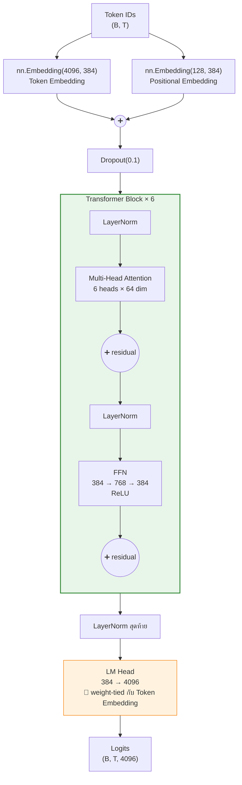
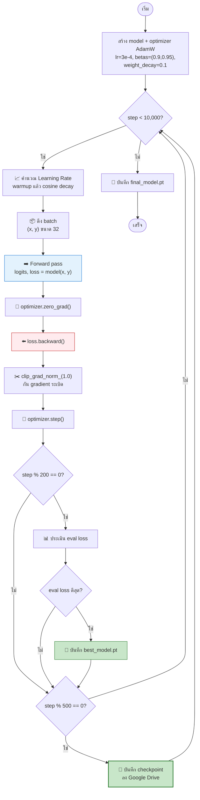
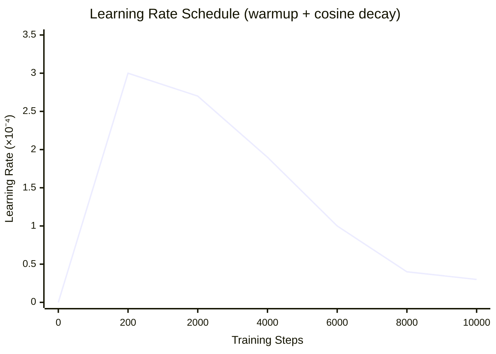
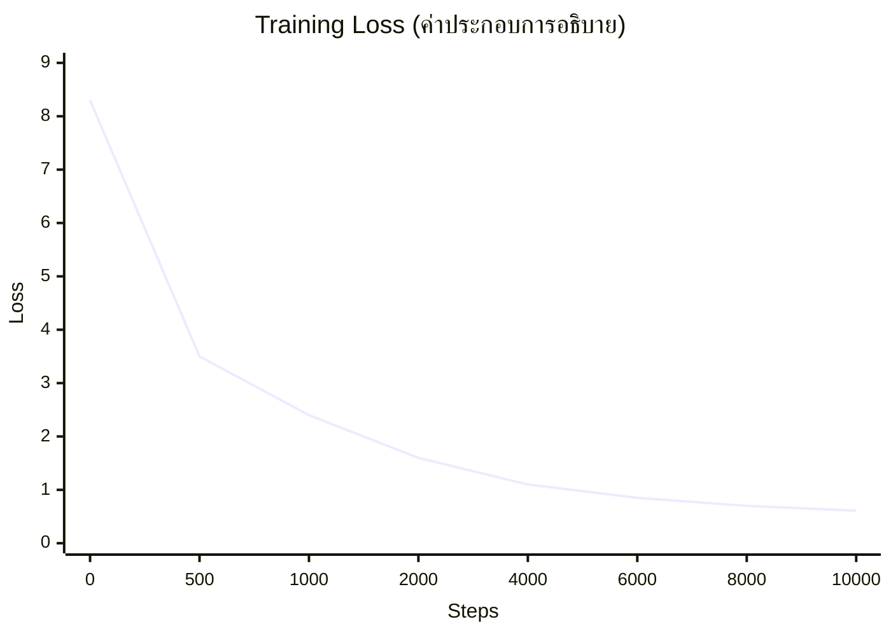
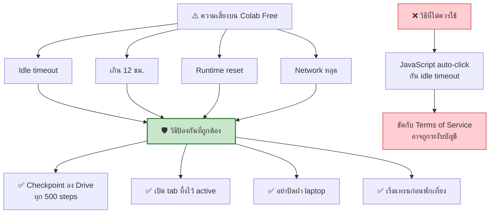

[⬅️ Module 02](02-data-tokenizer.md) | [หน้าหลัก](../README.md) | [ถัดไป: Export Checkpoint ➡️](04-export-checkpoint.md)

---

# 🧠 Module 03 — Model Architecture & Training

> ⏱️ **75 นาที** · อ่านโค้ด + Lab เทรนจริงบน Colab

## 🎯 Learning Objectives
- อ่านและอธิบายโค้ด `model.py` ได้ทีละส่วน
- Map แต่ละบรรทัดของโค้ดเข้ากับแนวคิด LLM ที่เรียนใน Module 01
- เข้าใจ training loop: loss, optimizer, LR schedule, checkpointing
- เทรนโมเดลของตัวเองสำเร็จ

---

## 3.1 สถาปัตยกรรมของ GuppyLM



**สังเกต: เป็น Pre-Norm architecture** — LayerNorm อยู่**ก่อน** attention/FFN แล้วค่อยบวก residual (`x = x + attn(norm1(x))`) ซึ่งช่วยให้เทรน deep network ได้เสถียรกว่า post-norm

> 📖 **ศัพท์ที่ต้องรู้ (แบบเข้าใจง่าย):**
> - **LayerNorm (Layer Normalization)** = ตัว "ปรับสเกลตัวเลขให้อยู่ในช่วงพอดี ๆ" ก่อนส่งต่อ เหมือนปรับระดับเสียงไมค์ไม่ให้ดังหรือเบาเกินไป ป้องกันไม่ให้ตัวเลขบางตัวใหญ่จนกลบตัวอื่น
> - **Residual (residual connection)** = "ทางลัด" ที่เอา input เดิมบวกกลับเข้าไปกับผลลัพธ์ (`x = x + f(x)`) เหมือนเก็บสำเนาต้นฉบับไว้เผื่อชั้นนั้นทำพัง ก็ยังมีของเดิมเหลืออยู่ ช่วยให้ซ้อนหลายชั้นลึก ๆ ได้โดยไม่ "ลืม" ข้อมูลต้นทาง
> - **Pre-Norm vs Post-Norm** = แค่เรื่อง "ปรับสเกลก่อนหรือหลัง" — Pre-Norm (ปรับก่อนเข้า attention/FFN) เทรนง่ายและเสถียรกว่าเมื่อโมเดลลึก จึงเป็นแบบที่นิยมใช้กันในปัจจุบัน
> - **deep network** = โครงข่ายที่ซ้อนกันหลายชั้น (ของ GuppyLM คือ 6 ชั้น) ยิ่งลึกยิ่งเรียนรู้ลวดลายซับซ้อนได้ แต่ก็เทรนยากขึ้นถ้าไม่มี LayerNorm + Residual ช่วย

---

## 3.2 Mapping โค้ด ↔ แนวคิด

ตารางนี้คือ**หัวใจของการสอน module นี้** — เปิด `guppylm/model.py` คู่กันไป

| แนวคิด LLM | โค้ดใน `model.py` | อธิบาย |
|---|---|---|
| Token embedding | `self.tok_emb = nn.Embedding(vocab_size, d_model)` | ID → vector 384 มิติ |
| Positional encoding | `self.pos_emb = nn.Embedding(max_seq_len, d_model)` | learned position (ไม่ใช่ RoPE) |
| รวม embedding | `x = self.drop(self.tok_emb(idx) + self.pos_emb(pos))` | บวก token + position เข้าด้วยกัน |
| Q, K, V | `self.qkv = nn.Linear(d_model, 3 * d_model)` | สร้างทั้ง 3 พร้อมกันแล้ว split |
| Scaled dot-product | `attn = (q @ k.transpose(-2,-1)) / math.sqrt(self.head_dim)` | หาร √64 กันค่าใหญ่เกิน |
| Causal masking | `mask = torch.tril(...)` + `masked_fill(mask==0, float('-inf'))` | ห้ามมองอนาคต |
| Attention weights | `attn = self.dropout(F.softmax(attn, dim=-1))` | แปลงเป็น probability |
| FFN | `self.down(F.relu(self.up(x)))` | 384 → 768 → 384 |
| Residual | `x = x + self.attn(self.norm1(x), mask)` | pre-norm + residual |
| LayerNorm | `self.norm1 = nn.LayerNorm(d_model)` | คุมสเกล activation |
| Stack layers | `nn.ModuleList([Block(config) for _ in range(n_layers)])` | ซ้อน 6 ชั้น |
| Weight tying | `self.lm_head.weight = self.tok_emb.weight` | แชร์น้ำหนัก ประหยัด params |
| Loss | `F.cross_entropy(logits.view(...), targets.view(-1), ignore_index=0)` | ข้าม padding (id=0) |
| Weight init | `nn.init.normal_(m.weight, mean=0.0, std=0.02)` | init แบบ GPT มาตรฐาน |

> 🔗 **Weight tying คืออะไร (แบบเข้าใจง่าย)?** ปกติโมเดลมีตารางสองชุด: ชุดแรกแปลง "หมายเลข token → ความหมาย" (ตอนขาเข้า) ชุดที่สองแปลง "ความหมาย → หมายเลข token" (ตอนขาออก) ทั้งสองชุดทำงานตรงข้ามกันด้วยข้อมูลเดียวกัน weight tying คือการ **ใช้ตารางเดียวร่วมกันทั้งขาเข้าและขาออก** เหมือนใช้พจนานุกรมไทย-อังกฤษเล่มเดียวเปิดได้สองทาง แทนที่จะซื้อสองเล่ม — ช่วยลดจำนวน parameter และมักทำให้โมเดลเรียนรู้ได้ดีขึ้นด้วย
>
> 🎯 **Weight init (initialization) คืออะไร?** คือการ "สุ่มค่าน้ำหนักเริ่มต้น" ก่อนเทรน การสุ่มด้วยค่าเล็ก ๆ (std=0.02) ตามสูตรของ GPT ช่วยให้โมเดลออกสตาร์ทจากจุดที่เทรนต่อได้ราบรื่น ไม่ระเบิดตั้งแต่ก้าวแรก

### Cell — นับ parameters และตรวจ shape

```python
from guppylm.config import GuppyConfig
from guppylm.model import GuppyLM
import torch

m = GuppyLM(GuppyConfig())
print(m.param_summary())

# ทดสอบ forward pass
idx = torch.randint(0, 4096, (2, 16))    # batch=2, seq_len=16
logits, loss = m(idx)
print(f"logits shape: {logits.shape}")   # (2, 16, 4096)
print(f"loss (ไม่มี target): {loss}")     # None

# ทดสอบพร้อม target
targets = torch.randint(0, 4096, (2, 16))
logits, loss = m(idx, targets)
print(f"loss เริ่มต้น: {loss.item():.3f}")  # ควรใกล้ ln(4096) ≈ 8.3
```

**✅ ผลลัพธ์ที่ควรเห็น:**
```
GuppyLM: 8,7xx,xxx params (8.7M)
logits shape: torch.Size([2, 16, 4096])
loss เริ่มต้น: 8.3xx
```

> 🔑 **จุดสอนสำคัญ:** loss เริ่มต้น ≈ 8.3 = ln(4096) พิสูจน์ว่าโมเดลเริ่มจาก "เดามั่วเท่า ๆ กันทุก token" ถูกต้องตามทฤษฎี ถ้าได้ค่าต่างจากนี้มาก แปลว่า initialization มีปัญหา

---

## 3.3 Configuration

### `GuppyConfig` (สถาปัตยกรรมโมเดล)

```python
vocab_size   = 4096
max_seq_len  = 128
d_model      = 384
n_layers     = 6
n_heads      = 6
ffn_hidden   = 768
dropout      = 0.1
pad_id       = 0      # <pad>
bos_id       = 1      # <|im_start|>
eos_id       = 2      # <|im_end|>
```

### `TrainConfig` (การเทรน)

```python
batch_size     = 32
learning_rate  = 3e-4
min_lr         = 3e-5
weight_decay   = 0.1
warmup_steps   = 200
max_steps      = 10000
eval_interval  = 200
save_interval  = 500
grad_clip      = 1.0
device         = "auto"
output_dir     = "checkpoints"
```

---

## 3.4 Training Loop



> 📖 **ศัพท์ในลูปนี้ (แบบเข้าใจง่าย):**
> - **Forward pass** = ป้อนข้อมูลเข้าโมเดลเพื่อให้มันทำนายออกมา (ขาไป)
> - **Backward pass / `loss.backward()`** = คำนวณย้อนกลับว่าน้ำหนักแต่ละตัวทำให้ผิดพลาดไปทางไหน (ขากลับ) ผลลัพธ์คือ **gradient**
> - **gradient** = "ลูกศรบอกทิศทาง" ว่าควรปรับน้ำหนักไปทางไหนและแรงแค่ไหนเพื่อให้ loss ลดลง เหมือนเข็มทิศชี้ทางลงเขา
> - **optimizer (AdamW)** = ตัวที่หยิบ gradient มาปรับน้ำหนักจริง ๆ ตามขนาดก้าว (LR) ที่กำหนด
> - **`optimizer.zero_grad()`** = ล้าง gradient เก่าทิ้งก่อนคำนวณรอบใหม่ (ไม่ให้ค่าค้างจากรอบก่อนมาปนกัน)

> ✂️ **Gradient clipping คืออะไร (`clip_grad_norm_(1.0)`)?** บางครั้ง gradient มีค่าใหญ่ผิดปกติ ทำให้โมเดลก้าวกระโดดแรงจนเตลิด (gradient ระเบิด) gradient clipping คือการ "จำกัดขนาดก้าวสูงสุด" ไว้ไม่ให้เกินเพดาน (ในที่นี้คือ 1.0) เหมือนตัวจำกัดความเร็วรถ ต่อให้เหยียบคันเร่งแรงแค่ไหนก็ไม่วิ่งเกินที่ตั้งไว้ ช่วยให้เทรนไม่พังกลางคัน

### Learning Rate Schedule



**สูตรที่ใช้:**
```python
# ช่วง warmup (step < 200)
lr = learning_rate * step / warmup_steps

# ช่วง cosine decay
progress = (step - warmup_steps) / (max_steps - warmup_steps)
coeff = 0.5 * (1.0 + math.cos(math.pi * progress))
lr = min_lr + (learning_rate - min_lr) * coeff
```

> 📖 **Learning Rate (LR) คืออะไร?** คือ "ขนาดก้าว" ในการปรับน้ำหนักแต่ละครั้ง — LR สูง = ก้าวใหญ่ (เรียนเร็วแต่เสี่ยงพลาดเป้า), LR ต่ำ = ก้าวเล็ก (ช้าแต่แม่นยำ) การปรับ LR ระหว่างเทรนคือการเลือกจังหวะก้าวให้เหมาะกับแต่ละช่วง

> 🚗 **อุปมา "ขับรถออกจากบ้านไปจอดในโรงรถ":**
> - **warmup** (ช่วงแรก ค่อย ๆ เพิ่ม LR) = ตอนสตาร์ทรถ เราไม่กระทืบคันเร่งทันที ค่อย ๆ เร่งความเร็วขึ้น เพราะตอนเริ่ม weights ยังสุ่มมั่ว ถ้าก้าวใหญ่ทันทีจะพุ่งออกนอกเส้นทาง (gradient ระเบิด / diverge)
> - **cosine decay** (ช่วงหลัง ค่อย ๆ ลด LR) = ตอนใกล้จอด เราชะลอความเร็วลงเรื่อย ๆ เพื่อค่อย ๆ เลื่อนเข้าช่องจอดให้พอดี ถ้ายังซิ่งเร็วอยู่จะจอดเลยเป้า (พลาดจุด loss ต่ำสุด)

**ทำไมต้อง warmup?** ตอนเริ่มเทรน weights ยังสุ่มอยู่ ถ้า LR สูงทันทีจะทำให้ gradient ระเบิดหรือ diverge (เตลิดหนีออกจากคำตอบที่ดี) — ค่อย ๆ เพิ่มขึ้นจะเสถียรกว่า

**ทำไมต้อง cosine decay?** ช่วงท้ายต้องการปรับละเอียด LR ต่ำช่วยให้ converge (ลู่เข้า) เข้าจุดต่ำสุดได้ดีกว่า

> 📖 **converge / diverge:** converge = โมเดล "ลู่เข้า" หาคำตอบที่ดีขึ้นเรื่อย ๆ (loss ลดลงและนิ่ง) ส่วน diverge = ตรงข้าม คือ "เตลิด" ออกห่างจากคำตอบจน loss พุ่งขึ้นหรือกลายเป็น NaN

### AMP (Automatic Mixed Precision)

```python
use_amp = device.type == "cuda"
```

> 📖 **AMP (Automatic Mixed Precision) คืออะไร?** คือเทคนิค "ใช้ตัวเลขความละเอียดต่ำผสมกับความละเอียดสูง" ระหว่างเทรน ปกติคอมพิวเตอร์เก็บตัวเลขทศนิยมแบบ 32 บิต (FP32) ซึ่งแม่นแต่กินหน่วยความจำ AMP ยอมใช้ 16 บิต (FP16/BF16) ในจุดที่ไม่ต้องการความแม่นมาก จึงเร็วขึ้นและประหยัดหน่วยความจำ

> ⚖️ **อุปมา "จดเลขหยาบ ๆ ในที่ที่ไม่ต้องเป๊ะ":** เวลาคำนวณเลขในใจ เราไม่จำเป็นต้องจดทศนิยม 10 ตำแหน่งทุกจุด — จุดที่ไม่สำคัญก็ปัดเศษให้เร็วขึ้น เก็บความละเอียดเต็มไว้เฉพาะจุดที่จำเป็นจริง ๆ AMP ทำแบบเดียวกันเพื่อเทรนให้เร็วขึ้นโดยผลลัพธ์แทบไม่ต่าง

> 📌 **จุดสำคัญเชิงออกแบบ:** AMP ถูก gate (จำกัดให้เปิด) ไว้เฉพาะ CUDA เท่านั้น
> - บน **GPU**: ใช้ FP16/BF16 → เร็วขึ้นมาก ประหยัด VRAM (หน่วยความจำของการ์ดจอ)
> - บน **CPU/MPS**: fallback (ถอยกลับ) เป็น FP32 อัตโนมัติ ไม่ error
>
> นี่คือเหตุผลที่โค้ดชุดเดียวรันได้ทั้ง Colab GPU และเครื่อง CPU

---

## 3.5 Lab: เทรนจริง

> 🖥️ **Lab นี้รันได้ทั้ง Google Colab และ Jupyter บนเครื่องตัวเอง** — โค้ดชุดเดียวกัน
> โค้ดเต็มพร้อมคัดลอกอยู่ที่ [`code/colab/COLAB_CELLS.md`](../code/colab/COLAB_CELLS.md) (Cell 1–4)

### ⚠️ กับดักสำคัญ: ทำไมตั้ง `CKPT_DIR` แล้ว checkpoint ยังหาย?

นี่คือจุดที่ผิดพลาดกันบ่อยที่สุดในขั้นเทรน:

```mermaid
flowchart TD
    subgraph WRONG["❌ วิธีที่ไม่ได้ผล"]
        W1["ตั้ง CKPT_DIR ในโน้ตบุ๊ก"] --> W2["!python -m guppylm.train"]
        W2 --> W3["🔴 นี่คือ subprocess<br/>แยกออกไปคนละ process"]
        W3 --> W4["train() เรียก TrainConfig()<br/>ที่ output_dir='checkpoints'<br/>(hardcode)"]
        W4 --> W5["💥 checkpoint ตกใน<br/>checkpoints/ ของ session<br/>= หายเมื่อ session ตาย"]
    end

    subgraph RIGHT["✅ วิธีที่ถูกต้อง"]
        R1["import guppylm.train"] --> R2["override TrainConfig<br/>ให้ output_dir = CKPT_DIR"]
        R2 --> R3["เรียก train()<br/>ในโปรเซสเดียวกับโน้ตบุ๊ก"]
        R3 --> R4["🟢 checkpoint ไปอยู่ที่<br/>CKPT_DIR (บน Drive) จริง"]
    end

    style WRONG fill:#ffebee,stroke:#c62828
    style RIGHT fill:#e8f5e9,stroke:#2e7d32,stroke-width:2px
```



**สาเหตุที่แท้จริง:** ใน `guppylm/train.py` ฟังก์ชัน `train()` สร้าง config เองด้วย `TrainConfig()` โดยที่ `TrainConfig.output_dir` เป็นค่า **hardcode = `"checkpoints"`** และไม่รับ argument, ไม่อ่าน environment variable ใด ๆ

ดังนั้นถ้าเราสั่ง `!python -m guppylm.train` (เครื่องหมาย `!` = รันเป็น subprocess) ตัวแปร `CKPT_DIR` ที่เราตั้งในโน้ตบุ๊กจะอยู่ **คนละ process** จึงไม่มีผลกับ subprocess เลย

### Cell — ตั้งที่เก็บ checkpoint ให้ถูก แล้วเทรน (in-process)

```python
# 1) ตรวจ path ที่กำหนดไว้จาก Module 02
print("CKPT_DIR =", CKPT_DIR)
# Colab:  /content/drive/MyDrive/guppylm_workshop/checkpoints
# local:  <โฟลเดอร์ปัจจุบัน>/guppylm_workshop/checkpoints

# 2) override TrainConfig ที่ train.py ใช้ ให้ output_dir ชี้ไป CKPT_DIR
import guppylm.train as gtrain
from guppylm.config import TrainConfig

_BaseTrainConfig = TrainConfig
gtrain.TrainConfig = lambda: _BaseTrainConfig(output_dir=CKPT_DIR)
assert gtrain.TrainConfig().output_dir == CKPT_DIR

# 3) เทรน — เรียก train() ตรง ๆ (ไม่ใช่ !python -m) จึงอยู่ process เดียวกับโน้ตบุ๊ก
gtrain.train()
```

> 🔑 **ทำไม override ที่ `gtrain.TrainConfig` ไม่ใช่ `guppylm.config.TrainConfig`?**
> เพราะ `train.py` เขียน `from .config import TrainConfig` ชื่อ `TrainConfig` จึงถูก bind ไว้ใน namespace ของ `guppylm.train` แล้ว การแทนที่จึงต้องทำที่ `guppylm.train.TrainConfig` เพื่อให้ `train()` หยิบตัวที่เราแก้ไปใช้

**✅ ผลลัพธ์ที่ควรเห็น:**
```
Device: cuda
GuppyLM: 8,7xx,xxx params (8.7M)
Train: 57,000, Eval: 3,000
   Step |         LR |      Train |       Eval |     Time
--------------------------------------------------------
     0 |   0.000000 |     8.3170 |         -- |     0.4s
   200 |   0.000300 |     4.8210 |     4.9030 |    12.1s
   ...
 10000 |   0.000030 |     0.6120 |     0.6880 |   298.5s
Done! 298s, best eval: 0.6880
```

⏱️ **เวลาที่คาดหวัง:** ~5 นาทีบน T4 ที่ว่าง (เผื่อ 15–30 นาทีถ้า GPU แชร์กันเยอะ)

### Cell — ยืนยันว่า checkpoint ไปอยู่ถูกที่

```python
import os
for f in sorted(os.listdir(CKPT_DIR)):
    print(f, f"{os.path.getsize(os.path.join(CKPT_DIR, f))/1024/1024:.2f} MB")
assert os.path.exists(os.path.join(CKPT_DIR, 'best_model.pt'))
print("✅ checkpoint อยู่ใน CKPT_DIR แล้ว")
```

> 💻 **บน Jupyter local:** ทำเหมือนกันทุกขั้น เพียงแค่ `CKPT_DIR` เป็นโฟลเดอร์ในเครื่อง (ไม่ต้อง mount Drive) — ดู Cell 2 ใน [`COLAB_CELLS.md`](../code/colab/COLAB_CELLS.md) ที่ตรวจ environment ให้อัตโนมัติ

### วิธีอ่าน Loss Curve



> ⚠️ กราฟนี้เป็น**ค่าประกอบการอธิบายรูปทรงของ curve** ไม่ใช่ผลการวัดจริง — ตัวเลขจริงขึ้นกับ run ให้นักศึกษาเปรียบเทียบกับผลของตัวเอง

| รูปแบบที่เห็น | ความหมาย | ต้องทำอะไร |
|---|---|---|
| ลดลงเรื่อย ๆ แล้วนิ่ง | ✅ ปกติ converge ดี | ไม่ต้องทำอะไร |
| ไม่ลดเลย แบนราบ | ⚠️ LR ต่ำเกิน / data ผิด | ตรวจ data, เพิ่ม LR |
| แกว่งขึ้นลงรุนแรง | ⚠️ LR สูงเกิน | ลด LR |
| กลายเป็น NaN | ❌ gradient ระเบิด | ลด LR ÷10, ตรวจ grad_clip |
| train ลด แต่ eval ขึ้น | ⚠️ Overfitting | เพิ่ม data diversity |

---

## 3.6 เทคนิคป้องกัน Session ตาย



### Resume จาก checkpoint

```python
import torch, os

resume_path = f'{CKPT_DIR}/best_model.pt'
if os.path.exists(resume_path):
    ckpt = torch.load(resume_path, map_location='cpu', weights_only=False)
    model.load_state_dict(ckpt['model_state_dict'])
    print("✅ Resumed from checkpoint")
else:
    print("เริ่มเทรนใหม่จากศูนย์")
```

> ⚠️ **ข้อจำกัดที่ต้องบอกนักศึกษา:**
> `best_model.pt` / `final_model.pt` ของ GuppyLM บันทึก `step`, `model_state_dict`, `config` (และ `eval_loss` สำหรับ best)
> แต่ **ไม่ได้บันทึก `optimizer_state_dict`**
> ดังนั้นการ resume จะได้แค่ weights ไม่ได้ต่อ optimizer momentum หรือ LR schedule
>
> สำหรับเวิร์กช็อปที่เทรนแค่ ~5 นาที ถือว่ายอมรับได้ แต่ถ้าจะทำจริงจังควรแก้ `train.py` ให้บันทึกเพิ่ม:
> ```python
> torch.save({
>     'model_state_dict': model.state_dict(),
>     'optimizer_state_dict': optimizer.state_dict(),  # เพิ่ม
>     'step': step,                                     # เพิ่ม
>     'config': config,
> }, path)
> ```

---

## 3.7 ทดสอบโมเดลที่เทรนเสร็จ (ยังอยู่ในโน้ตบุ๊ก)

```python
import os, torch
from guppylm.inference import GuppyInference

engine = GuppyInference(
    checkpoint_path=os.path.join(CKPT_DIR, 'best_model.pt'),
    tokenizer_path='data/tokenizer.json',
    device='cuda' if torch.cuda.is_available() else 'cpu',   # device-agnostic
)

for q in ["hi guppy", "are you hungry?", "tell me a joke"]:
    r = engine.chat_completion([{"role": "user", "content": q}])
    print(f"You>   {q}")
    print(f"Guppy> {r['choices'][0]['message']['content']}\n")
```

🎉 **ถึงจุดนี้นักศึกษามี LLM ของตัวเองแล้ว!** ขั้นต่อไปคือนำมันออกจาก Colab

---

## 🧪 Lab Exercises

ทำ [Lab 4–5](07-labs.md#lab-4--ปรับ-learning-rate)

---

[⬅️ Module 02](02-data-tokenizer.md) | [หน้าหลัก](../README.md) | [ถัดไป: Export Checkpoint ➡️](04-export-checkpoint.md)
