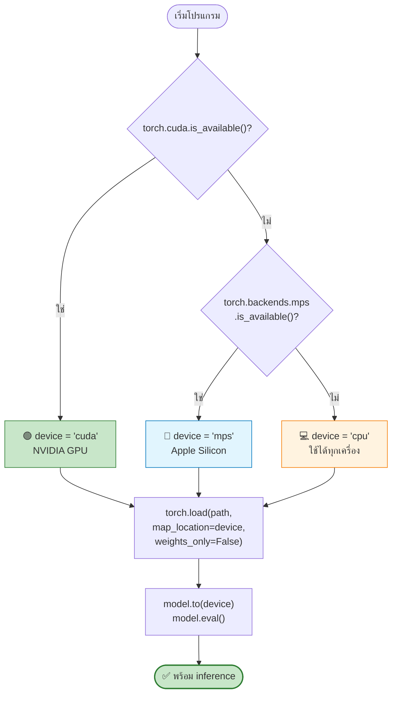
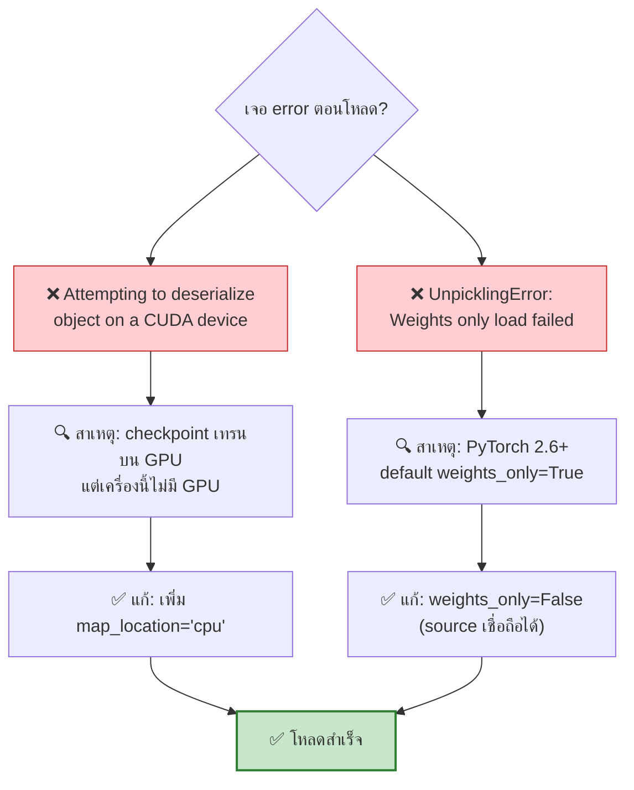
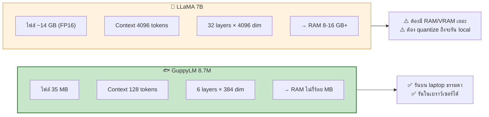

[⬅️ Module 04](04-export-checkpoint.md) | [หน้าหลัก](../README.md) | [ถัดไป: Optimize & Deploy ➡️](06-optimize-deploy.md)

---

# 💻 Module 05 — Run Local LLM

> ⏱️ **60 นาที** · Lab ปฏิบัติบนเครื่องนักศึกษา
> 🆕 **Module ใหม่** — จุดที่นักศึกษาจะรู้สึกว่า "ผมมี LLM เป็นของตัวเองจริง ๆ"

## 🎯 Learning Objectives
- โหลด checkpoint ที่เทรนบน GPU มารันบน CPU ได้
- เขียนโค้ด device-agnostic รองรับ cuda / mps / cpu
- สร้าง CLI chat interface ใช้งานได้จริง
- วัด performance ของโมเดลบนเครื่องตัวเอง

---

## 5.1 เตรียมโครงสร้างไฟล์

```
my-guppy/
├── guppylm/                  # clone จาก GitHub
│   ├── model.py
│   ├── config.py
│   ├── inference.py
│   └── ...
├── checkpoints/
│   └── best_model.pt         # 📥 จาก Colab
├── data/
│   └── tokenizer.json        # 📥 จาก Colab
└── chat.py                   # ✍️ เราเขียนเอง
```

### ขั้นตอน

```bash
# 1. activate venv ที่เตรียมไว้ตั้งแต่ Module 00
source guppy-env/bin/activate        # Windows: guppy-env\Scripts\activate

# 2. clone repo
git clone https://github.com/arman-bd/guppylm.git my-guppy
cd my-guppy

# 3. สร้างโฟลเดอร์และวางไฟล์จาก Colab
mkdir -p checkpoints data
# แตก ZIP ที่ดาวน์โหลดมา แล้วคัดลอกไฟล์เข้าไป:
#   best_model.pt (หรือ pytorch_model.bin)  → checkpoints/
#   tokenizer.json                          → data/
#   config.json                             → checkpoints/

# 4. ตรวจสอบ
ls -lh checkpoints/ data/
```

---

## 5.2 วิธีเร็วที่สุด: ใช้ CLI ในตัว repo

repo GuppyLM มี CLI สำเร็จรูปให้อยู่แล้ว — เรียกผ่าน `python -m guppylm chat` ได้ทันทีโดยไม่ต้องเขียนโค้ดเอง

```bash
# โหมด interactive
python -m guppylm chat

# โหมดถามครั้งเดียว
python -m guppylm chat --prompt "tell me a joke"
```

**ค่า default ของ CLI ในตัว repo (`python -m guppylm chat`):**
| Argument | ค่า default |
|---|---|
| `--checkpoint` | `checkpoints/best_model.pt` |
| `--tokenizer` | `data/tokenizer.json` |
| `--device` | `cpu` |

> 📌 **หมายเหตุ:** หัวข้อ 5.2 นี้ใช้ CLI **ในตัว repo** (`python -m guppylm chat`) ซึ่งรันได้เลย ส่วนหัวข้อ 5.3 เราจะเขียนสคริปต์ `chat.py` **ของเราเอง** เพื่อเรียนรู้การทำ device-agnostic (เลือก cuda/mps/cpu อัตโนมัติ) — ทั้งสองแบบเรียก `GuppyInference` เหมือนกัน ต่างที่ CLI ในตัว repo ตั้ง device default เป็น `cpu` ส่วน `chat.py` ของเราจะเลือก device ที่ดีที่สุดให้อัตโนมัติ

**✅ ผลลัพธ์ที่ควรเห็น:**
```
You>   tell me a joke
Guppy> what did the fish say when it hit the wall. dam.
```

🎉 **นักศึกษามี LLM รันบนเครื่องตัวเองแล้ว — ไม่ต้องมี internet ไม่ต้องมี API key**

---

## 5.3 Device-Agnostic: รองรับทุกเครื่อง



### Lab: เขียน `chat.py`

```python
"""chat.py — Local GuppyLM chat, รองรับ cuda / mps / cpu อัตโนมัติ"""
import time
import torch
from guppylm.inference import GuppyInference


def pick_device() -> str:
    """เลือก device ที่ดีที่สุดที่มีในเครื่องนี้"""
    if torch.cuda.is_available():
        return "cuda"
    mps = getattr(torch.backends, "mps", None)
    if mps is not None and mps.is_available():
        return "mps"          # Apple Silicon
    return "cpu"


def main():
    device = pick_device()
    print(f"🖥️  Device: {device}")
    print("📥 กำลังโหลดโมเดล...")

    t0 = time.time()
    engine = GuppyInference(
        checkpoint_path="checkpoints/best_model.pt",
        tokenizer_path="data/tokenizer.json",
        device=device,
    )
    print(f"✅ โหลดเสร็จใน {time.time() - t0:.2f} วินาที\n")

    print("🐟 คุยกับ Guppy ได้เลย (พิมพ์ 'quit' เพื่อออก)")
    print("-" * 45)

    while True:
        try:
            msg = input("You>   ").strip()
        except (EOFError, KeyboardInterrupt):
            print("\nบ๊ายบาย! 🐟")
            break

        if msg.lower() in ("quit", "exit", "q"):
            print("บ๊ายบาย! 🐟")
            break
        if not msg:
            continue

        t0 = time.time()
        r = engine.chat_completion(
            [{"role": "user", "content": msg}],
            temperature=0.7,
            max_tokens=64,
            top_k=50,
        )
        answer = r["choices"][0]["message"]["content"]
        elapsed = time.time() - t0

        print(f"Guppy> {answer}")
        print(f"       ⏱️  {elapsed:.2f}s\n")


if __name__ == "__main__":
    main()
```

รัน:
```bash
python chat.py
```

---

## 5.4 GuppyInference API

จาก source ของ repo:

```python
GuppyInference(checkpoint_path, tokenizer_path, device="cpu")
```

**สิ่งที่เกิดขึ้นภายใน:**
```python
ckpt = torch.load(checkpoint_path, map_location=self.device, weights_only=False)
```

- โหลด `config.json` จาก directory เดียวกับ checkpoint ถ้ามี
- รองรับทั้ง key แบบ HuggingFace (`hidden_size`, `num_hidden_layers`) และแบบ native (`d_model`, `n_layers`)
- ถ้าไม่มี `config.json` จะ fallback ไปใช้ `ckpt["config"]`

**Method หลัก:**
```python
chat_completion(messages, temperature=0.7, max_tokens=64, top_k=50)
```

คืนค่าเป็น dict แบบ OpenAI-compatible:
```python
{
  "choices": [
    {"message": {"role": "assistant", "content": "..."}}
  ]
}
```

**Prompt format ภายใน (ChatML):**
```
<|im_start|>{role}
{content}<|im_end|>
```

---

## 5.5 ⚠️ 2 กับดักหลักตอนโหลด checkpoint



**โค้ดที่ถูกต้อง:**
```python
ckpt = torch.load(
    "checkpoints/best_model.pt",
    map_location="cpu",       # ← กับดักที่ 1
    weights_only=False,       # ← กับดักที่ 2
)
```

---

## 5.6 Lab: วัด Performance บนเครื่องตัวเอง

### สร้าง `benchmark.py`

```python
"""benchmark.py — วัดความเร็ว inference บนเครื่องนี้"""
import time
import torch
from guppylm.inference import GuppyInference

def pick_device():
    if torch.cuda.is_available():
        return "cuda"
    mps = getattr(torch.backends, "mps", None)
    if mps and mps.is_available():
        return "mps"
    return "cpu"

device = pick_device()
engine = GuppyInference("checkpoints/best_model.pt", "data/tokenizer.json", device)

prompts = ["hi guppy", "are you hungry?", "what is water",
           "tell me a joke", "do you like light"]

print(f"Device: {device}")
print("-" * 50)

total_time, total_tokens = 0.0, 0
for p in prompts:
    t0 = time.time()
    r = engine.chat_completion([{"role": "user", "content": p}], max_tokens=64)
    dt = time.time() - t0
    text = r["choices"][0]["message"]["content"]
    n_tok = len(engine.tokenizer.encode(text).ids)   # ประมาณจำนวน token ที่สร้าง

    total_time += dt
    total_tokens += n_tok
    print(f"{p:20} | {dt:5.2f}s | ~{n_tok:3d} tokens | {n_tok/dt:6.1f} tok/s")

print("-" * 50)
print(f"เฉลี่ย: {total_tokens/total_time:.1f} tokens/second")
```

> ⚠️ **หมายเหตุ:** ไม่มีตัวเลข benchmark ทางการจาก repo สำหรับโมเดล 8.7M บน CPU
> โมเดลนี้เล็กมาก (context 128 tokens, FFN 768) จึงคาดว่าเร็วพอสำหรับ chat แบบ interactive
> ให้นักศึกษา**วัดเองแล้วเปรียบเทียบกันในห้อง** — เป็น exercise ที่ดีและเห็นความต่างของ hardware จริง

### ตารางเก็บผลในห้องเรียน

| นักศึกษา | CPU/GPU | RAM | tokens/s | เวลาโหลดโมเดล |
|---|---|---|---|---|
| | | | | |
| | | | | |

---

## 5.7 ทำไม 8.7M ถึงรันบน CPU ได้สบาย?



> 💬 **หลักฐานที่ดีที่สุด:** browser demo ของ GuppyLM รันในเบราว์เซอร์ได้ด้วยไฟล์ ONNX เพียง ~10.5 MB — ถ้ารันในเบราว์เซอร์ได้ รันบน CPU ของ laptop ได้แน่นอน

---

## 🧪 Lab Exercises

ทำ [Lab 7](07-labs.md#lab-7--device-agnostic-script)

---

## 📝 สรุป Module 05

| สิ่งที่ทำ | ผลลัพธ์ |
|---|---|
| วางไฟล์จาก Colab | โครงสร้าง project ครบ |
| รัน CLI ในตัว repo | คุยกับโมเดลได้ทันที |
| เขียน `chat.py` device-agnostic | รองรับ cuda/mps/cpu |
| เข้าใจ `map_location` + `weights_only` | แก้ปัญหาโหลด checkpoint ได้ |
| วัด benchmark | รู้ว่าเครื่องตัวเองทำได้เท่าไหร่ |

---

[⬅️ Module 04](04-export-checkpoint.md) | [หน้าหลัก](../README.md) | [ถัดไป: Optimize & Deploy ➡️](06-optimize-deploy.md)
