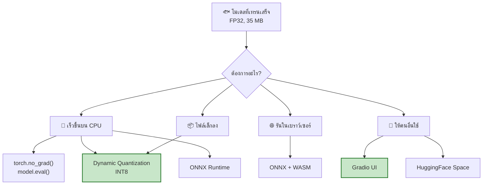
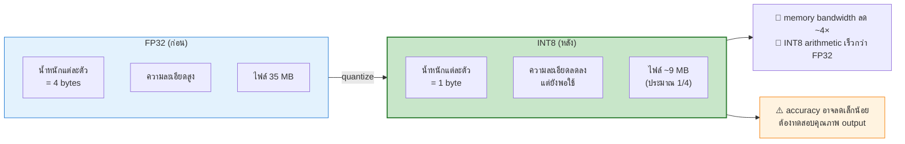
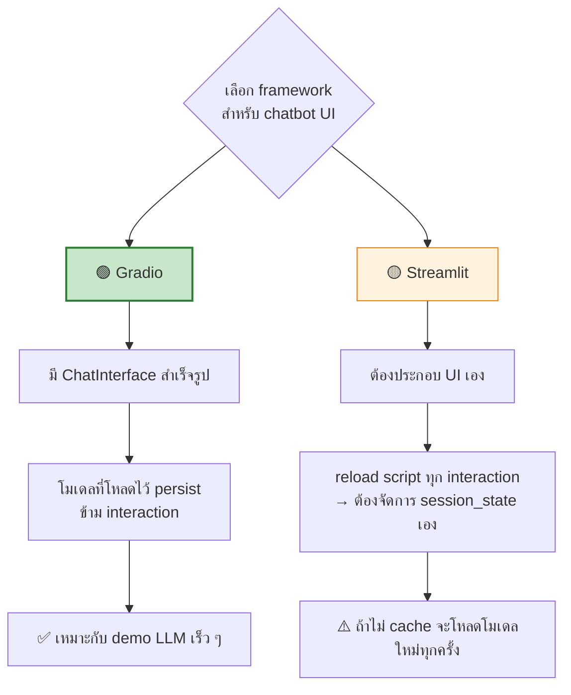
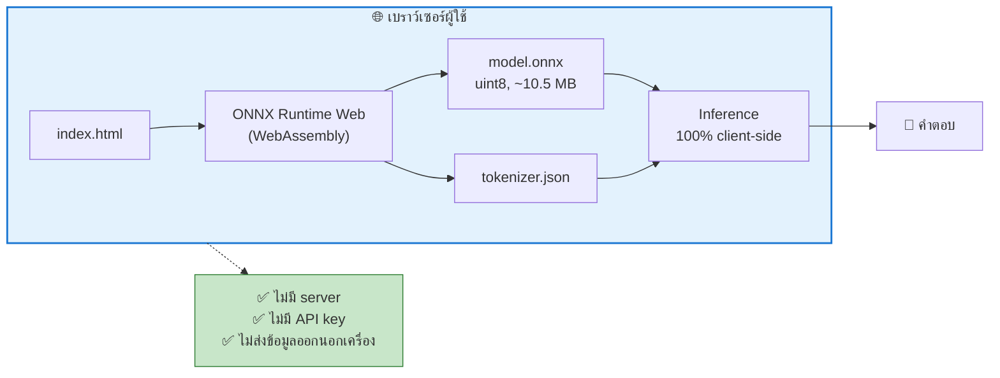
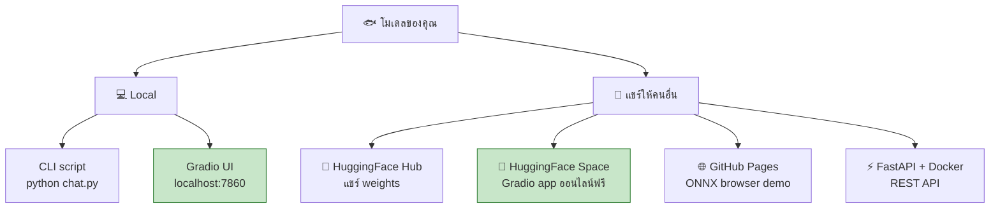

[⬅️ Module 05](05-run-local.md) | [หน้าหลัก](../README.md) | [ถัดไป: Lab Exercises ➡️](07-labs.md)

---

# ⚙️ Module 06 — Optimize & Deploy

> ⏱️ **30 นาที** · บรรยาย + demo

## 🎯 Learning Objectives
- เร่ง inference บน CPU ด้วย quantization
- สร้าง Web UI ให้โมเดลของตัวเอง
- เข้าใจทางเลือกในการ deploy โมเดลจริง

---

## 6.1 ภาพรวมตัวเลือกการ Optimize



---

## 6.2 พื้นฐานที่ต้องทำเสมอ

```python
model.eval()                    # ปิด dropout, ตั้ง LayerNorm เป็น inference mode
with torch.no_grad():           # ไม่สร้าง computational graph
    logits = model(x)
# หรือใช้ torch.inference_mode() ซึ่งเข้มกว่าและเร็วกว่าเล็กน้อย
```

> ✅ `GuppyInference` จัดการให้แล้วภายใน — แต่ถ้านักศึกษาเขียนโค้ดเองต้องจำ

**ทำไมสำคัญ?** ตาม PyTorch inference optimization checklist การปิด gradient tracking ลดทั้งการใช้หน่วยความจำและเวลาคำนวณ เพราะไม่ต้องเก็บ intermediate values สำหรับ backward pass

---

## 6.3 Dynamic Quantization — INT8

### แนวคิด



### โค้ด

```python
import torch
from guppylm.inference import GuppyInference

engine = GuppyInference("checkpoints/best_model.pt", "data/tokenizer.json", "cpu")

# quantize เฉพาะ Linear layers (ที่กินเวลามากที่สุด)
q_model = torch.quantization.quantize_dynamic(
    engine.model,
    {torch.nn.Linear},
    dtype=torch.qint8,
)

# เทียบขนาด
import os
torch.save(engine.model.state_dict(), "fp32.pt")
torch.save(q_model.state_dict(), "int8.pt")
print(f"FP32: {os.path.getsize('fp32.pt')/1024/1024:.2f} MB")
print(f"INT8: {os.path.getsize('int8.pt')/1024/1024:.2f} MB")
```

> 📌 **หมายเหตุเรื่อง API:** เอกสารนี้ pin `torch==2.6.0` ซึ่ง `torch.quantization.quantize_dynamic` ยังใช้ได้ปกติ ใน PyTorch รุ่นใหม่กว่า API หลักถูกย้ายไปที่ `torch.ao.quantization.quantize_dynamic` (ตัวเดิมยังเป็น alias ให้อยู่ แต่บางเวอร์ชันอาจขึ้น deprecation warning) — ถ้านักศึกษาใช้ PyTorch เวอร์ชันใหม่กว่าและเจอ warning ให้เปลี่ยนไปเรียก `torch.ao.quantization.quantize_dynamic` แทน (arguments เหมือนกันทุกประการ)

### ผลที่คาดหวัง

ตาม PyTorch documentation:
- **ขนาดโมเดลลดได้ ~4×** (FP32 → INT8)
- **memory bandwidth ลด ~4×**
- **INT8 arithmetic เร็วกว่า FP32 ราว 2–4×** บน hardware ที่รองรับ

บน x86 CPU PyTorch 2.0+ ใช้ x86 backend ใหม่ที่วัดได้ speedup แบบ geomean **2.97×** เทียบ FP32 (จากการทดสอบ 69 โมเดลบน 4th Gen Intel Xeon เทียบกับ FBGEMM backend เดิมที่ได้ 1.43×)

> ⚠️ **ต้องทดสอบคุณภาพเสมอ** — ให้นักศึกษาลองถามคำถามเดิมกับ FP32 และ INT8 แล้วเทียบคำตอบ บางครั้งโมเดลเล็กมากอย่าง 8.7M อาจ sensitive ต่อ quantization มากกว่าโมเดลใหญ่

---

## 6.4 ตัวเลือกอื่น ๆ

| เทคนิค | ได้อะไร | เหมาะเมื่อ | ข้อควรระวัง |
|---|---|---|---|
| `torch.compile` | ~15–25% เร็วขึ้น | รันยาว ๆ | compile ครั้งแรกช้า อาจไม่คุ้มในเวิร์กช็อปสั้น |
| **ONNX Runtime** | เร็วกว่า PyTorch eager บน CPU | deployment จริง | ต้อง export ก่อน |
| Dynamic Quantization | เร็ว + เล็ก | CPU inference | accuracy ลดเล็กน้อย |
| Batch inference | throughput สูงขึ้น | ประมวลผลหลายคำถามพร้อมกัน | latency ต่อคำถามไม่ลด |

---

## 6.5 Web UI ด้วย Gradio

### ทำไม Gradio ไม่ใช่ Streamlit?



### สร้าง `app.py`

```python
"""app.py — Web UI สำหรับ GuppyLM ที่เทรนเอง"""
import gradio as gr
import torch
from guppylm.inference import GuppyInference


def pick_device():
    if torch.cuda.is_available():
        return "cuda"
    mps = getattr(torch.backends, "mps", None)
    if mps and mps.is_available():
        return "mps"
    return "cpu"


DEVICE = pick_device()
print(f"Loading model on {DEVICE}...")
engine = GuppyInference(
    "checkpoints/best_model.pt",
    "data/tokenizer.json",
    device=DEVICE,
)
print("Model loaded.")


def chat(message, history, temperature, top_k, max_tokens):
    r = engine.chat_completion(
        [{"role": "user", "content": message}],
        temperature=temperature,
        top_k=int(top_k),
        max_tokens=int(max_tokens),
    )
    return r["choices"][0]["message"]["content"]


demo = gr.ChatInterface(
    fn=chat,
    title="🐟 My GuppyLM",
    description=f"LLM 8.7M parameters ที่เทรนเอง · รันบน {DEVICE} · ไม่ต้องใช้ internet",
    additional_inputs=[
        gr.Slider(0.1, 2.0, value=0.7, step=0.1, label="Temperature"),
        gr.Slider(1, 100, value=50, step=1, label="Top-K"),
        gr.Slider(16, 128, value=64, step=8, label="Max tokens"),
    ],
    examples=["hi guppy", "are you hungry?", "tell me a joke", "what is light"],
)

if __name__ == "__main__":
    demo.launch()   # เปิดที่ http://localhost:7860
```

รัน:
```bash
pip install gradio
python app.py
```

เปิดเบราว์เซอร์ที่ http://localhost:7860

> 💡 **จุดที่สนุกในห้องเรียน:** ให้นักศึกษาเลื่อน slider temperature แบบ real-time แล้วดูว่าคำตอบเปลี่ยนไปอย่างไร — เห็นผลของ sampling parameter ได้ทันที

---

## 6.6 รันในเบราว์เซอร์ (ONNX + WebAssembly)

repo GuppyLM มีโฟลเดอร์ `docs/` ที่เป็น browser demo:



**ไฟล์ใน `docs/`:**
- `index.html` — โหลด model.onnx + tokenizer.json แล้วรัน inference ผ่าน WASM
- `download.sh` — ดาวน์โหลดไฟล์โมเดลจาก HuggingFace

**ถ้าจะ host เอง:**
1. วาง `model.onnx` (ที่ export จาก Module 04) + `tokenizer.json` ในโฟลเดอร์เดียวกับ `index.html`
2. แก้ fetch URL ใน `index.html` ให้ชี้ไฟล์ของตัวเอง
3. Push ขึ้น GitHub Pages → ได้ demo ออนไลน์ของตัวเอง

**Demo ต้นฉบับ:** https://arman-bd.github.io/guppylm/

---

## 6.7 แผนที่เส้นทางการ Deploy



---

## 🧪 Lab Exercises

ทำ [Lab 8](07-labs.md#lab-8--quantization)

---

## 📝 สรุป Module 06

| เทคนิค | ผลลัพธ์ |
|---|---|
| `eval()` + `no_grad()` | เร็วขึ้น ประหยัด RAM (ต้องทำเสมอ) |
| Dynamic Quantization INT8 | ไฟล์เล็กลง ~4× เร็วขึ้น |
| Gradio ChatInterface | Web UI ใน 20 บรรทัด |
| ONNX + WASM | รันในเบราว์เซอร์ 100% client-side |

---

[⬅️ Module 05](05-run-local.md) | [หน้าหลัก](../README.md) | [ถัดไป: Lab Exercises ➡️](07-labs.md)
