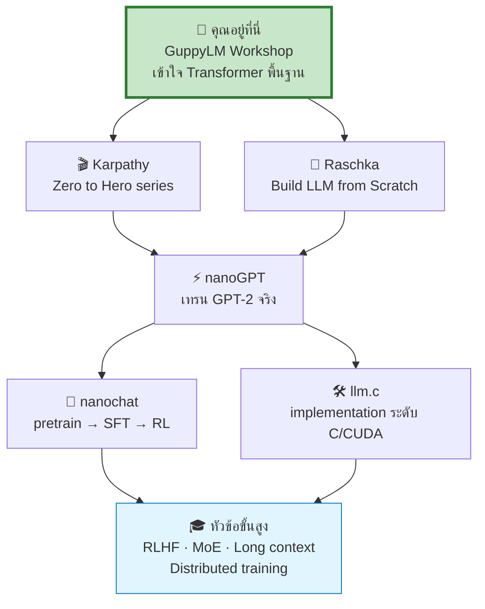

[⬅️ Assessment](09-assessment.md) | [หน้าหลัก](../README.md)

---

# 🔗 แหล่งอ้างอิงและเรียนต่อ

## 🗺️ เส้นทางการเรียนรู้ต่อ

---

## 🐟 GuppyLM (ต้นแบบของเวิร์กช็อปนี้)

| Resource | URL |
|---|---|
| GitHub Repository | https://github.com/arman-bd/guppylm |
| Pre-trained Model (9M) | https://huggingface.co/arman-bd/guppylm-9M |
| Dataset (60K) | https://huggingface.co/datasets/arman-bd/guppylm-60k-generic |
| Browser Demo | https://arman-bd.github.io/guppylm/ |
| บทความผู้สร้าง (Medium) | "Build Your Own Language Model in 5 Minutes — I Made Mine Talk Like a Fish" โดย Arman Hossain |

**ไฟล์สำคัญใน repo:**
| ไฟล์ | หน้าที่ |
|---|---|
| `guppylm/config.py` | `GuppyConfig` + `TrainConfig` (dataclass) |
| `guppylm/generate_data.py` | สร้าง synthetic data 60K จาก template composition |
| `guppylm/prepare_data.py` | เตรียม data + เทรน BPE tokenizer |
| `guppylm/dataset.py` | โหลด JSONL, สร้าง x/y แบบ next-token |
| `guppylm/model.py` | Transformer (~130 บรรทัด) |
| `guppylm/train.py` | Training loop (AMP, cosine LR, AdamW) |
| `guppylm/inference.py` | `GuppyInference` — ChatML + sampling |
| `tools/export_onnx.py` | Export ONNX + quantize uint8 |
| `train_guppylm.ipynb` | Notebook เทรน from scratch |
| `use_guppylm.ipynb` | Notebook chat กับ pre-trained |
| `docs/` | Browser demo (ONNX + WASM) |

**License:** MIT © Arman Hossain

---

## 🎓 เรียนต่อระดับถัดไป

### ระดับ 1 — เริ่มต้น (แนะนำหลังเวิร์กช็อปนี้)

| Resource | ทำไมควรดู |
|---|---|
| **Andrej Karpathy — "Let's build GPT: from scratch, in code, spelled out"** (YouTube) | บรรยายทีละบรรทัดตั้งแต่ศูนย์ — ต่อยอดจากสิ่งที่เรียนวันนี้โดยตรง |
| **Karpathy — "Neural Networks: Zero to Hero"** (YouTube playlist) | ปูพื้น backprop, makemore series ก่อนเข้า GPT |
| **Jay Alammar — "The Illustrated Transformer"** | ภาพประกอบดีที่สุดสำหรับเข้าใจ attention |
| **Transformer Explainer** (poloclub.github.io/transformer-explainer) | รัน GPT-2 small ในเบราว์เซอร์ เห็น attention แบบ interactive |

### ระดับ 2 — ลงลึก

| Resource | ทำไมควรดู |
|---|---|
| **karpathy/nanoGPT** (GitHub) | โค้ดเทรน GPT-2 ที่ใช้งานจริง สั้นและสะอาด |
| **karpathy/minGPT** (GitHub) | เวอร์ชันเน้นการศึกษา อ่านง่ายกว่า nanoGPT |
| **Sebastian Raschka — "Build a Large Language Model (From Scratch)"** (Manning, 2024) | หนังสือ 368 หน้า ISBN 9781633437166 — ครอบคลุมที่สุด |
| **rasbt/LLMs-from-scratch** (GitHub) | โค้ดประกอบหนังสือของ Raschka |
| **Raschka — "PyTorch in One Hour"** | ปูพื้น PyTorch เร็ว ๆ สำหรับคนที่ยังไม่คุ้น |

### ระดับ 3 — ขั้นสูง

| Resource | ทำไมควรดู |
|---|---|
| **karpathy/nanochat** | ครบวงจร pretrain → SFT → RL |
| **karpathy/llm.c** | Implementation ระดับ C/CUDA เห็นว่า GPU ทำงานอย่างไรจริง ๆ |
| **karpathy/microgpt** | LLM ใน ~200 บรรทัด สำหรับดูภาพรวมเร็ว ๆ |

---

## 📄 Papers ที่ควรอ่าน

| Paper | ปี | ทำไมสำคัญ |
|---|---|---|
| **"Attention Is All You Need"** (Vaswani et al.) | 2017 | ต้นกำเนิด Transformer — สถาปัตยกรรมที่ GuppyLM ใช้ |
| **"Language Models are Unsupervised Multitask Learners"** (GPT-2) | 2019 | decoder-only + scaling |
| **"Language Models are Few-Shot Learners"** (GPT-3) | 2020 | 175 billion parameters — แสดง emergent abilities |
| **"Neural Machine Translation of Rare Words with Subword Units"** (Sennrich et al.) | 2016 | ต้นกำเนิด BPE ที่ใช้ทำ tokenizer |

---

## 🛠️ เอกสารเทคนิค

### PyTorch
| หัวข้อ | ลิงก์/หมายเหตุ |
|---|---|
| Saving/Loading Models | อธิบายว่าทำไม `state_dict` ดีกว่าการ save ทั้ง model |
| `torch.load` + `weights_only` | สำคัญมากสำหรับ PyTorch 2.6+ |
| Quantization (INT8, x86 backend) | ตัวเลข speedup ที่อ้างอิงใน Module 06 |
| Inference Optimization Checklist | `eval()`, `no_grad()`, และเทคนิคอื่น ๆ |
| ติดตั้ง | https://pytorch.org/get-started/locally (เลือก CPU) |

### เครื่องมืออื่น
| เครื่องมือ | ลิงก์ |
|---|---|
| safetensors | https://huggingface.co/docs/safetensors |
| tokenizers (HF) | https://huggingface.co/docs/tokenizers |
| Gradio | https://www.gradio.app/docs |
| ONNX Runtime Web | https://onnxruntime.ai/docs/tutorials/web/ |
| Google Colab FAQ | https://research.google.com/colaboratory/faq.html |

---

## 🖼️ เครื่องมือ Visualize สำหรับการสอน

| เครื่องมือ | ใช้ทำอะไร |
|---|---|
| **Transformer Explainer** (Polo Club) | รัน GPT-2 small ในเบราว์เซอร์ เห็น attention flow แบบ interactive — เหมาะสาธิตสด |
| **BertViz** (`jessevig/bertviz`) | Visualize attention head ใน Jupyter notebook |
| **Tiktokenizer** | ดูว่าข้อความถูกหั่นเป็น token อย่างไรในโมเดลต่าง ๆ |

---

## 🇹🇭 แหล่งเรียนรู้ภาษาไทย / LLM ภาษาไทย

> สำหรับนักศึกษาที่อยากต่อยอดไปทาง NLP ภาษาไทย

- **PyThaiNLP** — library NLP ภาษาไทย (tokenization, POS tagging)
- **WangchanBERTa** (VISTEC) — pre-trained language model ภาษาไทย
- **Typhoon / OpenThaiGPT** — LLM ภาษาไทย open-source

> 💡 **โจทย์ท้าทายสำหรับนักศึกษา:** ลองเทรน GuppyLM ด้วย corpus ภาษาไทย — จะพบว่า BPE tokenizer ต้องปรับ แม้ ByteLevel BPE (ที่ repo ใช้) จะเข้ารหัสภาษาไทยได้โดยไม่เกิด `<unk>` แต่ก็แตก 1 อักขระไทยเป็นหลาย byte token ทำให้ sequence ยาวและชน context limit 128 tokens เร็ว นี่คือปัญหาจริงของการทำ NLP ภาษาไทย

---

## 📊 ตารางเปรียบเทียบขนาดโมเดล (สำหรับอ้างอิงในการสอน)

| Model | Parameters | เทียบ GuppyLM |
|---|---|---|
| **GuppyLM** | 8.7M | 1× |
| GPT-2 Small | 124M | ~14× |
| GPT-2 Large | 774M | ~89× |
| LLaMA 7B | 7,000M | ~805× |
| GPT-3 | 175,000M | ~20,000× |

> 💬 **ประโยคที่ควรจบเวิร์กช็อป:**
> *"สิ่งที่เราสร้างวันนี้กับ GPT-4 ใช้แนวคิดเดียวกัน — Transformer, next-token prediction, attention ความต่างคือ scale, data, และ engineering ถ้าคุณเข้าใจ GuppyLM คุณเข้าใจแกนกลางของ LLM ทั้งหมดแล้ว"*

---

## 📌 หมายเหตุคุณภาพข้อมูล (Caveats)

เอกสารชุดนี้อ้างอิงจาก source ที่ตรวจสอบได้ แต่มีบางจุดที่ควรตรวจซ้ำก่อนสอน:

| ประเด็น | สถานะ |
|---|---|
| Colab idle timeout ~90 นาที | ⚠️ community รายงาน — Google ไม่เผยแพร่ตัวเลขทางการ |
| Colab quota 15–30 GPU-hr/สัปดาห์ | ⚠️ ประมาณการ — Google ระบุว่า "does not publish these limits" |
| Colab เพดาน 12 ชั่วโมง | ✅ ยืนยันจาก Colab FAQ |
| tokens/second บน CPU สำหรับ 8.7M | ⚠️ ไม่มี benchmark ทางการ — ให้นักศึกษาวัดเอง |
| CLI arguments ของ `tools/export_onnx.py` | ⚠️ ไม่สามารถยืนยัน verbatim — ตรวจไฟล์จริงก่อนสอน |
| Checkpoint มีแค่ `model_state_dict` + `config` | ✅ ยืนยันจาก source (ไม่มี optimizer state) |
| Config values (10,000 steps, batch 32, LR 3e-4) | ✅ ยืนยันจาก `config.py` |
| PyTorch 2.6 `weights_only=True` default | ✅ ยืนยันจาก PyTorch release blog |
| INT8 speedup 2.97× geomean | ✅ ยืนยันจาก PyTorch x86 backend documentation |
| Dataset uniqueness ~27% | ⚠️ มาจากบทความของผู้สร้างเอง |

> 📌 **สำหรับผู้สอน:** repository อาจมีการอัปเดตหลังวันที่รวบรวมข้อมูล ควรตรวจ README และ source (`model.py`, `train.py`, `config.py`) ล่าสุดก่อนวันสอนเสมอ

---

[⬅️ Assessment](09-assessment.md) | [หน้าหลัก](../README.md)
