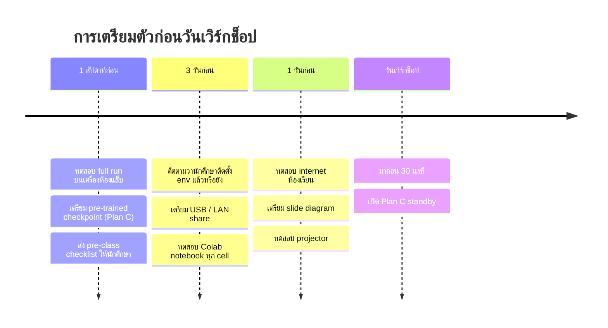
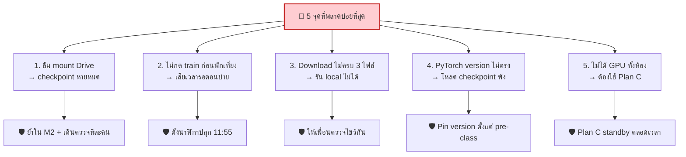
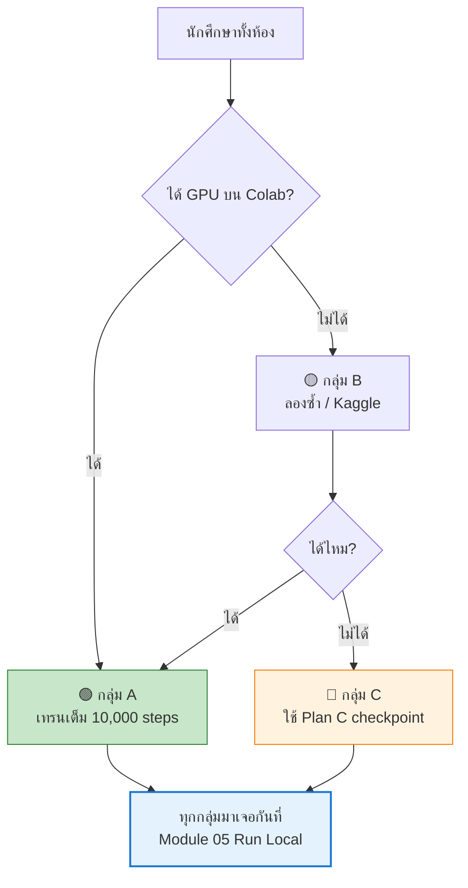

[⬅️ กลับหน้าหลัก](../README.md)

---

# 📖 คู่มือผู้สอน

> เอกสารนี้สำหรับผู้สอนเท่านั้น — ไม่ต้องแจกนักศึกษา

## ⏳ Timeline การเตรียมตัว



---

## ✅ Checklist ผู้สอน

### 1 สัปดาห์ก่อน

- [ ] **ทดสอบ full run เอง** ตั้งแต่ Module 00 ถึง 06 บนเครื่องที่**ช้าที่สุด**ในห้องแล็บ
- [ ] จับเวลาแต่ละ module จริง แล้วปรับ rundown ตามผล
- [ ] เตรียม **pre-trained checkpoint** (เทรนเอง หรือใช้ `arman-bd/guppylm-9M`)
- [ ] อัปโหลด checkpoint ขึ้น Google Drive + HuggingFace เป็น backup
- [ ] ส่ง [Pre-class Checklist](../docs/00-preparation.md) ให้นักศึกษา
- [ ] แจ้งนักศึกษาว่าต้องใช้ **Gmail ส่วนตัว ไม่ใช่บัญชีสถาบัน**

### 3 วันก่อน

- [ ] ติดตามว่านักศึกษารัน `verify_setup.py` ผ่านแล้วกี่คน
- [ ] เตรียม USB flash drive ≥ 2 ตัว บรรจุ:
  - [ ] `guppy_export.zip` (checkpoint + tokenizer + config, ~35 MB)
  - [ ] PyTorch wheel offline (เผื่อเน็ตห้องช้า)
  - [ ] repo zip
- [ ] ทดสอบ Colab notebook ทุก cell อีกครั้ง (Colab อัปเดตบ่อย)
- [ ] ตรวจว่า `tools/export_onnx.py` ใน repo มี arguments อะไรบ้าง

### 1 วันก่อน

- [ ] ทดสอบความเร็ว internet ห้องเรียน (นักศึกษา 30-50 คนโหลดพร้อมกัน)
- [ ] เตรียม slide diagram (คัดจาก mermaid ในเอกสารนี้)
- [ ] ทดสอบ projector / จอแสดงผล
- [ ] เตรียมเครื่องผู้สอนให้พร้อมทั้ง Colab และ local

### วันเวิร์กช็อป

- [ ] มาก่อน 30 นาที เปิดเครื่อง ทดสอบทุกอย่าง
- [ ] เปิด LAN file server standby
  ```bash
  cd /path/to/backup && python -m http.server 8000
  # นักศึกษาเข้า http://<ip-ผู้สอน>:8000
  ```
- [ ] เขียน URL สำคัญบนกระดาน
- [ ] เตรียม Plan C ให้พร้อมใช้ทันที

---

## ⏱️ Rundown พร้อมหมายเหตุผู้สอน

| เวลา | Module | หมายเหตุสำคัญ |
|---|---|---|
| 09:00–09:30 | M0 Setup | **เดินตรวจทีละคน** ว่า `nvidia-smi` เห็น GPU ไหม ใครไม่ได้ให้จับคู่กับคนที่ได้ |
| 09:30–10:30 | M1 Fundamentals | เปิด browser demo ให้เล่นก่อน — สร้างความอยากรู้ |
| 10:30–10:45 | พัก | ใช้เวลานี้ช่วยคนที่ยังติดปัญหา setup |
| 10:45–12:00 | M2 Data | ย้ำเรื่อง **mount Drive** ให้หนักที่สุด |
| **12:00** | 🔴 **จุดสำคัญ** | **ต้องกด Run training cell ก่อนพักเที่ยง** |
| 12:00–13:00 | พักเที่ยง | เดินตรวจว่า training ทุกเครื่องกำลังรัน |
| 13:00–14:15 | M3 Model | เดินโค้ด `model.py` ทีละบรรทัดพร้อม diagram |
| 14:15–15:00 | M4 Export | ย้ำ checklist 3 ไฟล์ |
| 15:00–15:15 | พัก | |
| 15:15–16:15 | M5 Run Local | **จุด peak ของความสนุก** — นักศึกษาเห็นโมเดลตัวเองรัน |
| 16:15–16:45 | M6 Optimize | ถ้าเวลาไม่พอ ตัด ONNX ออกได้ |
| 16:45–17:00 | Wrap-up | มอบหมาย assignment |

---

## 🎯 จุดที่ต้องเน้นเป็นพิเศษ



### 1. Mount Google Drive (Module 02)

**ปัญหา:** นักศึกษา save ไว้ที่ `/content/` แล้ว session ตาย → เสียงานทั้งหมด

**วิธีป้องกัน:**
- อธิบายด้วย diagram ephemeral vs persistent
- **เดินตรวจทีละคน**ว่า path ชี้ไป Drive จริง
- ให้พิมพ์ `print(CKPT_DIR)` แล้วยกมือถ้าเห็น `/content/drive/...`
- ⚠️ **ย้ำให้หนัก:** แค่ตั้ง `CKPT_DIR` ไม่พอ ต้องรัน **Cell 4b (override `TrainConfig`) ก่อน** แล้วเทรนด้วย `gtrain.train()` (in-process) — **ห้ามใช้ `!python -m guppylm.train`** เพราะ subprocess จะไม่เห็น `CKPT_DIR` (ดู [Module 03 §3.5](../docs/03-model-training.md#35-lab-เทรนจริง-cell-4) และ [Troubleshooting](../docs/08-troubleshooting.md))
- ให้ตรวจด้วย `assert gtrain.TrainConfig().output_dir == CKPT_DIR` ก่อนกดเทรน

### 2. เริ่ม Training ก่อนพักเที่ยง

**ปัญหา:** ถ้าเริ่มเทรนตอนบ่าย จะเสียเวลารอ 15–30 นาที

**วิธีป้องกัน:** ตั้งนาฬิกาปลุก 11:55 บอกทุกคนกด Run พร้อมกัน (แต่เหลื่อมกันเล็กน้อยเพื่อลดการแย่ง GPU)

### 3. Download ครบ 3 ไฟล์

**วิธีป้องกัน:** ให้นักศึกษาจับคู่ตรวจไขว้กัน แล้วยกมือเมื่อทั้งคู่ครบ

### 4. PyTorch Version

**วิธีป้องกัน:** กำหนดเวอร์ชันชัดเจนตั้งแต่ pre-class เช่น
```bash
pip install torch==2.6.0 --index-url https://download.pytorch.org/whl/cpu
```

### 5. Colab ไม่ให้ GPU

**วิธีป้องกัน:** ดู [Plan C](PLAN-C.md)

---

## 💬 ประโยคสำคัญที่ควรพูด

| จังหวะ | ประโยค |
|---|---|
| เปิดงาน | *"วันนี้เราจะไม่ใช้ LLM ของคนอื่น — เราจะสร้างของเราเอง แล้วเอากลับบ้านไปรันบนเครื่องตัวเอง"* |
| M1 (scale) | *"ความต่างระหว่างสิ่งที่เราจะสร้างวันนี้กับ GPT-4 คือ scale ไม่ใช่แนวคิด"* |
| M2 (data) | *"ถ้าเปลี่ยนข้อมูลเทรนจากปลาเป็นหุ่นยนต์ ต้องแก้ architecture ไหม? ไม่เลย — the model is the data"* |
| M3 (loss 8.3) | *"loss เริ่มต้น 8.3 = ln(4096) นี่คือค่าที่โมเดลเดามั่วสุ่มเท่ากันทุก token ถ้าเห็นตัวเลขนี้แปลว่าเราทำถูก"* |
| M5 (สำเร็จ) | *"ตอนนี้คุณมี LLM ที่เทรนเอง รันบนเครื่องตัวเอง ไม่ต้องมี internet ไม่ต้องมี API key"* |
| ปิดงาน | *"ถ้าคุณเข้าใจ GuppyLM คุณเข้าใจแกนกลางของ LLM ทั้งหมดแล้ว ที่เหลือคือ scale และ engineering"* |

---

## 🧑‍🏫 การจัดการห้องเรียน

### แบ่งกลุ่มตามสถานการณ์



> 💡 **สำคัญ:** ทุกกลุ่มต้องได้ทำ Module 05 (Run Local) เพราะเป็นจุดที่นักศึกษารู้สึกว่า "สำเร็จ" มากที่สุด อย่าให้ใครพลาดส่วนนี้

### เทคนิคจัดการเวลา

- ✅ ให้นักศึกษาที่เสร็จก่อนช่วยเพื่อน (ให้ bonus point)
- ✅ ถ้าเวลาไม่พอ ตัด M6 (Optimize) ออกได้ — ให้ไปทำเป็น assignment แทน
- ✅ อย่าบรรยายทฤษฎียาว — ให้ลงมือทำเร็ว ๆ แล้วอธิบายระหว่างรอ
- ❌ อย่าหยุดทั้งห้องเพื่อรอคนที่ติดปัญหา 1-2 คน

---

## 📊 การเก็บข้อมูลเพื่อปรับปรุง

บันทึกไว้หลังเวิร์กช็อปแต่ละครั้ง:

| ข้อมูล | ค่าที่วัดได้ |
|---|---|
| จำนวนนักศึกษา | |
| กี่คนได้ GPU บน Colab | |
| เวลาเทรนเฉลี่ย | |
| กี่คนต้องใช้ Plan C | |
| Module ไหนใช้เวลาเกินแผน | |
| ปัญหาที่พบใหม่ (ไม่มีใน troubleshooting) | |
| Feedback จากนักศึกษา | |

> 💡 อัปเดต [Troubleshooting Guide](../docs/08-troubleshooting.md) ด้วยปัญหาใหม่ที่พบทุกครั้ง

---

## 🔗 ลิงก์ด่วนสำหรับผู้สอน

| ต้องการ | ไปที่ |
|---|---|
| แผนสำรองฉุกเฉิน | [Plan C](PLAN-C.md) |
| Colab cells พร้อมใช้ | [`code/colab/`](../code/colab/) |
| Local scripts | [`code/local/`](../code/local/) |
| เฉลย Lab ทั้งหมด | [Lab Exercises](../docs/07-labs.md) |
| เฉลยคำถามความเข้าใจ | [Assessment](../docs/09-assessment.md) |

---

[⬅️ กลับหน้าหลัก](../README.md)
