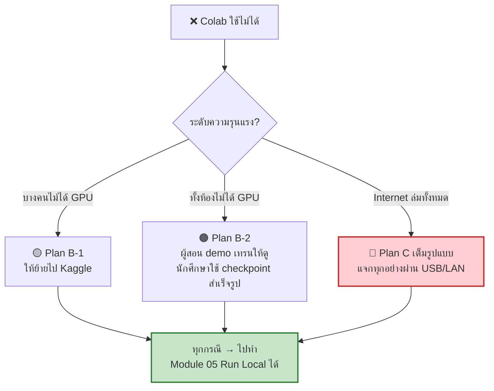

[⬅️ คู่มือผู้สอน](INSTRUCTOR_GUIDE.md) | [หน้าหลัก](../README.md)

---

# 🚨 Plan C — แผนสำรองฉุกเฉิน

> ใช้เมื่อ Colab ใช้ไม่ได้ทั้งห้อง หรือ internet ล่ม

## 🎯 หลักการ

**เป้าหมายของเวิร์กช็อปไม่ได้อยู่ที่การเทรน — อยู่ที่ความเข้าใจ**
ถ้าเทรนไม่ได้ ยังสอนได้ครบทุกอย่าง เพียงข้ามเฟส Train ไปทำเฟส Run



---

## 📦 สิ่งที่ต้องเตรียมล่วงหน้า

### ชุด Emergency Kit (เตรียม 1 สัปดาห์ก่อน)

```
emergency-kit/
├── guppy_export.zip              # ~35 MB  ⭐ สำคัญที่สุด
│   ├── pytorch_model.bin
│   ├── tokenizer.json
│   └── config.json
├── guppylm-repo.zip              # ~1 MB   repo snapshot
├── wheels/                       # ~2 GB   PyTorch offline
│   ├── torch-2.6.0-*.whl
│   ├── tokenizers-*.whl
│   └── ...
├── train_guppylm_completed.ipynb # notebook ที่มี output ครบ
└── README_EMERGENCY.txt          # วิธีใช้สำหรับนักศึกษา
```

### วิธีเตรียม checkpoint

**ทางเลือก 1 — เทรนเอง (แนะนำ):**
```python
# บน Colab ล่วงหน้า เทรนเต็ม 10,000 steps
# แล้ว export ตาม Module 04
```

**ทางเลือก 2 — ใช้ pre-trained ของ repo:**
```bash
# ดาวน์โหลดจาก HuggingFace
huggingface-cli download arman-bd/guppylm-9M --local-dir ./guppy-pretrained
```

### วิธีเตรียม PyTorch wheels offline

```bash
mkdir wheels && cd wheels
pip download torch --index-url https://download.pytorch.org/whl/cpu
pip download tokenizers safetensors gradio
```

ติดตั้งบนเครื่องนักศึกษา:
```bash
pip install --no-index --find-links=./wheels torch tokenizers safetensors gradio
```

---

## 🚀 วิธีแจกไฟล์ในห้องเรียน

### วิธี 1 — LAN File Server (เร็วที่สุด)

บนเครื่องผู้สอน:
```bash
cd emergency-kit
python -m http.server 8000
```

หา IP ของตัวเอง:
```bash
# Linux/macOS
ip addr | grep "inet " | grep -v 127.0.0.1
# Windows
ipconfig
```

เขียนบนกระดาน:
```
📥 ดาวน์โหลดที่: http://192.168.1.xxx:8000
```

> ⚡ **เร็วมาก** — 35 MB ผ่าน LAN ใช้เวลาไม่กี่วินาที และไม่กิน internet

### วิธี 2 — USB Flash Drive

เตรียม ≥ 2 ตัว เวียนกันในห้อง (ใช้เวลานานกว่าแต่ไม่ต้องพึ่ง network เลย)

### วิธี 3 — HuggingFace / Google Drive

ถ้า internet ยังใช้ได้แต่ Colab ไม่ให้ GPU:
```python
from huggingface_hub import hf_hub_download
p = hf_hub_download(repo_id="arman-bd/guppylm-9M", filename="pytorch_model.bin")
```

---

## 📝 การปรับ Rundown เมื่อใช้ Plan C

| เวลาเดิม | Module เดิม | 🔄 ปรับเป็น |
|---|---|---|
| 09:00–09:30 | M0 Setup | เหมือนเดิม (แจกไฟล์แทนการเปิด Colab) |
| 09:30–10:30 | M1 Fundamentals | **เหมือนเดิม** ✅ |
| 10:45–12:00 | M2 Data | เหมือนเดิม แต่รันบนเครื่อง local (dataset เล็ก ๆ) |
| 13:00–14:15 | M3 Model | **เหมือนเดิม** ✅ (อ่านโค้ด + demo notebook ที่มี output ครบ) |
| 14:15–15:00 | M4 Export | 🔄 เปลี่ยนเป็น **"วิเคราะห์ checkpoint ที่ได้รับ"** |
| 15:15–16:15 | M5 Run Local | **เหมือนเดิม** ✅ **จุดสำคัญที่สุด** |
| 16:15–16:45 | M6 Optimize | **เหมือนเดิม** ✅ |

> ✅ **สังเกต:** 5 จาก 7 module ทำได้เหมือนเดิม — เสียแค่ประสบการณ์เทรนจริง

### กิจกรรมทดแทน Module 03–04

**แทนการเทรนจริง ให้ทำ 3 อย่างนี้:**

1. **เดิน notebook ที่เทรนเสร็จแล้ว** — เปิด `train_guppylm_completed.ipynb` ที่มี output ครบ อธิบาย loss curve ที่เห็นจริง

2. **เทรน mini-model บน CPU** (5 นาที) — ให้เห็นว่า loss ลดจริง แม้คุณภาพจะต่ำ
   ```python
   # CPU-friendly config แบบ in-process override (ไม่ต้องแก้ config.py)
   # ตรงกับ Cell 10 ใน code/colab/COLAB_CELLS.md
   import guppylm.train as gtrain
   from guppylm.config import GuppyConfig, TrainConfig

   gtrain.GuppyConfig = lambda: GuppyConfig(
       d_model=128, n_layers=2, n_heads=4, ffn_hidden=256, max_seq_len=64)
   gtrain.TrainConfig = lambda: TrainConfig(
       output_dir=CKPT_DIR, batch_size=16, max_steps=300, warmup_steps=30,
       eval_interval=50, save_interval=100, device="cpu")

   gtrain.train()
   ```
   > 💡 โมเดลจะพูดไม่รู้เรื่อง แต่**เห็น loss ลดลงจริง** ซึ่งเป็นจุดสอนที่สำคัญ
   > 📌 บน Jupyter local ตั้ง `CKPT_DIR` เป็นโฟลเดอร์ในเครื่องก่อน (ดู Cell 2 ใน COLAB_CELLS.md)

3. **วิเคราะห์ checkpoint ที่ได้รับ**
   ```python
   import torch
   ckpt = torch.load("best_model.pt", map_location="cpu", weights_only=False)

   print("Keys:", list(ckpt.keys()))
   print("\nLayers ใน state_dict:")
   for k, v in list(ckpt['model_state_dict'].items())[:10]:
       print(f"  {k:45} {tuple(v.shape)}")

   total = sum(v.numel() for v in ckpt['model_state_dict'].values())
   print(f"\nรวม parameters: {total:,}")
   print(f"ขนาดถ้าเป็น FP32: {total*4/1024/1024:.1f} MB")
   ```

---

## 💬 วิธีสื่อสารกับนักศึกษา

**❌ อย่าพูดว่า:** *"วันนี้ Colab เสีย เลยทำไม่ได้"*

**✅ พูดว่า:** *"วันนี้เราจะได้เรียนรู้สถานการณ์จริงของวิศวกร — เมื่อ cloud resource ไม่พร้อม เราต้องมีแผนสำรอง ในอุตสาหกรรมจริง ทีมมักแยก training environment ออกจาก serving environment อยู่แล้ว วันนี้เราจะโฟกัสที่ฝั่ง deployment ซึ่งเป็นสิ่งที่คุณจะทำบ่อยกว่าในการทำงานจริง"*

> 💡 **เปลี่ยนวิกฤตเป็นบทเรียน:** การรับมือกับข้อจำกัดของทรัพยากรคือทักษะจริงของวิศวกร

---

## ✅ Checklist Plan C

### เตรียมล่วงหน้า
- [ ] เทรน + export checkpoint แล้ว
- [ ] ทดสอบว่า checkpoint โหลดบนเครื่อง CPU ได้จริง
- [ ] เตรียม USB ≥ 2 ตัว
- [ ] ทดสอบ LAN file server
- [ ] เตรียม notebook ที่มี output ครบ
- [ ] เตรียม CPU-friendly config สำหรับ mini-training
- [ ] ดาวน์โหลด wheels offline

### วันเวิร์กช็อป (เมื่อต้องใช้ Plan C)
- [ ] ประกาศให้ห้องทราบด้วยกรอบเชิงบวก
- [ ] เริ่ม LAN file server ทันที
- [ ] เขียน URL/IP บนกระดาน
- [ ] เดินตรวจว่าทุกคนได้ไฟล์ครบ
- [ ] ปรับ rundown ตามตารางด้านบน
- [ ] แจ้งว่า assignment จะปรับให้เหมาะสม (ไม่ต้องเทรนบน Colab)

---

## 🔄 การปรับ Assignment เมื่อใช้ Plan C

| Assignment เดิม | 🔄 ปรับเป็น |
|---|---|
| สร้าง personality ใหม่ (ต้องเทรน) | ให้ทำที่บ้านเมื่อ Colab ใช้ได้ / ขยายเวลาส่ง |
| Scale up (ต้องเทรน 3 ขนาด) | เปลี่ยนเป็นวิเคราะห์ + คำนวณ parameters ทางทฤษฎี |
| Deploy จริง | ✅ ทำได้เหมือนเดิม (ใช้ checkpoint ที่ได้รับ) |
| Optimization report | ✅ ทำได้เหมือนเดิม |
| สรุปเชิงเทคนิค | ✅ ทำได้เหมือนเดิม |

---

[⬅️ คู่มือผู้สอน](INSTRUCTOR_GUIDE.md) | [หน้าหลัก](../README.md)
